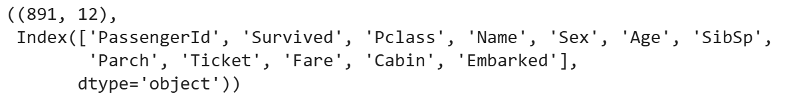
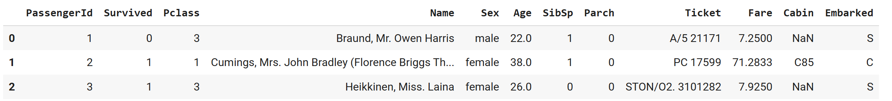
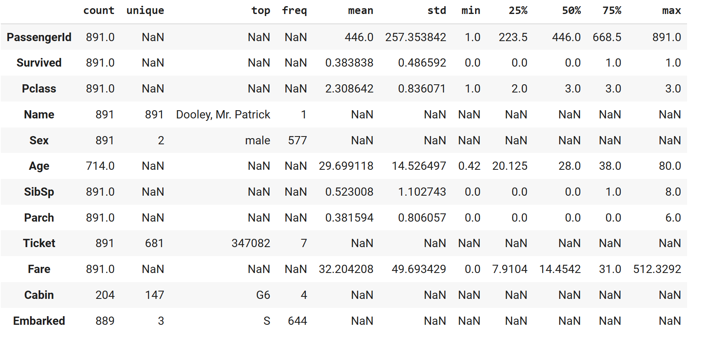
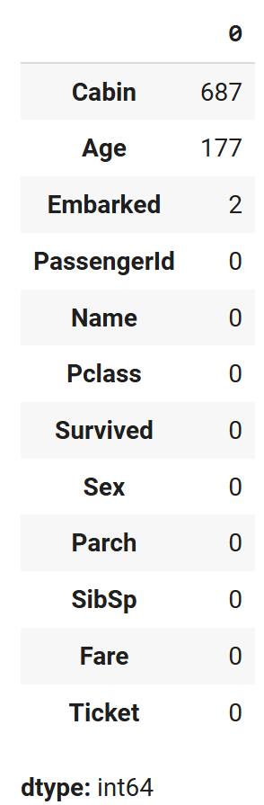
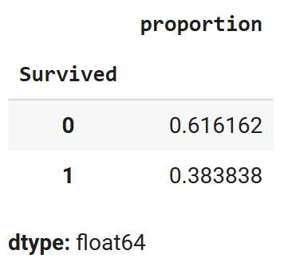
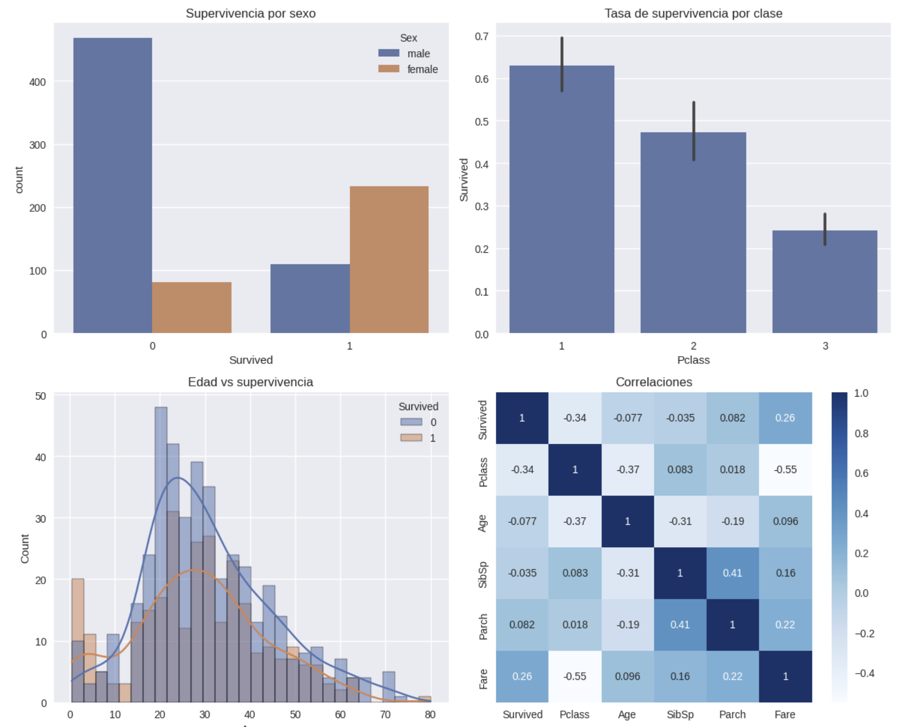

## Contexto
El Titanic fue una tragedia en la cual un barco chocó contra un iceberg en el mar, resultando en muchas pérdidas. El dataset que se usará en esta actividad posee datos relevantes que nos pueden ayudar a discernir si hubo variables que afectaron la probabilidad de supervivencia de los tripulantes.

## Objetivos
- Valorar qué variables estuvieron relacionadas con la supervivencia.
- Evaluar la calidad de los datos (si hay datos faltantes y cómo imputarlos).
- Formular hipótesis de interés para comprobar en un futuro.

## Actividades (con tiempos estimados)
- Investigación del caso — 10 min  
- Observación del dataset — 10 min  
- Elaboración del código — 20 min  
- Análisis de los resultados — 45 min  
- Documentación de los hallazgos — 20 min  

## Desarrollo
Inicialmente se investigó el caso para refrescar la memoria sobre lo que aconteció en el suceso. Posteriormente se hizo una observación inicial del dataset de Kaggle, para ver el tipo de datos con los que estaríamos trabajando, luego se siguió con la elaboración del código. 

```python hl_lines="2 6" linenums="1"
import pandas as pd
import numpy as np
import matplotlib.pyplot as plt
import seaborn as sns
import warnings
warnings.filterwarnings('ignore')

plt.style.use('seaborn-v0_8')
sns.set_palette('deep')

from pathlib import Path
try:
    from google.colab import drive
    drive.mount('/content/drive')
    ROOT = Path('/content/drive/MyDrive/IA-UT1')
except Exception:
    ROOT = Path.cwd() / 'IA-UT1'

DATA_DIR = ROOT / 'data'
RESULTS_DIR = ROOT / 'results'
for d in (DATA_DIR, RESULTS_DIR):
    d.mkdir(parents=True, exist_ok=True)
print('Outputs →', ROOT)

!pip -q install kaggle
from google.colab import files
files.upload()  # Subí tu archivo kaggle.json descargado
!mkdir -p ~/.kaggle && cp kaggle.json ~/.kaggle/ && chmod 600 ~/.kaggle/kaggle.json
!kaggle competitions download -c titanic -p data
!unzip -o data/titanic.zip -d data

train = pd.read_csv('data/train.csv')
test = pd.read_csv('data/test.csv')
```

A partir de allí se hicieron las importaciones necesarias de las librerías, y con este código se leyeron los datos directamente del kaggle.json descargado, generando los CSV de test y train.

Posteriormente se hicieron múltiples operaciones para obtener datos relevantes.

Forma y columnas (tipos de datos):
```python hl_lines="2 6" linenums="1"
train.shape, train.columns
```

Las primeras 3 filas de los datos:
```python hl_lines="2 6" linenums="1"
train.head(3)
```

Datos generales de todas las columnas, como promedio, mínimo, percentiles y número de datos:
```python hl_lines="2 6" linenums="1"
train.describe(include='all').T
```

Los datos que poseen un mayor número de valores faltantes (NA):
```python hl_lines="2 6" linenums="1"
train.isna().sum().sort_values(ascending=False)
```

Proporción de los datos que poseemos, de sobrevivientes:
```python hl_lines="2 6" linenums="1"
train['Survived'].value_counts(normalize=True)
```

Múltiples gráficos de tasas de supervivencia por edad y sexo, además de la matriz de correlaciones:
```python hl_lines="2 6" linenums="1"
fig, axes = plt.subplots(2, 2, figsize=(12, 10))

# Supervivencia global por sexo
sns.countplot(data=train, x='Survived', hue='Sex', ax=axes[0,0])
axes[0,0].set_title('Supervivencia por sexo')

# Tasa de supervivencia por clase
sns.barplot(data=train, x='Pclass', y='Survived', estimator=np.mean, ax=axes[0,1])
axes[0,1].set_title('Tasa de supervivencia por clase')

# Distribución de edad por supervivencia
sns.histplot(data=train, x='Age', hue='Survived', kde=True, bins=30, ax=axes[1,0])
axes[1,0].set_title('Edad vs supervivencia')

# Correlaciones numéricas
numeric_cols = ['Survived', 'Pclass', 'Age', 'SibSp', 'Parch', 'Fare']
sns.heatmap(train[numeric_cols].corr(), annot=True, cmap='Blues', ax=axes[1,1])
axes[1,1].set_title('Correlaciones')

plt.tight_layout()
plt.show()
```

## Evidencias








## Reflexión

### ¿Qué variables parecen más relacionadas con Survived?
El sexo parece ser una variable muy relacionada, a simple vista de los gráficos más del 75% de las mujeres sobrevivieron mientras que la mayoría de hombres murieron.  

Luego estarían los datos de la clase de billete y la tarifa, ya que son las que tienen mayor peso en el gráfico de correlaciones para el dato de Survived.  

- La clase del tripulante es negativa, dado que a mayor valor de clase significa que eras de una clase más baja/barata y que tuviste menos probabilidades de sobrevivir.  
- Por otro lado, la tarifa tiene una relación positiva porque a mayor tarifa pagada el tripulante tuvo mayor chance de sobrevivir.  

---

### ¿Dónde hay más valores faltantes? ¿Cómo los imputarías?
En las cabinas principalmente y en la edad es donde hay más datos faltantes.  

- Para las cabinas veo difícil imputarlos, capaz se podría poner la moda del valor de letra inicial (A, B, C, D) y luego la media de los números que vienen después, pero no creo que sea lo correcto. Además, hay que evaluar si afecta la probabilidad de supervivencia; en tal caso puede ser relevante.  
- Para la edad yo usaría la media probablemente, aunque como se vio en otra parte de los gráficos no está tan correlacionada en la supervivencia, solo en extremos como en los muy jóvenes entre 0 y 5 que sobrevivieron más de los que no.  

---

### ¿Qué hipótesis probarías a continuación?
Revisaría si no están relacionadas la clase y el monto de tarifa, porque es probable que uno esté afectando al otro; no sé si sea relevante tener los dos datos.  

Además, vería la relación entre las cabinas y la supervivencia, al menos solo con los pasajeros para los que sí poseemos datos, y vería si están relacionadas las cabinas con la clase.  

- Capaz aquellos con las mejores clases se encontraban en cabinas más cercanas a los botes, o en la zona superior del barco, o si es que tuvieron un trato preferencial por el simple hecho de haber pagado más.  
- Creo que a más mala la clase (es decir a mayor valor) los valores del primer carácter de las cabinas se encuentran más bajos, por lo que podría ser que se encontraban en zonas más ocultas o más bajas del bote. Probaría esa hipótesis también.  
- Estaría bueno saber si cabinas con un carácter mayor (F > A) significan que se encontraban más abajo.  

**Mi hipótesis** sobre qué grupo es el que tuvo las mayores probabilidades o cantidad de sobrevivientes es el de mujeres con una mejor clase (1era clase).


## Referencias
- https://juanfkurucz.com/ucu-ia/ut1/01-eda-titanic/
- https://www.kaggle.com/competitions/titanic/data
