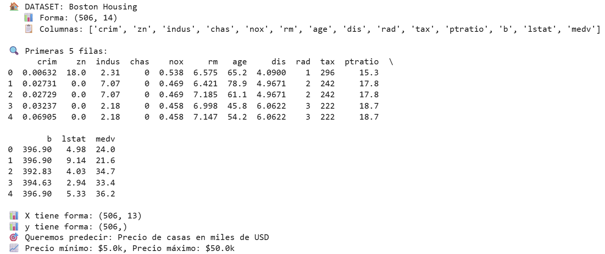
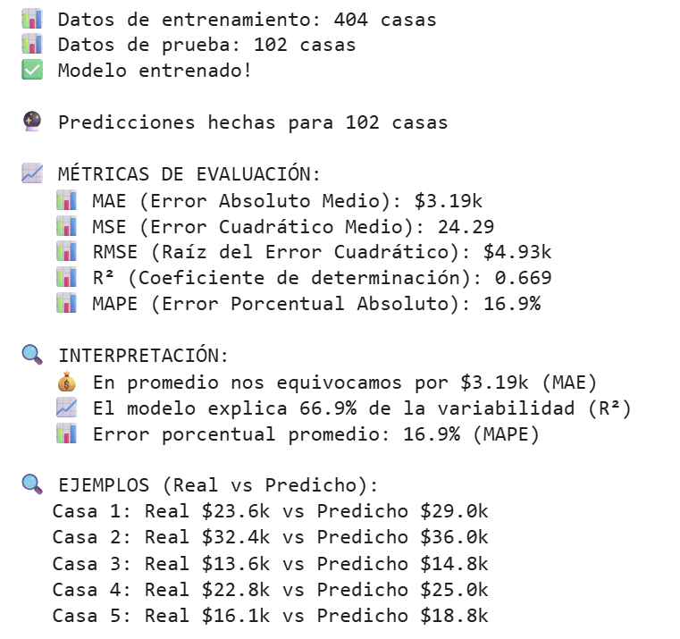
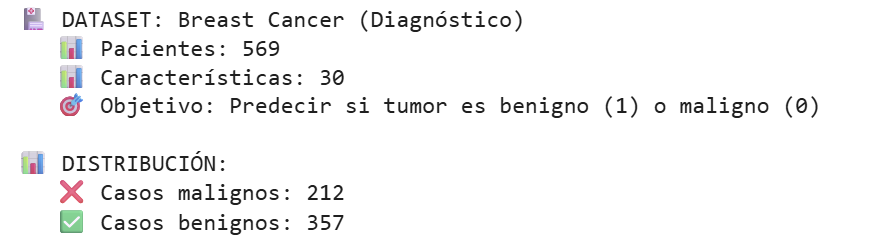
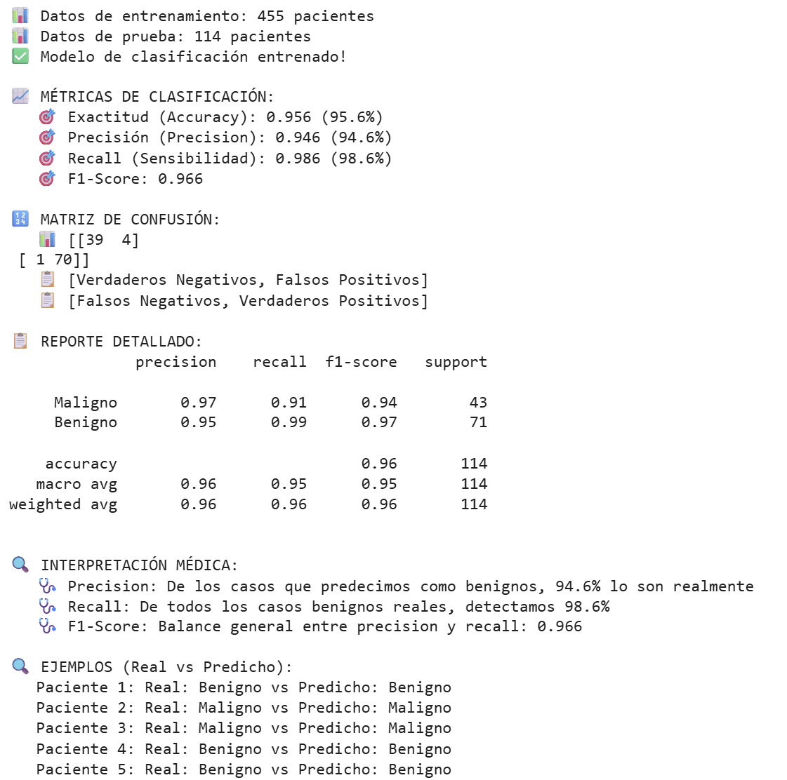

<link rel="stylesheet" href="../custom.css">

# Regresión Lineal y Logística
## 2025-08-31

## Contexto
Se evaluaron 2 casos de negocio para el uso del modelo de regresión lineal y del modelo de regresión logística. Primero, para la regresión lineal se buscará estimar el valor medio de precio de casas para una inmobiliaria de Boston, y para la regresión logística se buscará hacer un diagnóstico médico para clasificar tumores en benignos o malignos.

## Objetivos
- Aprender a cargar y explorar datos.
- Implementar regresión lineal paso a paso.
- Implementar regresión logística paso a paso.
- Interpretar resultados de forma simple.
- Evaluar la aplicación de los modelos en sus respectivos casos.

## Actividades (con tiempos estimados)
- Investigación del caso — 15 min  
- Investigación de los componentes (Documentación) — 30 min  
- Elaboración del código — 25 min  
- Análisis de los resultados — 50 min  
- Documentación de los hallazgos — 25 min  

## Desarrollo
Primero se leyó la documentación necesaria para el uso de los modelos, el uso y significado de las métricas utilizadas, y la división en partes de test y training data.  

Posteriormente, para cada caso se evaluó el contexto del negocio y se empezó la implementación del código.

Primero se hicieron las importaciones necesarias (setup):

```python hl_lines="2 6" linenums="1"
# Importar librerías que vamos a usar
import pandas as pd
import numpy as np
import matplotlib.pyplot as plt

# Para los modelos de machine learning
from sklearn.linear_model import LinearRegression, LogisticRegression
from sklearn.model_selection import train_test_split
from sklearn.metrics import mean_squared_error, mean_absolute_error, r2_score, accuracy_score, classification_report, confusion_matrix, precision_score, recall_score, f1_score
from sklearn.datasets import load_breast_cancer

print("✅ Setup completo!")
```

Luego se comenzó por el primer caso de negocio que fue el de la inmobiliaria de Boston, se cargó el dataset a partir de la URL, exploramos la forma de los datos, sus columnas, y nos centramos en separar los datos en X e y sobre la columna medv que es el precio de las casas que queremos predecir (extrayendo de los datos medv para X, y dejando solo medv para y):

```python hl_lines="2 6" linenums="1"
# === CARGAR DATOS DE CASAS EN BOSTON ===

# 1. Cargar el dataset desde una URL
url = "https://raw.githubusercontent.com/selva86/datasets/master/BostonHousing.csv"
boston_data = pd.read_csv(url)

print("🏠 DATASET: Boston Housing")
print(f"   📊 Forma: {boston_data.shape}")
print(f"   📋 Columnas: {list(boston_data.columns)}")

# 2. Explorar los datos básicamente
print("\n🔍 Primeras 5 filas:")
print(boston_data.head())

# 3. Preparar X (variables independientes) e y (variable dependiente)
# La columna 'medv' es el precio de la casa que queremos predecir
X = boston_data.drop('medv', axis=1)  # Todas las columnas EXCEPTO la que queremos predecir
y = boston_data['medv']                # Solo la columna que queremos predecir

print(f"\n📊 X tiene forma: {X.shape}")
print(f"📊 y tiene forma: {y.shape}")
print(f"🎯 Queremos predecir: Precio de casas en miles de USD")
print(f"📈 Precio mínimo: ${y.min():.1f}k, Precio máximo: ${y.max():.1f}k")
```

Posteriormente se dividieron los datos en test y train, entrenamos al modelo, hicimos las predicciones, y evaluamos el modelo en las distintas métricas MAE, MSE, RMSE, R², MAPE. Se obtuvieron ciertas interpretaciones a partir de dichas métricas y se hizo una comparación de lo predicho para las primeras 5 casas vs el valor real.

```python hl_lines="2 6" linenums="1"
# === ENTRENAR MODELO DE REGRESIÓN LINEAL ===

# 1. Dividir datos en entrenamiento y prueba
X_train, X_test, y_train, y_test = train_test_split(X, y, test_size=0.2, random_state=42)

print(f"📊 Datos de entrenamiento: {X_train.shape[0]} casas")
print(f"📊 Datos de prueba: {X_test.shape[0]} casas")

# 2. Crear y entrenar el modelo
modelo_regresion = LinearRegression()
modelo_regresion.fit(X_train, y_train)

print("✅ Modelo entrenado!")

# 3. Hacer predicciones
predicciones = modelo_regresion.predict(X_test)

print(f"\n🔮 Predicciones hechas para {len(predicciones)} casas")

# 4. Evaluar qué tan bueno es el modelo con MÚLTIPLES MÉTRICAS
mae = mean_absolute_error(y_test, predicciones)
mse = mean_squared_error(y_test, predicciones)
rmse = np.sqrt(mse)
r2 = r2_score(y_test, predicciones)

# Calcular MAPE manualmente
mape = np.mean(np.abs((y_test - predicciones) / y_test)) * 100

print(f"\n📈 MÉTRICAS DE EVALUACIÓN:")
print(f"   📊 MAE (Error Absoluto Medio): ${mae:.2f}k")
print(f"   📊 MSE (Error Cuadrático Medio): {mse:.2f}")
print(f"   📊 RMSE (Raíz del Error Cuadrático): ${rmse:.2f}k")
print(f"   📊 R² (Coeficiente de determinación): {r2:.3f}")
print(f"   📊 MAPE (Error Porcentual Absoluto): {mape:.1f}%")

print(f"\n🔍 INTERPRETACIÓN:")
print(f"   💰 En promedio nos equivocamos por ${mae:.2f}k (MAE)")
print(f"   📈 El modelo explica {r2*100:.1f}% de la variabilidad (R²)")
print(f"   📊 Error porcentual promedio: {mape:.1f}% (MAPE)")

# 5. Comparar algunas predicciones reales vs predichas
print(f"\n🔍 EJEMPLOS (Real vs Predicho):")
for i in range(5):
    real = y_test.iloc[i]
    predicho = predicciones[i]
    print(f"   Casa {i+1}: Real ${real:.1f}k vs Predicho ${predicho:.1f}k")
```

Luego se continuó con el segundo caso de uso, los diagnósticos médicos de cáncer, en benigno o maligno, usando la regresión logística.

Primero se cargó el dataset y se convirtió en DataFrame para ser más legible; se imprimieron ciertas características como el número de pacientes, las características que teníamos y nuestro objetivo a predecir.

Por último se vio el balance de las clases, observando que hay más casos de cáncer benignos que malignos, para ver las proporciones.

```python hl_lines="2 6" linenums="1"
# === CARGAR DATOS DE DIAGNÓSTICO DE CÁNCER ===

# 1. Cargar el dataset de cáncer de mama (que viene con sklearn)
cancer_data = load_breast_cancer()

# 2. Convertir a DataFrame para verlo mejor
X_cancer = pd.DataFrame(cancer_data.data, columns=cancer_data.feature_names)
y_cancer = cancer_data.target  # 0 = maligno, 1 = benigno

print("🏥 DATASET: Breast Cancer (Diagnóstico)")
print(f"   📊 Pacientes: {X_cancer.shape[0]}")
print(f"   📊 Características: {X_cancer.shape[1]}")
print(f"   🎯 Objetivo: Predecir si tumor es benigno (1) o maligno (0)")

# 3. Ver balance de clases
casos_malignos = (y_cancer == 0).sum()
casos_benignos = (y_cancer == 1).sum()

print(f"\n📊 DISTRIBUCIÓN:")
print(f"   ❌ Casos malignos: {casos_malignos}")
print(f"   ✅ Casos benignos: {casos_benignos}")
```

Por último, al igual que con el primer caso de uso, dividimos los datos en train y test, creamos y entrenamos el modelo de regresión logística, hicimos las predicciones y evaluamos múltiples métricas, en este caso de clasificación, como lo son accuracy, precision, recall y f1-score. Mostramos la matriz de confusión con los VN, FP, FN y VP.

Generamos el classification report para obtener un reporte más detallado de las métricas mencionadas y los promedios (avg). Se hicieron ciertas interpretaciones a partir de los datos obtenidos de las métricas y, por último, llegamos a ver ciertos ejemplos específicos de los primeros 5 pacientes: lo predicho versus la realidad.

```python hl_lines="2 6" linenums="1"
# === ENTRENAR MODELO DE CLASIFICACIÓN ===

# 1. Dividir datos en entrenamiento y prueba
X_train_cancer, X_test_cancer, y_train_cancer, y_test_cancer = train_test_split(
    X_cancer, y_cancer, test_size=0.2, random_state=42
)

print(f"📊 Datos de entrenamiento: {X_train_cancer.shape[0]} pacientes")
print(f"📊 Datos de prueba: {X_test_cancer.shape[0]} pacientes")

# 2. Crear y entrenar modelo de regresión logística
modelo_clasificacion = LogisticRegression(max_iter=5000, random_state=42)
modelo_clasificacion.fit(X_train_cancer, y_train_cancer)

print("✅ Modelo de clasificación entrenado!")

# 3. Hacer predicciones
predicciones_cancer = modelo_clasificacion.predict(X_test_cancer)

# 4. Evaluar con MÚLTIPLES MÉTRICAS de clasificación
exactitud = accuracy_score(y_test_cancer, predicciones_cancer)
precision = precision_score(y_test_cancer, predicciones_cancer)
recall = recall_score(y_test_cancer, predicciones_cancer)
f1 = f1_score(y_test_cancer, predicciones_cancer)

print(f"\n📈 MÉTRICAS DE CLASIFICACIÓN:")
print(f"   🎯 Exactitud (Accuracy): {exactitud:.3f} ({exactitud*100:.1f}%)")
print(f"   🎯 Precisión (Precision): {precision:.3f} ({precision*100:.1f}%)")
print(f"   🎯 Recall (Sensibilidad): {recall:.3f} ({recall*100:.1f}%)")
print(f"   🎯 F1-Score: {f1:.3f}")

# Mostrar matriz de confusión de forma simple
matriz_confusion = confusion_matrix(y_test_cancer, predicciones_cancer)
print(f"\n🔢 MATRIZ DE CONFUSIÓN:")
print(f"   📊 {matriz_confusion}")
print(f"   📋 [Verdaderos Negativos, Falsos Positivos]")
print(f"   📋 [Falsos Negativos, Verdaderos Positivos]")

# Reporte detallado
print(f"\n📋 REPORTE DETALLADO:")
print(classification_report(y_test_cancer, predicciones_cancer, target_names=['Maligno', 'Benigno']))

print(f"\n🔍 INTERPRETACIÓN MÉDICA:")
print(f"   🩺 Precision: De los casos que predecimos como benignos, {precision*100:.1f}% lo son realmente")
print(f"   🩺 Recall: De todos los casos benignos reales, detectamos {recall*100:.1f}%")
print(f"   🩺 F1-Score: Balance general entre precision y recall: {f1:.3f}")

# 5. Ver ejemplos específicos
print(f"\n🔍 EJEMPLOS (Real vs Predicho):")
for i in range(5):
    real = "Benigno" if y_test_cancer[i] == 1 else "Maligno"
    predicho = "Benigno" if predicciones_cancer[i] == 1 else "Maligno"
    print(f"   Paciente {i+1}: Real: {real} vs Predicho: {predicho}")
```

## Evidencias





[Collab](https://colab.research.google.com/drive/1WbL_Uz2sgvZYRXbqB-5cTVjz9RlNIj27?usp=sharing)

## Investigación de Métricas

### Métricas de Regresión
- MAE (Mean Absolute Error): Promedio de los errores absolutos sin importar si son positivos o negativos.  
- MSE (Mean Squared Error): Promedio de los errores al cuadrado, penaliza más los errores grandes.  
- RMSE (Root Mean Squared Error): Raíz cuadrada del MSE, vuelve a las unidades originales del problema.  
- R² (Coeficiente de Determinación): Indica qué porcentaje de la varianza es explicada por el modelo (0–1, donde 1 es perfecto).  
- MAPE (Mean Absolute Percentage Error): Error porcentual promedio, útil para comparar modelos con diferentes escalas.  

### Métricas de Clasificación
- Accuracy: Porcentaje de predicciones correctas sobre el total.  
- Precision: De todas las predicciones positivas, ¿cuántas fueron realmente correctas?  
- Recall (Sensibilidad): De todos los casos positivos reales, ¿cuántos detectamos?  
- F1-Score: Promedio armónico entre *precision* y *recall*.  
- Matriz de Confusión: Tabla que muestra predicciones vs valores reales.  

---

### Comparación entre Regresión Lineal y Regresión Logística

| Aspecto             | Regresión Lineal                                  | Regresión Logística                                                                 |
|---------------------|--------------------------------------------------|--------------------------------------------------------------------------------------|
| **Qué predice**     | Números continuos                                | Categorías                                                                           |
| **Ejemplo de uso**  | Determinar precios de autos según datos históricos | Determinar si un paciente posee una enfermedad según su registro médico              |
| **Rango de salida** | Cualquier valor real                             | 0 a 1 (probabilidad), luego clasificado según un umbral                             |
| **Métrica principal** | MAE, MSE, RMSE, R², MAPE                         | Accuracy, Precision, Recall, F1-Score, Matriz de Confusión                          |

## Reflexión

### **Preguntas:**

**¿Cuál es la diferencia principal entre regresión lineal y logística?**

**Respuesta:** La regresión lineal devuelve **valores continuos** (números reales), mientras que la regresión logística devuelve **probabilidades** que luego se asignan a categorías.

---

**¿Por qué dividimos los datos en entrenamiento y prueba?**

**Respuesta:** Dividimos los datos en entrenamiento y prueba para **evitar el overfitting**. Si entrenamos el modelo con los mismos datos que usamos para probarlo, puede sobreajustarse a esa muestra específica y no generalizar bien a datos nuevos. La separación permite evaluar el rendimiento real del modelo.

---

**¿Qué significa una exactitud del 95%?**

**Respuesta:** Significa que el modelo **predice correctamente el 95% de los casos**.

---

**¿Cuál es más peligroso: predecir "benigno" cuando es "maligno", o al revés?**

**Respuesta:** Es más peligroso predecir "benigno" cuando en realidad es "maligno", porque se subestima un riesgo grave y no se toman las acciones necesarias para salvar una vida. Predecir "maligno" cuando es "benigno" solo provoca alarma innecesaria o pérdida de tiempo.

### **Reflexión Final**  
Responde con tus propias palabras:

**¿Cuál modelo usarías para predecir el salario de un empleado?**

**Respuesta:** Dado que el salario es un valor **continuo**, usaría un modelo de **regresión lineal**, porque nos da valores continuos. Las categorías de un modelo de regresión logística no serían aptas para este tipo de predicciones.

**¿Cuál modelo usarías para predecir si un email es spam?**

**Respuesta:** Dado que la predicción es sobre **categorías**, usaría un modelo de **regresión logística**, ya que la regresión lineal no es adecuada para este tipo de predicciones.

**¿Por qué es importante separar datos de entrenamiento y prueba?**

**Respuesta:** Dividimos los datos en entrenamiento y prueba para **evitar el overfitting**. Si entrenamos el modelo con los mismos datos que usamos para probarlo, puede sobreajustarse a esa muestra específica y no generalizar bien a datos nuevos. La separación permite evaluar el rendimiento real del modelo.

## Referencias
- https://juanfkurucz.com/ucu-ia/ut1/04-regresion-lineal-logistica/
- https://scikit-learn.org/stable/modules/generated/sklearn.linear_model.LinearRegression.html
- https://scikit-learn.org/stable/modules/generated/sklearn.linear_model.LogisticRegression.html
- https://scikit-learn.org/stable/modules/generated/sklearn.model_selection.train_test_split.html
- https://scikit-learn.org/stable/modules/model_evaluation.html#regression-metrics
- https://scikit-learn.org/stable/modules/generated/sklearn.metrics.precision_score.html
- https://scikit-learn.org/stable/modules/generated/sklearn.metrics.recall_score.html
- https://scikit-learn.org/stable/modules/generated/sklearn.metrics.f1_score.html
- https://scikit-learn.org/stable/modules/generated/sklearn.metrics.confusion_matrix.html
- https://scikit-learn.org/stable/modules/generated/sklearn.metrics.classification_report.html
