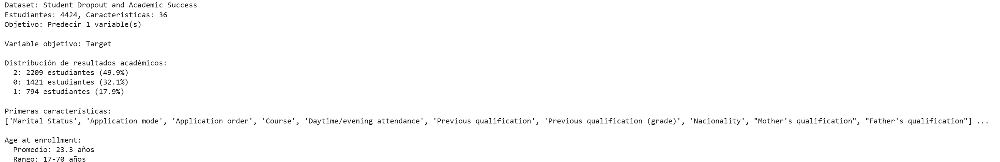
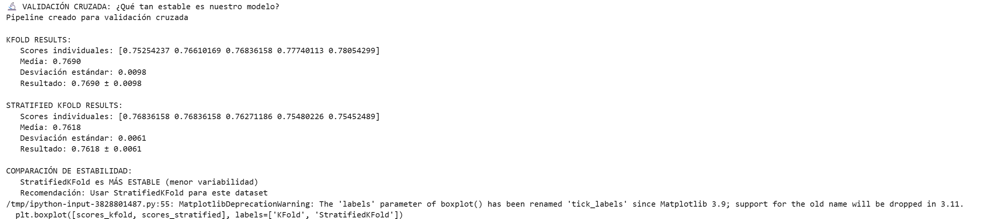
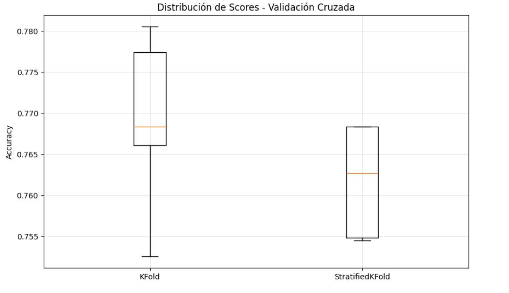
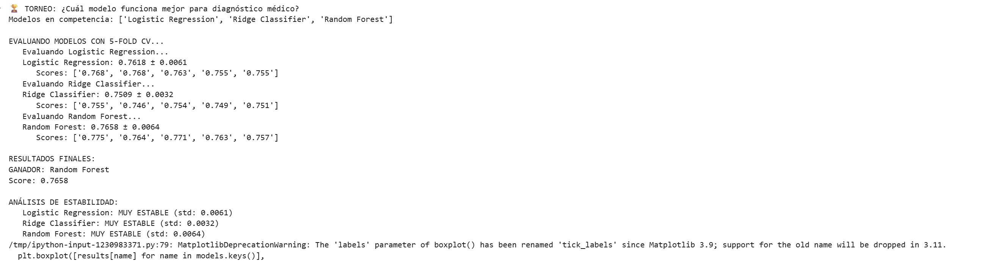
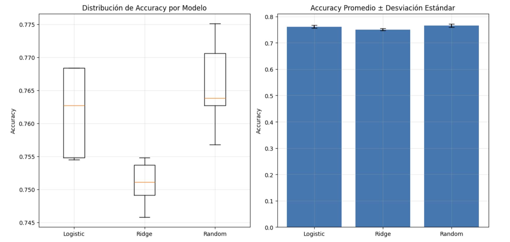
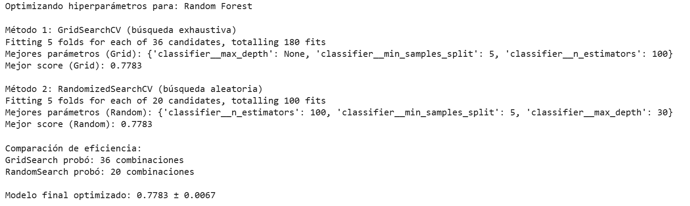

<link rel="stylesheet" href="../custom.css">

# Validación y Selección de Modelos - Fill in the Blanks
## 2025-08-31

## Contexto
Se utilizará el dataset **Student Dropout and Academic Success** para el uso de *pipelines*, haciendo una evaluación y validación cruzada del modelo, con el objetivo de obtener métricas de estabilidad.

## Objetivos
- Aprender a prevenir *data leakage* usando *pipelines*  
- Implementar validación cruzada (*cross-validation*) robusta  
- Comparar múltiples modelos de forma sistemática  
- Interpretar métricas de estabilidad y selección de modelos  

## Actividades (con tiempos estimados)
- Investigación del dataset — 15 min  
- Investigación de los nuevos conceptos (KFold, cross_val_score, etc.) — 25 min  
- Elaboración del código — 45 min  
- Análisis de los resultados — 35 min  
- Documentación de los hallazgos — 25 min  

## Desarrollo
Se comenzó con una investigación básica de los componentes utilizados en las librerías importadas, y se investigó el caso de **Student Dropout and Academic Success** como dataset para tener una idea del contexto de los datos con los que trabajaríamos.

Posteriormente se empezó la elaboración del código en Google Colab, primero importando las librerías necesarias, e importando los datos del JSON de Kaggle de la misma forma que en la entrega anterior.

Por último, se comenzó con la elaboración del código, empezando por la importación de las librerías con sus respectivos componentes:

```python hl_lines="2 6" linenums="1"
!pip install ucimlrepo

# Importar librerías que vamos a usar
import pandas as pd
import numpy as np
import matplotlib.pyplot as plt

# Para validación y selección de modelos
from sklearn.linear_model import LogisticRegression, RidgeClassifier
from sklearn.ensemble import RandomForestClassifier
from sklearn.model_selection import train_test_split, cross_val_score, KFold, StratifiedKFold
from sklearn.preprocessing import StandardScaler
from sklearn.pipeline import Pipeline
# Para cargar datos desde UCI ML Repository
from ucimlrepo import fetch_ucirepo
from sklearn.metrics import accuracy_score, classification_report

print("Setup completo!")
```

Luego se obtuvieron los datos de los estudiantes, y se dividieron en features y targets (valores de Dropout, Enrolled y Graduate).
Se mapearon dichas categorías a valores 0, 1, 2 respectivamente para facilitar su manejo, observamos la distribución de las clases, mostramos las features, y finalmente revisamos características básicas de la edad de enrollment.

```python hl_lines="2 6" linenums="1"
# Cargar dataset de estudiantes desde UCI
student_data = fetch_ucirepo(id=697)

# Preparar datos
X = student_data.data.features
y = student_data.data.targets

print("Dataset: Student Dropout and Academic Success")
print(f"Estudiantes: {X.shape[0]}, Características: {X.shape[1]}")
print(f"Objetivo: Predecir {len(y.columns)} variable(s)")

# Explorar variable objetivo
target_col = y.columns[0]  # Primera columna objetivo
y_series = y[target_col]
print(f"\nVariable objetivo: {target_col}")

# Mapear valores para mejor interpretación
target_mapping = {'Dropout': 0, 'Enrolled': 1, 'Graduate': 2}
y_mapped = y_series.map(target_mapping)

# Distribución de clases
print("\nDistribución de resultados académicos:")
value_counts = y_mapped.value_counts()
for outcome, count in value_counts.items():
    percentage = (count / len(y_mapped)) * 100
    print(f"  {outcome}: {count} estudiantes ({percentage:.1f}%)")

# Ver algunas características
print(f"\nPrimeras características:")
print(X.columns.tolist()[:10], "...")

# Estadísticas básicas
print(f"\nAge at enrollment:")
if 'Age at enrollment' in X.columns:
    age_col = X['Age at enrollment']
    print(f"  Promedio: {age_col.mean():.1f} años")
    print(f"  Rango: {age_col.min():.0f}-{age_col.max():.0f} años")
```

Se preparó la variable objetivo como una serie simple.

```python hl_lines="2 6" linenums="1"
# Convertir strings a números para sklearn
target_mapping = {0: 'Dropout', 1: 'Enrolled', 2: 'Graduate'}
reverse_mapping = {'Dropout': 0, 'Enrolled': 1, 'Graduate': 2}

# Si y_series contiene strings, convertir a números
if y_series.dtype == 'object':
    y_target = y_series.map(reverse_mapping)
else:
    y_target = y_series

X_features = X       # Features del dataset

print("Datos preparados para validación:")
print(f"X shape: {X_features.shape}")
print(f"y shape: {y_target.shape}")
print(f"Clases únicas: {sorted(y_target.unique())}")
print(f"Mapeo: {target_mapping}")
```

Se creó un pipeline para la validación cruzada, usando un KFold básico y un StratifiedKFold. Finalmente, se compararon ambas validaciones cruzadas y se generó un diagrama de caja, observando que StratifiedKFold es más estable y recomendado.

```python hl_lines="2 6" linenums="1"
# === VALIDACIÓN CRUZADA PARA ESTABILIDAD ===

print("🔬 VALIDACIÓN CRUZADA: ¿Qué tan estable es nuestro modelo?")

# 1. Crear pipeline robusto para usar en CV
pipeline_robust = Pipeline([
    ('scaler', StandardScaler()),
    ('classifier', LogisticRegression(max_iter=1000, random_state=42))
])

print("Pipeline creado para validación cruzada")

# 2. Crear KFold básico
kfold = KFold(n_splits=5, shuffle=True, random_state=42)

# 3. Evaluar con KFold usando cross_val_score
scores_kfold = cross_val_score(
    pipeline_robust, X_features, y_target, cv=kfold, scoring='accuracy'
)

print(f"\nKFOLD RESULTS:")
print(f"   Scores individuales: {scores_kfold}")
print(f"   Media: {scores_kfold.mean():.4f}")
print(f"   Desviación estándar: {scores_kfold.std():.4f}")
print(f"   Resultado: {scores_kfold.mean():.4f} ± {scores_kfold.std():.4f}")

# 4. Crear StratifiedKFold (mantiene proporción de clases)
stratified_kfold = StratifiedKFold(n_splits=5, shuffle=True, random_state=42)

# 5. Evaluar con StratifiedKFold
scores_stratified = cross_val_score(
    pipeline_robust, X_features, y_target, cv=stratified_kfold, scoring='accuracy'
)

print(f"\nSTRATIFIED KFOLD RESULTS:")
print(f"   Scores individuales: {scores_stratified}")
print(f"   Media: {scores_stratified.mean():.4f}")
print(f"   Desviación estándar: {scores_stratified.std():.4f}")
print(f"   Resultado: {scores_stratified.mean():.4f} ± {scores_stratified.std():.4f}")

# 6. Comparar estabilidad (menor desviación = más estable)
print(f"\nCOMPARACIÓN DE ESTABILIDAD:")
if scores_stratified.std() < scores_kfold.std():
    print("   StratifiedKFold es MÁS ESTABLE (menor variabilidad)")
    mejor_cv = "StratifiedKFold"
else:
    print("   KFold es MÁS ESTABLE (menor variabilidad)")
    mejor_cv = "KFold"

print(f"   Recomendación: Usar {mejor_cv} para este dataset")

# 7. Visualizar la distribución de scores
import matplotlib.pyplot as plt
plt.figure(figsize=(10, 6))
plt.boxplot([scores_kfold, scores_stratified], labels=['KFold', 'StratifiedKFold'])
plt.title('Distribución de Scores - Validación Cruzada')
plt.ylabel('Accuracy')
plt.grid(True, alpha=0.3)
plt.show()
```

Como ultima secciòn de codigo lo que se hizo fue una comparaciòn entre distintos modelos, en este caso entre:
- LogisticRegression
- RidgeClassifier
- RandomForestClassifier

Se evaluaron los valores obtenidos de la validaciòn cruzada usada en cada modelo para encontrar el mejor, utilizando tambien diagramas de caja para obtener una representaciòn màs visual, uno para la acurracy promedio de cada modelo, y otro para el promedio +- la desviaciòn estandar.

El ganador termino siendo el RandomForest.

```python hl_lines="2 6" linenums="1"
# === COMPETENCIA DE MODELOS ===

print("🏆 TORNEO: ¿Cuál modelo funciona mejor para diagnóstico médico?")

# 1. Definir candidatos (diferentes algoritmos)
models = {
    'Logistic Regression': Pipeline([
        ('scaler', StandardScaler()),
        ('classifier', LogisticRegression(max_iter=1000, random_state=42))
    ]),

    # 2. Ridge Classifier (regresión logística con regularización L2)
    'Ridge Classifier': Pipeline([
        ('scaler', StandardScaler()),
        ('classifier', RidgeClassifier(alpha=1.0, random_state=42))
    ]),

    # 3. Random Forest (ensemble, no necesita escalado)
    'Random Forest': Pipeline([
        ('classifier', RandomForestClassifier(n_estimators=100, random_state=42))
    ])
}

print(f"Modelos en competencia: {list(models.keys())}")

# 4. Evaluar cada modelo con validación cruzada
print(f"\nEVALUANDO MODELOS CON 5-FOLD CV...")

results = {}
for name, model in models.items():
    print(f"   Evaluando {name}...")

    # Usar StratifiedKFold para mantener balance de clases
    scores = cross_val_score(
        model, X_features, y_target,
        cv=StratifiedKFold(n_splits=5, shuffle=True, random_state=42),
        scoring='accuracy'
    )

    results[name] = scores

    print(f"   {name}: {scores.mean():.4f} ± {scores.std():.4f}")
    print(f"      Scores: {[f'{s:.3f}' for s in scores]}")

# 5. Encontrar el mejor modelo
print(f"\nRESULTADOS FINALES:")

# Encontrar modelo con mayor accuracy promedio
best_mean_score = 0
best_model_name = ""

for name, scores in results.items():
    if scores.mean() > best_mean_score:
        best_mean_score = scores.mean()
        best_model_name = name

print(f"GANADOR: {best_model_name}")
print(f"Score: {best_mean_score:.4f}")

# 6. Análisis detallado de estabilidad
print(f"\nANÁLISIS DE ESTABILIDAD:")
for name, scores in results.items():
    stability = scores.std()

    if stability < 0.02:
        status = "MUY ESTABLE"
    elif stability < 0.05:
        status = "ESTABLE"
    else:
        status = "INESTABLE"

    print(f"   {name}: {status} (std: {stability:.4f})")

# 7. Visualización comparativa
plt.figure(figsize=(12, 6))

# Boxplot de distribución de scores
plt.subplot(1, 2, 1)
plt.boxplot([results[name] for name in models.keys()],
           labels=[name.split()[0] for name in models.keys()])
plt.title('Distribución de Accuracy por Modelo')
plt.ylabel('Accuracy')
plt.grid(True, alpha=0.3)

# Barplot de medias con error bars
plt.subplot(1, 2, 2)
names = list(models.keys())
means = [results[name].mean() for name in names]
stds = [results[name].std() for name in names]

plt.bar(range(len(names)), means, yerr=stds, capsize=5)
plt.xticks(range(len(names)), [name.split()[0] for name in names])
plt.title('Accuracy Promedio ± Desviación Estándar')
plt.ylabel('Accuracy')
plt.grid(True, alpha=0.3)

plt.tight_layout()
plt.show()
```

Como ejercicio extra se usó el mejor modelo (RandomForest) y se optimizó mediante búsqueda de hiperparámetros con GridSearchCV y RandomizedSearchCV, evaluados nuevamente con cross-validation, y observando los mejores hiperparámetros que ofrecieron.

```python hl_lines="2 6" linenums="1"
from sklearn.model_selection import GridSearchCV, RandomizedSearchCV, cross_val_score

# Seleccionar el mejor modelo de la competencia anterior
best_model_base = models[best_model_name]

print(f"Optimizando hiperparámetros para: {best_model_name}")

# Definir espacio de búsqueda de hiperparámetros
if 'Random Forest' in best_model_name:
    param_grid = {
        'classifier__n_estimators': [50, 100, 200],
        'classifier__max_depth': [None, 10, 20, 30],
        'classifier__min_samples_split': [2, 5, 10]
    }
elif 'Logistic' in best_model_name:
    param_grid = {
        'classifier__C': [0.1, 1, 10, 100],
        'classifier__max_iter': [1000, 2000]
    }
else:  # Ridge
    param_grid = {
        'classifier__alpha': [0.1, 1, 10, 100]
    }

# MÉTODO 1: GridSearchCV (búsqueda exhaustiva)
print("\nMétodo 1: GridSearchCV (búsqueda exhaustiva)")
grid_search = GridSearchCV(
    best_model_base,
    param_grid,
    cv=5,
    scoring='accuracy',
    n_jobs=-1,
    verbose=1
)

grid_search.fit(X_features, y_target)

print(f"Mejores parámetros (Grid): {grid_search.best_params_}")
print(f"Mejor score (Grid): {grid_search.best_score_:.4f}")

# MÉTODO 2: RandomizedSearchCV (búsqueda aleatoria, más eficiente)
print("\nMétodo 2: RandomizedSearchCV (búsqueda aleatoria)")
random_search = RandomizedSearchCV(
    best_model_base,
    param_grid,
    n_iter=20,  # Solo 20 combinaciones aleatorias
    cv=5,
    scoring='accuracy',
    n_jobs=-1,
    random_state=42,
    verbose=1
)

random_search.fit(X_features, y_target)

print(f"Mejores parámetros (Random): {random_search.best_params_}")
print(f"Mejor score (Random): {random_search.best_score_:.4f}")

# Comparar eficiencia
print(f"\nComparación de eficiencia:")
print(f"GridSearch probó: {len(grid_search.cv_results_['params'])} combinaciones")
print(f"RandomSearch probó: {len(random_search.cv_results_['params'])} combinaciones")

# Evaluar modelo final optimizado
final_model = grid_search.best_estimator_
final_scores = cross_val_score(final_model, X_features, y_target, cv=5)
print(f"\nModelo final optimizado: {final_scores.mean():.4f} ± {final_scores.std():.4f}")
```

## Evidencias







[Collab](https://colab.research.google.com/drive/1LPVfz1k5r_PqFv78RmyuAdG03qsu6nAc?usp=sharing)

## Preguntas para investigar

***¿Cuántas muestras y características tiene el dataset?***  
Tiene **4424 muestras** y **36 características**.

***¿Qué tipos de variables incluye? (demográficas, académicas, socioeconómicas)***  
- **Académicas:** Calificaciones, cursos, carrera, evaluaciones, etc.  
- **Demográficas:** Edad, sexo, estado civil, nacionalidad, etc.  
- **Socioeconómicas:** Ocupación de padres.  

Lista de variables:  
`['Marital Status', 'Application mode', 'Application order', 'Course', 'Daytime/evening attendance', 'Previous qualification', 'Previous qualification (grade)', 'Nacionality', "Mother's qualification", "Father's qualification", "Mother's occupation", "Father's occupation", 'Admission grade', 'Displaced', 'Educational special needs', 'Debtor', 'Tuition fees up to date', 'Gender', 'Scholarship holder', 'Age at enrollment', 'International', 'Curricular units 1st sem (credited)', 'Curricular units 1st sem (enrolled)', 'Curricular units 1st sem (evaluations)', 'Curricular units 1st sem (approved)', 'Curricular units 1st sem (grade)', 'Curricular units 1st sem (without evaluations)', 'Curricular units 2nd sem (credited)', 'Curricular units 2nd sem (enrolled)', 'Curricular units 2nd sem (evaluations)', 'Curricular units 2nd sem (approved)', 'Curricular units 2nd sem (grade)', 'Curricular units 2nd sem (without evaluations)', 'Unemployment rate', 'Inflation rate', 'GDP']`

***¿Las clases están balanceadas o desbalanceadas?***  
Hay **3 clases** que están desbalanceadas. Esto ocurre cuando una o varias clases en un conjunto de datos tienen una representación significativamente menor que otras.

***¿Qué significan las 3 categorías objetivo?***  
Representan el estado final del estudiante al terminar el curso. Son las categorías que queremos predecir:  
- **Dropout**  
- **Enrolled**  
- **Graduate**

---

## ¿Qué significan las métricas de validación?

- **Cross-Validation:** Técnica que divide los datos en *k* partes para entrenar y evaluar múltiples veces.  
- **Accuracy promedio:** Estimación media del rendimiento esperado en datos nuevos.  
- **Desviación estándar:** Indica qué tan consistente es el modelo entre diferentes divisiones de datos.  
- **StratifiedKFold:** Mantiene la proporción de clases en cada *fold*, especialmente importante en datasets desbalanceados.  

---

## ¿Cuándo usar cada método?

- **GridSearchCV:** Cuando tienes pocos hiperparámetros y suficiente tiempo de cómputo.  
- **RandomizedSearchCV:** Cuando tienes muchos hiperparámetros o poco tiempo disponible.  
- **Pipeline + SearchCV:** Siempre, ya que previene *data leakage* automáticamente.  
- **cross_val_score:** En el resultado final, para validar que la optimización no causó sobreajuste (*overfitting*).  

---

## Reflexión

### **Preguntas:**

***¿Qué es data leakage y por qué es peligroso?***  
Es cuando el modelo accede a información de la parte de testing, o a *features* que no deberían estar en el entrenamiento.  
Es peligroso porque el modelo puede sobreajustarse y, aunque muestre buen rendimiento en entrenamiento, luego falle con datos nuevos y desconocidos.  

***¿Cuándo usar KFold vs StratifiedKFold?***  
- Si las clases están balanceadas → usar **KFold**.  
- Si hay clases desbalanceadas → usar **StratifiedKFold**, ya que mantiene la proporción de clases en cada fold.  

***¿Cómo interpretar "95.2% ± 2.1%" en cross-validation?***  
- **95.2%** es el *accuracy promedio*.  
- **± 2.1%** es la variabilidad entre los *folds*.  
Esto indica buena precisión promedio y resultados consistentes entre folds.  

***¿Por qué Random Forest no necesita StandardScaler?***  
Porque los árboles de decisión se basan en comparaciones de valores y divisiones en categorías, por lo que la normalización no afecta los resultados.  

***En diagnóstico médico, ¿prefieres un modelo con 98% accuracy pero inestable, o 95% accuracy pero muy estable?***  
Prefiero el **95% pero muy estable**, ya que en medicina la confiabilidad es más importante que una mayor precisión aislada. Las predicciones deben ser lo más seguras posibles para evitar errores graves en pacientes.  

## Referencias
- https://juanfkurucz.com/ucu-ia/ut1/05-validacion-seleccion-modelos/
- https://archive.ics.uci.edu/dataset/697/predict+students+dropout+and+academic+success
- https://scikit-learn.org/stable/modules/generated/sklearn.linear_model.RidgeClassifier.html
- https://scikit-learn.org/stable/modules/generated/sklearn.ensemble.RandomForestClassifier.html
- https://scikit-learn.org/stable/modules/generated/sklearn.model_selection.cross_val_score.html
- https://scikit-learn.org/stable/modules/generated/sklearn.model_selection.StratifiedKFold.html
- https://scikit-learn.org/stable/modules/generated/sklearn.preprocessing.StandardScaler.html