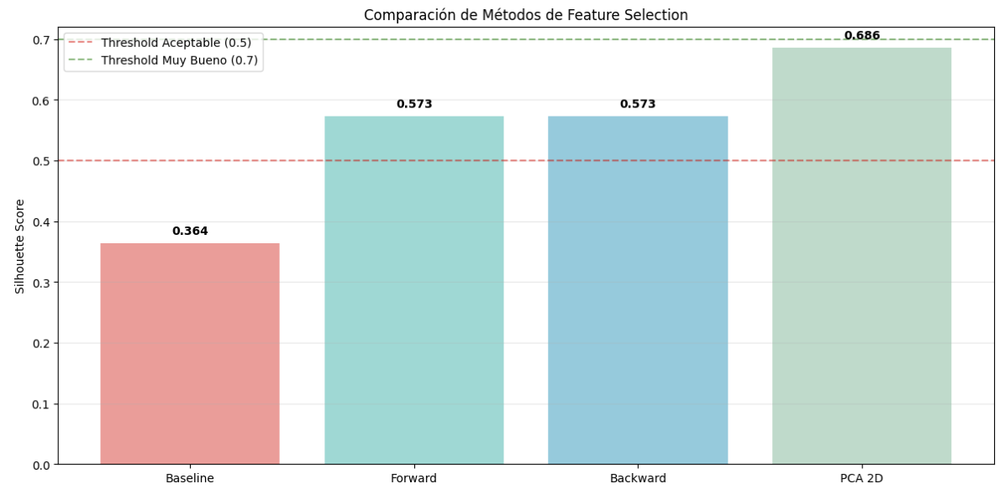
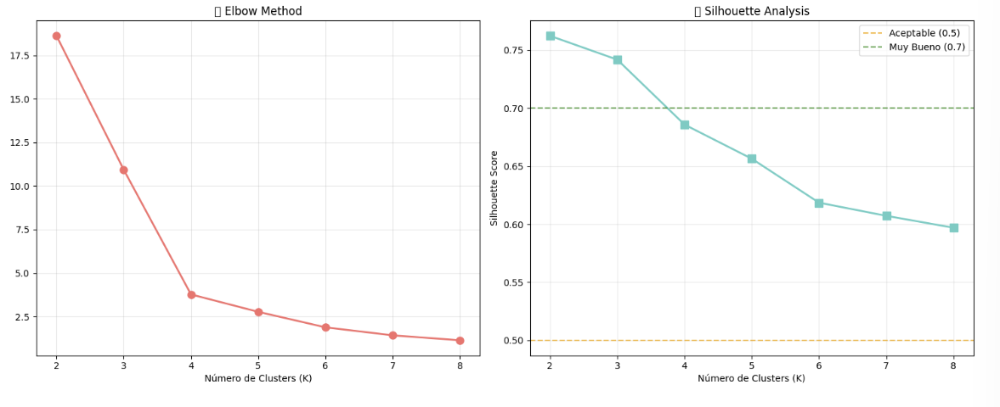
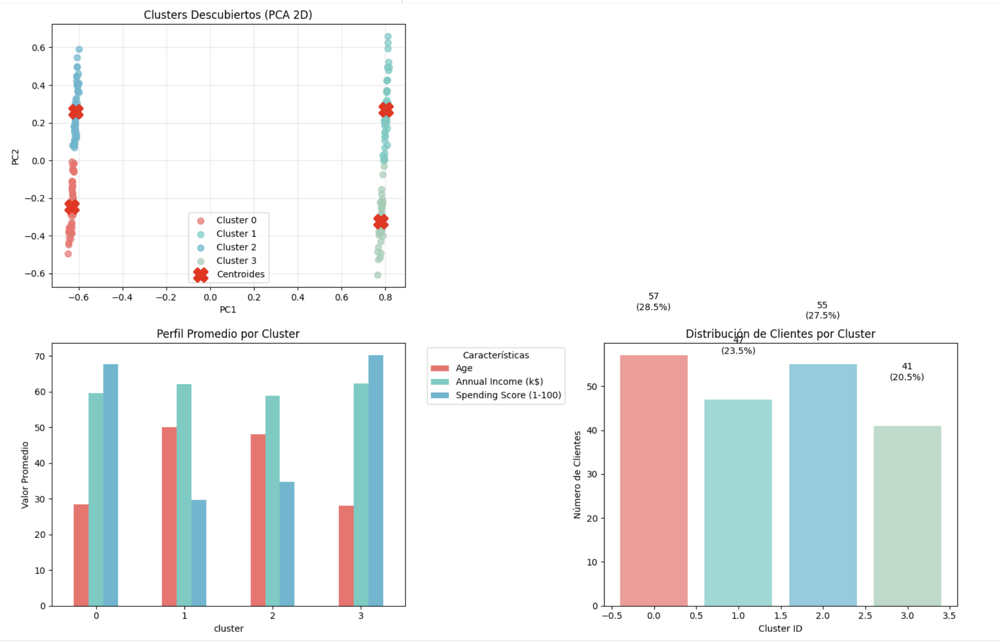
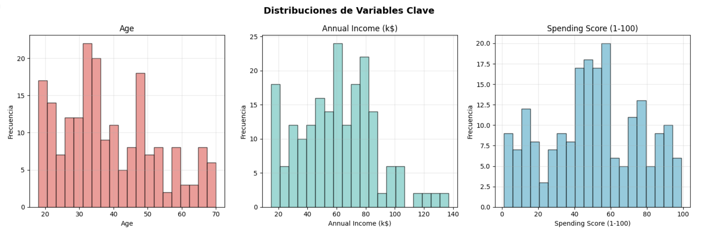
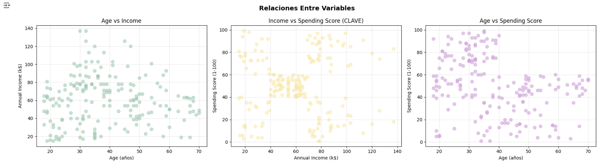
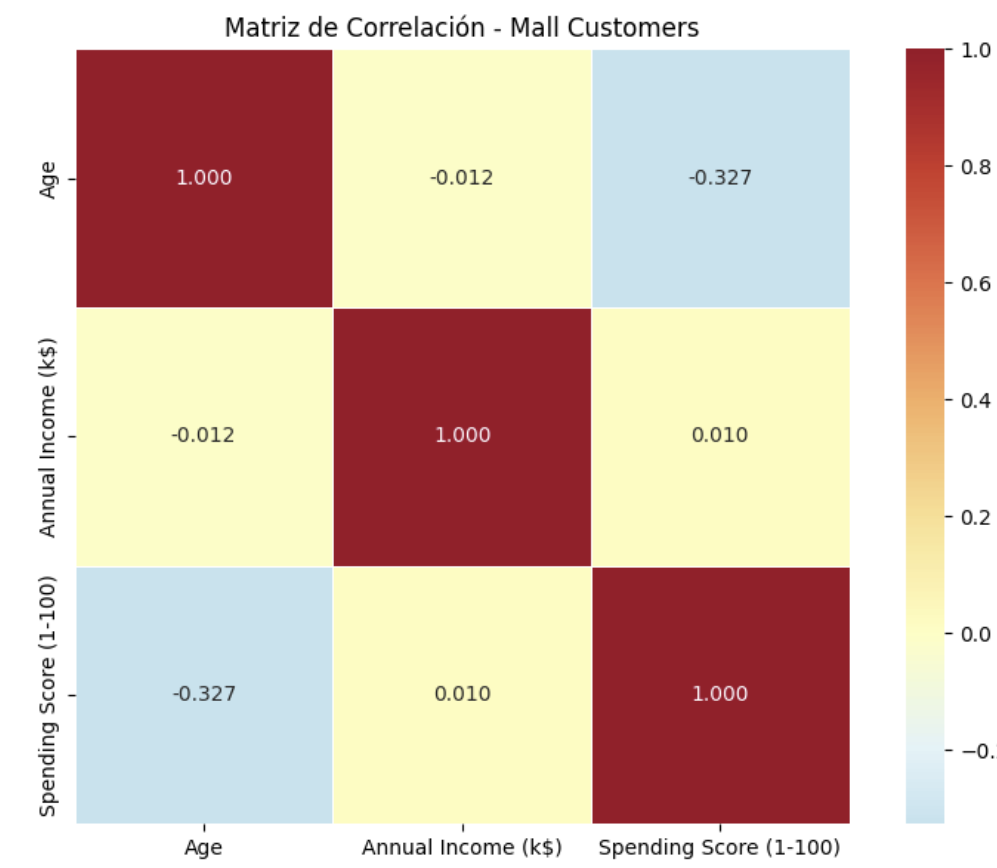
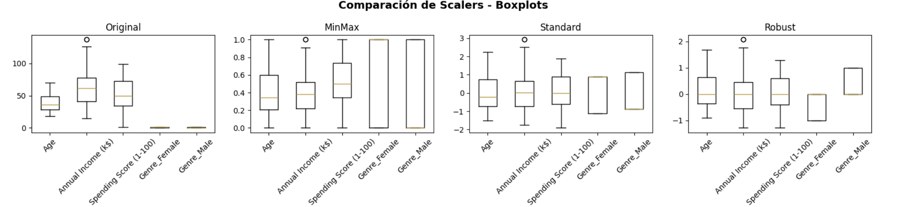
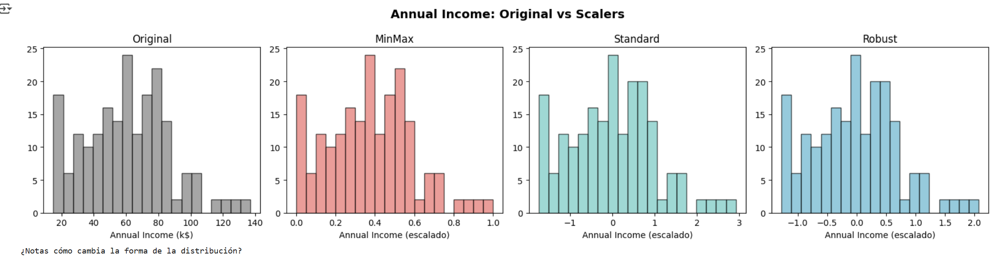
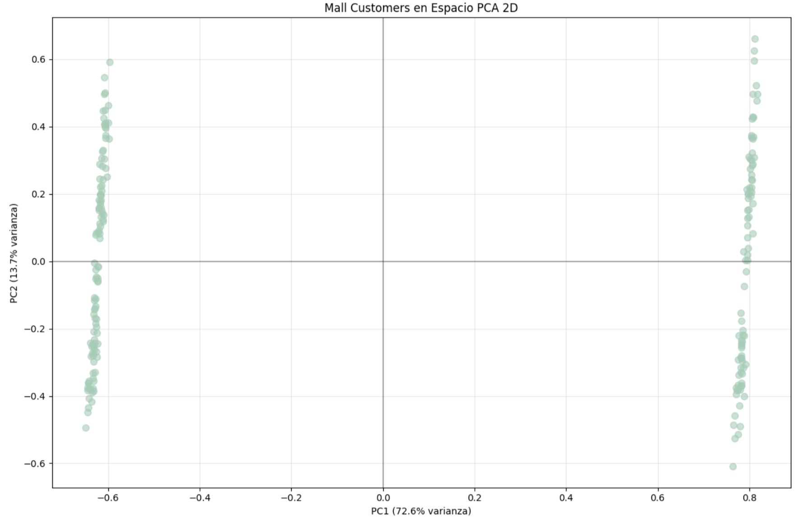

<link rel="stylesheet" href="../custom.css">

# Clustering y PCA - Mall Customer Segmentation
## 2025-09-21

## Contexto
Los centros comerciales necesitan comprender mejor el comportamiento de sus clientes para optimizar sus estrategias de marketing y maximizar la rentabilidad. Sin una segmentación adecuada, las campañas resultan genéricas y poco efectivas, desperdiciando recursos en audiencias incorrectas.

Se utilizará el **Mall Customer Segmentation Dataset** de Kaggle, que contiene información real de aproximadamente 200 clientes con datos completos sobre CustomerID, género, edad, ingreso anual y puntuación de gasto (Spending Score)

## Objetivos

- Identificar 3-5 segmentos de clientes distintos usando K-Means 
- Aplicar técnicas de normalización (MinMax, Standard, Robust)
- Usar PCA para reducción de dimensionalidad y visualización 
- Comparar PCA con métodos de selección de features 
- Interpretar resultados desde perspectiva de negocio
- Encontrar audiencias objetivo para mejorar las estrategias de marketing.

## Actividades (con tiempos estimados)

- Investigación del dataset — 15 min  
- Investigación de los nuevos conceptos (Clustering, Scalers, PCA, Feature Selection,e tc) — 40 min  
- Elaboración del código — 1h 30 min  
- Análisis de los resultados — 50 min  
- Documentación de los hallazgos — 40 min  

## Desarrollo
Se comenzó con una investigación básica de los componentes utilizados en las librerías importadas, y se investigó el caso de **Mall Customer Segmentation Dataset** como dataset para tener una idea del contexto de los datos con los que trabajaríamos.

### Data understanding
Posteriormente se empezó la elaboración del código en Google Colab, primero importando las librerías necesarias, e importando los datos.

Por último, se comenzó con la elaboración del código, empezando por el entendimiento de los datos.

Primero se hizo una inspección inicial del dataaset, para conocer sus features, forma, tipos de datos, y como estos estaban distribuidos (por genero, por ejemplo).

A su vez se buscaron outlier (datos atipicos), y se realizaron visualicaciones graficas de las relaciones clave (como graficos de dispersión, e histogramas), y de las distribuciones de los datos.

Posteriormente se realizo una matriz de correlación para encontrar las correlaciones mas altas, y entender que datos estan relacionados entre si. Y se hizo un analisis comparativo por genero.

```python hl_lines="2 6" linenums="1"
# === IMPORTS BÁSICOS PARA EMPEZAR ===
import pandas as pd
import numpy as np

print("Iniciando análisis de Mall Customer Segmentation Dataset")
print("Pandas y NumPy cargados - listos para trabajar con datos")

# Descargar desde GitHub (opción más confiable)
url = "https://raw.githubusercontent.com/SteffiPeTaffy/machineLearningAZ/master/Machine%20Learning%20A-Z%20Template%20Folder/Part%204%20-%20Clustering/Section%2024%20-%20K-Means%20Clustering/Mall_Customers.csv"

df_customers = pd.read_csv(url)

print("INFORMACIÓN DEL DATASET:")
print(f"Shape: {df_customers.shape[0]} filas, {df_customers.shape[1]} columnas")
print(f"Columnas: {list(df_customers.columns)}")
print(f"Memoria: {df_customers.memory_usage(deep=True).sum() / 1024:.1f} KB")

print(f"\nPRIMERAS 5 FILAS:")
df_customers.head()

# === ANÁLISIS DE TIPOS Y ESTRUCTURA ===
print("INFORMACIÓN DETALLADA DE COLUMNAS:")
print(df_customers.info())

print(f"\nESTADÍSTICAS DESCRIPTIVAS:")
df_customers.describe()

# === ANÁLISIS DE GÉNERO ===
print("DISTRIBUCIÓN POR GÉNERO:")
gender_counts = df_customers['Genre'].value_counts()
print(gender_counts)
print(f"\nPorcentajes:")
for gender, count in gender_counts.items():
    pct = (count / len(df_customers) * 100)
    print(f"   {gender}: {pct:.1f}%")

# === ESTADÍSTICAS DE VARIABLES DE SEGMENTACIÓN ===
numeric_vars = ['Age', 'Annual Income (k$)', 'Spending Score (1-100)']

print("ESTADÍSTICAS CLAVE:")
print(df_customers[numeric_vars].describe().round(2))

print(f"\nRANGOS OBSERVADOS:")
for var in numeric_vars:
    min_val, max_val = df_customers[var].min(), df_customers[var].max()
    mean_val = df_customers[var].mean()
    print(f"   {var}: {min_val:.0f} - {max_val:.0f} (promedio: {mean_val:.1f})")

# === DETECCIÓN DE OUTLIERS USANDO IQR ===
print("DETECCIÓN DE OUTLIERS:")

outlier_cols = ['Age', 'Annual Income (k$)', 'Spending Score (1-100)']

for col in outlier_cols:
    Q1 = df_customers[col].quantile(0.25)
    Q3 = df_customers[col].quantile(0.75)
    IQR = Q3 - Q1

    # Calcular límites
    lower_bound = Q1 - 1.5 * IQR
    upper_bound = Q3 + 1.5 * IQR

    # Encontrar outliers
    outliers = df_customers[(df_customers[col] < lower_bound) |
                           (df_customers[col] > upper_bound)]

    print(f"   {col}: {len(outliers)} outliers ({len(outliers)/len(df_customers)*100:.1f}%)")
    print(f"      Límites normales: {lower_bound:.1f} - {upper_bound:.1f}")

# === IMPORTS PARA VISUALIZACIÓN ===
import matplotlib.pyplot as plt
import seaborn as sns

# Configurar estilo
plt.style.use('default')
sns.set_palette("husl")

# === HISTOGRAMAS DE VARIABLES PRINCIPALES ===
fig, axes = plt.subplots(1, 3, figsize=(15, 5))
fig.suptitle('Distribuciones de Variables Clave', fontsize=14, fontweight='bold')

vars_to_plot = ['Age', 'Annual Income (k$)', 'Spending Score (1-100)']
colors = ['#FF6B6B', '#4ECDC4', '#45B7D1']

for i, (var, color) in enumerate(zip(vars_to_plot, colors)):
    axes[i].hist(df_customers[var], bins=20, alpha=0.7, color=color, edgecolor='black')
    axes[i].set_title(f'{var}')
    axes[i].set_xlabel(var)
    axes[i].set_ylabel('Frecuencia')
    axes[i].grid(True, alpha=0.3)

plt.tight_layout()
plt.show()

# === SCATTER PLOTS PARA RELACIONES CLAVE ===
fig, axes = plt.subplots(1, 3, figsize=(18, 5))
fig.suptitle('Relaciones Entre Variables', fontsize=14, fontweight='bold')

# Age vs Income
axes[0].scatter(df_customers['Age'], df_customers['Annual Income (k$)'],
                alpha=0.6, color='#96CEB4', s=50)
axes[0].set_xlabel('Age (años)')
axes[0].set_ylabel('Annual Income (k$)')
axes[0].set_title('Age vs Income')
axes[0].grid(True, alpha=0.3)

# Income vs Spending Score ⭐ CLAVE PARA SEGMENTACIÓN
axes[1].scatter(df_customers['Annual Income (k$)'], df_customers['Spending Score (1-100)'],
                alpha=0.6, color='#FFEAA7', s=50)
axes[1].set_xlabel('Annual Income (k$)')
axes[1].set_ylabel('Spending Score (1-100)')
axes[1].set_title('Income vs Spending Score (CLAVE)')
axes[1].grid(True, alpha=0.3)

# Age vs Spending Score
axes[2].scatter(df_customers['Age'], df_customers['Spending Score (1-100)'],
                alpha=0.6, color='#DDA0DD', s=50)
axes[2].set_xlabel('Age (años)')
axes[2].set_ylabel('Spending Score (1-100)')
axes[2].set_title('Age vs Spending Score')
axes[2].grid(True, alpha=0.3)

plt.tight_layout()
plt.show()

# === MATRIZ DE CORRELACIÓN ===
correlation_vars = ['Age', 'Annual Income (k$)', 'Spending Score (1-100)']
corr_matrix = df_customers[correlation_vars].corr()

print("MATRIZ DE CORRELACIÓN:")
print(corr_matrix.round(3))

# Visualizar matriz de correlación
plt.figure(figsize=(8, 6))
sns.heatmap(corr_matrix, annot=True, cmap='RdYlBu_r', center=0,
            fmt='.3f', linewidths=0.5, square=True)
plt.title('Matriz de Correlación - Mall Customers')
plt.tight_layout()
plt.show()

print(f"\nCORRELACIÓN MÁS FUERTE:")
# Encontrar la correlación más alta (excluyendo diagonal)
corr_flat = corr_matrix.where(np.triu(np.ones(corr_matrix.shape), k=1).astype(bool))
max_corr = corr_flat.stack().idxmax()
max_val = corr_flat.stack().max()
print(f"   {max_corr[0]} ↔ {max_corr[1]}: {max_val:.3f}")

# === COMPARACIÓN ESTADÍSTICAS POR GÉNERO ===
print("ANÁLISIS COMPARATIVO POR GÉNERO:")

gender_stats = df_customers.groupby('Genre')[numeric_vars].agg(['mean', 'std']).round(2)
print(gender_stats)

print(f"\nINSIGHTS POR GÉNERO:")
for var in numeric_vars:
    male_avg = df_customers[df_customers['Genre'] == 'Male'][var].mean()
    female_avg = df_customers[df_customers['Genre'] == 'Female'][var].mean()

    if male_avg > female_avg:
        higher = "Hombres"
        diff = male_avg - female_avg
else:
    higher = "Mujeres"
    diff = female_avg - male_avg

print(f"   {var}: {higher} tienen promedio más alto (diferencia: {diff:.1f})")
```

#### Conclusiones del Análisis Exploratorio

Se llegaron a ciertas conclusiones a partir de todas las observaciones:

- ¿Qué variable tiene el rango más amplio? Annual Income (k$)
- ¿Cuál es la distribución de género en el dataset? 40% hombres 60% mujeres
- ¿Qué variable muestra mayor variabilidad (std)? Annual Income (k$)
- ¿Los clientes son jóvenes o mayores en promedio? Son más jóvenes en comparación con los límites del rango
- ¿El income promedio sugiere qué clase social? No, por lo visto en gráficos previos, ya que hay gente que gana mucho y gasta poco, y viceversa.
- ¿Por qué la normalización será crítica acá? Porque es importante tener datos medibles como los géneros en un valor numérico, en vez de como un string.

##### Preparación para el Clustering

Además con estos gráficos e información se hizo una pequeña preparación para la próxima fase de este desarrollo, el clustering:

* La relación entre Income y Spending Score parece ser adecuada para el clustering debido a las agrupaciones observadas en el gráfico de dispersión

* Imaginamos 5 grupos a partir de la observación del gráfico de dispersión: aquellos que ganan poco y gastan mucho, los que ganan poco y gastan poco, los que ganan en el promedio y gastan lo promedio (donde se concentran la mayoría de los valores), los que ganan mucho y gastan mucho, y por último los que ganan mucho y gastan poco. Estas divisiones dispares de, a pesar de ganar lo mismo, gastar mucho o poco pueden deberse a la edad y/o género.

Se hizo un poco mas de análisis de las columnas, y se tomaron ciertas features, ademas se uso OneHotEncoder para la codificación, obteniendo 2 columnas generadas Genre_Female y Genre_Male.

```python hl_lines="2 6" linenums="1"
# === ANÁLISIS DE COLUMNAS DISPONIBLES ===
print("ANÁLISIS DE COLUMNAS PARA CLUSTERING:")
print(f"   Todas las columnas: {list(df_customers.columns)}")
print(f"   Numéricas: {df_customers.select_dtypes(include=[np.number]).columns.tolist()}")
print(f"   Categóricas: {df_customers.select_dtypes(include=[object]).columns.tolist()}")

# Identificar qué excluir y qué incluir
exclude_columns = ['CustomerID']  # ID no aporta información
numeric_columns = ['Age', 'Annual Income (k$)', 'Spending Score (1-100)']
categorical_columns = ['Genre']

# === IMPORT ONEHOTENCODER ===
from sklearn.preprocessing import OneHotEncoder

print("CODIFICACIÓN DE VARIABLES CATEGÓRICAS CON SKLEARN:")
print("Usaremos OneHotEncoder en lugar de pd.get_dummies() por varias razones:")
print("   Integración perfecta con pipelines de sklearn")
print("   Manejo automático de categorías no vistas en nuevos datos")
print("   Control sobre nombres de columnas y comportamiento")
print("   Consistencia con el ecosistema de machine learning")

# Crear y configurar OneHotEncoder
encoder = OneHotEncoder(sparse_output=False)

# Ajustar y transformar Genre
genre_data = df_customers[['Genre']]  # Debe ser 2D para sklearn
genre_encoded_array = encoder.fit_transform(genre_data)  # Método para ajustar y transformar

# Obtener nombres de las nuevas columnas
feature_names = encoder.get_feature_names_out(['Genre'])  # Método para obtener nombres de las features
genre_encoded = pd.DataFrame(genre_encoded_array, columns=feature_names)

print(f"\nRESULTADO DE CODIFICACIÓN:")
print(f"   Categorías originales: {df_customers['Genre'].unique()}")
print(f"   Columnas generadas: {list(genre_encoded.columns)}")
print(f"   Shape: {genre_data.shape} → {genre_encoded.shape}")

# Mostrar ejemplo de codificación
print(f"\nEJEMPLO DE TRANSFORMACIÓN:")
comparison = pd.concat([
    df_customers['Genre'].head().reset_index(drop=True),
    genre_encoded.head()
], axis=1)
print(comparison)

# === CREACIÓN DEL DATASET FINAL ===
# Combinar variables numéricas + categóricas codificadas
X_raw = pd.concat([
    df_customers[numeric_columns],
    genre_encoded
], axis=1)
```

Se obtuvieron estos resultados:
ANÁLISIS DE COLUMNAS PARA CLUSTERING:

* Todas las columnas: ['CustomerID', 'Genre', 'Age', 'Annual Income (k$)', 'Spending Score (1-100)']
* Numéricas: ['CustomerID', 'Age', 'Annual Income (k$)', 'Spending Score (1-100)']
* Categóricas: ['Genre']

SELECCIÓN DE FEATURES:

* Excluidas: ['CustomerID'] (no informativas)
* Numéricas: ['Age', 'Annual Income (k$)', 'Spending Score (1-100)']
* Categóricas: ['Genre'] (codificaremos)

RESULTADO DE CODIFICACIÓN:

* Categorías originales: ['Male' 'Female']
* Columnas generadas: ['Genre_Female', 'Genre_Male']
* Shape: (200, 1) → (200, 2)

DATASET FINAL PARA CLUSTERING:

* Shape: (200, 5)
* Columnas: ['Age', 'Annual Income (k$)', 'Spending Score (1-100)', 'Genre_Female', 'Genre_Male']
* Variables numéricas: ['Age', 'Annual Income (k$)', 'Spending Score (1-100)']
* Variables categóricas codificadas: ['Genre_Female', 'Genre_Male']
* Total features: 5 (3 numéricas + 2 categóricas binarias)
* Memoria: 7.9 KB

Por ultimo se hizo una verificación de la calidad de los datos, y un analisis de escalas para la normalización.

```python hl_lines="2 6" linenums="1"
# === VERIFICACIONES ANTES DE CONTINUAR ===
print("VERIFICACIÓN DE CALIDAD:")

# 1. Datos faltantes
missing_data = X_raw.isnull().sum()
print(f"\nDATOS FALTANTES:")
if missing_data.sum() == 0:
    print("   PERFECTO! No hay datos faltantes")
else:
    for col, missing in missing_data.items():
        if missing > 0:
            pct = (missing / len(X_raw)) * 100
            print(f"   WARNING {col}: {missing} faltantes ({pct:.1f}%)")

# 2. Vista previa
print(f"\nVISTA PREVIA DEL DATASET:")
print(X_raw.head())

# 3. Tipos de datos
print(f"\nTIPOS DE DATOS:")
print(X_raw.dtypes)

# === ANÁLISIS DE ESCALAS ===
print("ANÁLISIS DE ESCALAS - ¿Por qué necesitamos normalización?")

print(f"\nESTADÍSTICAS POR VARIABLE:")
for col in X_raw.columns:
    if X_raw[col].dtype in ['int64', 'float64']:  # Solo numéricas
        min_val = X_raw[col].min()
        max_val = X_raw[col].max()
        mean_val = X_raw[col].mean()
        std_val = X_raw[col].std()

        print(f"\n   {col}:")
        print(f"      Rango: {min_val:.1f} - {max_val:.1f}")
        print(f"      Media: {mean_val:.1f}")
        print(f"      Desviación: {std_val:.1f}")
```

No se encontraron datos faltantes, lo cual es perfecto.

ANÁLISIS DE LAS ESTADÍSTICAS - COMPLETA:

* ¿Qué variable tiene el rango más amplio? Annual Income (k$)
* ¿Cuál es la distribución de género en el dataset? 40% hombres 60% mujeres
* ¿Qué variable muestra mayor variabilidad (std)? Annual Income (k$)
* ¿Los clientes son jóvenes o mayores en promedio? Son mas jovenes en comparación con los limites del rango
* ¿El income promedio sugiere qué clase social? No, por lo visto en graficos previos, ya que hay gente que gana mucho y gasta poco, y viceversa.
* ¿Por qué la normalización será crítica aca? Porque es importante tener datos medibles como los generos en un valor numerico, en vez de como un string.

### Data preparation

Despues del analisis se empezo a prepar los datos para el modelado, primero con la normalización, se probaron 3 scalers distintos para hallar cual seria el mejor para el dataset que poseemos.

Se probaron:

* MinMax Scaler
* Standard Scaler
* Robust Scaler

Se hizo una comparativa visual de como se verian los datos escalados con cada scaler, y como se ajusta a las escalas de forma distinta. Posteriormente se hicieron compración de distribuciones, y un analisis estadistico post scaling, donde se observo que el rango del mixmax es de 0 a 1, la media y std del standard es 0 y 1 respectivamente, y qu el RobustScaler es el menos afectado por outliers.

```python hl_lines="2 6" linenums="1"
# === IMPORTAR HERRAMIENTAS DE NORMALIZACIÓN ===
from sklearn.preprocessing import MinMaxScaler, StandardScaler, RobustScaler

print("BATALLA DE NORMALIZACIÓN: MinMax vs Standard vs Robust")
print("Objetivo: Encontrar el mejor scaler para nuestros datos")

# Recordar por qué es importante
print(f"\nESCALAS ACTUALES (problema):")
for col in X_raw.columns:
    min_val, max_val = X_raw[col].min(), X_raw[col].max()
    print(f"   {col}: {min_val:.1f} - {max_val:.1f} (rango: {max_val-min_val:.1f})")

print("\nLas escalas son MUY diferentes - normalización es crítica!")

# === CREAR Y APLICAR LOS 3 SCALERS ===
scalers = {
    'MinMax': MinMaxScaler(),        # Escala a rango [0,1]
    'Standard': StandardScaler(),      # Media=0, std=1
    'Robust': RobustScaler()         # Usa mediana y IQR, robusto a outliers
}

# Aplicar cada scaler
X_scaled = {}
for name, scaler in scalers.items():
    X_scaled[name] = scaler.fit_transform(X_raw)  # Método para entrenar y transformar
    print(f"{name}Scaler aplicado: {X_scaled[name].shape}")

print(f"\nTenemos 3 versiones escaladas de los datos para comparar")

# === COMPARACIÓN VISUAL CON BOXPLOTS ===
fig, axes = plt.subplots(1, 4, figsize=(16, 4))
fig.suptitle('Comparación de Scalers - Boxplots', fontsize=14, fontweight='bold')

# Datos originales
axes[0].boxplot([X_raw[col] for col in X_raw.columns], labels=X_raw.columns)
axes[0].set_title('Original')
axes[0].tick_params(axis='x', rotation=45)

# Datos escalados
for i, (name, X_scaled_data) in enumerate(X_scaled.items(), 1):
    axes[i].boxplot([X_scaled_data[:, j] for j in range(X_scaled_data.shape[1])],
                    labels=X_raw.columns)
    axes[i].set_title(f'{name}')
    axes[i].tick_params(axis='x', rotation=45)

plt.tight_layout()
plt.show()

print("Observa cómo cada scaler ajusta las escalas de forma diferente")

# === COMPARAR DISTRIBUCIONES DE UNA VARIABLE ===
# Vamos a analizar 'Annual Income (k$)' en detalle
income_col_idx = 1  # Posición de Annual Income

fig, axes = plt.subplots(1, 4, figsize=(16, 4))
fig.suptitle('Annual Income: Original vs Scalers', fontsize=14, fontweight='bold')

# Original
axes[0].hist(X_raw.iloc[:, income_col_idx], bins=20, alpha=0.7, color='gray', edgecolor='black')
axes[0].set_title('Original')
axes[0].set_xlabel('Annual Income (k$)')

# Escalados
colors = ['#FF6B6B', '#4ECDC4', '#45B7D1']
for i, ((name, X_scaled_data), color) in enumerate(zip(X_scaled.items(), colors), 1):
    axes[i].hist(X_scaled_data[:, income_col_idx], bins=20, alpha=0.7, color=color, edgecolor='black')
    axes[i].set_title(f'{name}')
    axes[i].set_xlabel('Annual Income (escalado)')

plt.tight_layout()
plt.show()

print("¿Notas cómo cambia la forma de la distribución?")

# === ESTADÍSTICAS DESPUÉS DEL SCALING ===
print("ESTADÍSTICAS POST-SCALING (Annual Income):")

# Original
income_original = X_raw['Annual Income (k$)']
print(f"\n   Original:")
print(f"      Media: {income_original.mean():.1f}")
print(f"      Std:   {income_original.std():.1f}")
print(f"      Min:   {income_original.min():.1f}")
print(f"      Max:   {income_original.max():.1f}")

# Escalados
for name, X_scaled_data in X_scaled.items():
    income_scaled = X_scaled_data[:, income_col_idx]
    print(f"\n   {name}:")
    print(f"      Media: {income_scaled.mean():.3f}")
    print(f"      Std:   {income_scaled.std():.3f}")
    print(f"      Min:   {income_scaled.min():.3f}")
    print(f"      Max:   {income_scaled.max():.3f}")

print(f"\nOBSERVACIONES:")
print(f"   MinMaxScaler → Rango [0,1]")
print(f"   StandardScaler → Media=0, Std=1")
print(f"   RobustScaler → Menos afectado por outliers")
```


Para encontrar el mejor de los scalers se hizo un test de impacto en el clustering, aplicando un K-Mean con K=4, y calculando el silhouette score, se encontro que el mejor segun dicho score fue el MinMax Scaler.

```python hl_lines="2 6" linenums="1"
# === IMPORT PARA CLUSTERING TEST ===
from sklearn.cluster import KMeans
from sklearn.metrics import silhouette_score

# === QUICK TEST: ¿Qué scaler funciona mejor para clustering? ===
print("QUICK TEST: Impacto en Clustering (K=4)")

clustering_results = {}
for name, X_scaled_data in X_scaled.items():
    # Aplicar K-Means con K=4
    kmeans = KMeans(n_clusters=4, random_state=42, n_init=10)  # Completar
    labels = kmeans.fit_predict(X_scaled_data)  # Método para obtener clusters

    # Calcular silhouette score
    silhouette = silhouette_score(X_scaled_data, labels)  # Métrica de calidad
    clustering_results[name] = silhouette

    print(f"   {name:>10}: Silhouette Score = {silhouette:.3f}")

# Encontrar el mejor
best_scaler = max(clustering_results, key=clustering_results.get)
best_score = clustering_results[best_scaler]

print(f"\nGANADOR: {best_scaler} (Score: {best_score:.3f})")

# === TOMAR DECISIÓN BASADA EN RESULTADOS ===
print("DECISIÓN FINAL DEL SCALER:")

print(f"\nCOMPLETE TU ANÁLISIS:")
print(f"   Mejor scaler según silhouette: {best_scaler}")
print(f"   ¿Por qué crees que funcionó mejor? Funciono mejor debido a que los datos no poseen un rango demasiado extenso, no hay datos atipicos que puedan romper el escalamiento, por lo cual es una buena forma de escalar los valores para la segmentación.")
print(f"   ¿Algún scaler tuvo problemas obvios? Ninguno mostro problemas obvios, ya que todos poseen valores entre 0 y 1.")

# Implementar decisión
selected_scaler_name = best_scaler  # O elige manualmente: 'MinMax', 'Standard', 'Robust'
selected_scaler = scalers[selected_scaler_name]

# Aplicar scaler elegido
X_preprocessed = X_scaled[selected_scaler_name]
feature_names_scaled = [f"{col}_scaled" for col in X_raw.columns]

print(f"\nSCALER SELECCIONADO: {selected_scaler_name}")
print(f"Datos preparados: {X_preprocessed.shape}")
print(f"Listo para PCA y Feature Selection")
```

Impacto en Clustering (K=4)

- MinMax: Silhouette Score = 0.364
- Standard: Silhouette Score = 0.332
- Robust: Silhouette Score = 0.298

**GANADOR: MinMax (Score: 0.364)**

Un score mas bajo es menos confiable, mayor es mas confiable, debido a que estan mas definidos los clusters (mas separados unos de otros y se ve una clara división).

Se selecciono al MinMaxScore y se hicieron estas observaciones:

* Mejor scaler según silhouette: MinMax
* Funciono mejor debido a que los datos no poseen un rango demasiado extenso, no hay datos atipicos que puedan romper el escalamiento, por lo cual es una buena forma de escalar los valores para la segmentación.
* Ninguno scaler mostro problemas obvios, ya que todos poseen valores entre 0 y 1.

Posterior a la selección del scaler se uso PCA, tratando de reducir las 5 dimensiones a 2 para visualización y un analisis de la varianza.


```python hl_lines="2 6" linenums="1"
from sklearn.decomposition import PCA

# === OPERACIÓN: DIMENSION COLLAPSE ===
print("PCA: Reduciendo dimensiones sin perder la esencia")
print("   Objetivo: De 5D → 2D para visualización + análisis de varianza")

# 1. Aplicar PCA completo para análisis de varianza
pca_full = PCA()
X_pca_full = pca_full.fit_transform(X_preprocessed)

# 2. ANÁLISIS DE VARIANZA EXPLICADA
explained_variance_ratio = pca_full.explained_variance_ratio_
cumulative_variance = np.cumsum(explained_variance_ratio)

print(f"\n📊 ANÁLISIS DE VARIANZA EXPLICADA:")
for i, (var, cum_var) in enumerate(zip(explained_variance_ratio, cumulative_variance)):
    print(f"   PC{i+1}: {var:.3f} ({var*100:.1f}%) | Acumulada: {cum_var:.3f} ({cum_var*100:.1f}%)")

# 3. VISUALIZACIÓN DE VARIANZA EXPLICADA
fig, axes = plt.subplots(1, 2, figsize=(15, 6))

# Scree plot
axes[0].bar(range(1, len(explained_variance_ratio) + 1), explained_variance_ratio,
           alpha=0.7, color='#FF6B6B')
axes[0].set_xlabel('Componentes Principales')
axes[0].set_ylabel('Varianza Explicada')
axes[0].set_title('📊 Scree Plot - Varianza por Componente')
axes[0].set_xticks(range(1, len(explained_variance_ratio) + 1))

# Cumulative variance
axes[1].plot(range(1, len(cumulative_variance) + 1), cumulative_variance,
            marker='o', linewidth=2, markersize=8, color='#4ECDC4')
axes[1].axhline(y=0.95, color='red', linestyle='--', alpha=0.7, label='95% threshold')
axes[1].axhline(y=0.90, color='orange', linestyle='--', alpha=0.7, label='90% threshold')
axes[1].set_xlabel('Número de Componentes')
axes[1].set_ylabel('Varianza Acumulada')
axes[1].set_title('📈 Varianza Acumulada')
axes[1].legend()
axes[1].grid(True, alpha=0.3)
axes[1].set_xticks(range(1, len(cumulative_variance) + 1))

plt.tight_layout()
plt.show()

# 4. DECISIÓN SOBRE NÚMERO DE COMPONENTES
print(f"\n🎯 DECISIÓN DE COMPONENTES:")
n_components_90 = np.argmax(cumulative_variance >= 0.90) + 1
n_components_95 = np.argmax(cumulative_variance >= 0.95) + 1

print(f"   📊 Para retener 90% varianza: {n_components_90} componentes")
print(f"   📊 Para retener 95% varianza: {n_components_95} componentes")
print(f"   🎯 Para visualización: 2 componentes ({cumulative_variance[1]*100:.1f}% varianza)")

# 5. APLICAR PCA CON 2 COMPONENTES PARA VISUALIZACIÓN
pca_2d = PCA(n_components=2, random_state=42)
X_pca_2d = pca_2d.fit_transform(X_preprocessed)

print(f"\nPCA aplicado:")
print(f"   📊 Dimensiones: {X_preprocessed.shape} → {X_pca_2d.shape}")
print(f"   📈 Varianza explicada: {pca_2d.explained_variance_ratio_.sum()*100:.1f}%")

# 6. ANÁLISIS DE COMPONENTES PRINCIPALES
print(f"\n🔍 INTERPRETACIÓN DE COMPONENTES:")
feature_names = ['Age', 'Annual Income (k$)', 'Spending Score (1-100)', 'Genre_Female', 'Genre_Male']

for i, pc in enumerate(['PC1', 'PC2']):
    print(f"\n   {pc} (varianza: {pca_2d.explained_variance_ratio_[i]*100:.1f}%):")
    # Obtener los loadings (pesos de cada feature original en el componente)
    loadings = pca_2d.components_[i]
    for j, (feature, loading) in enumerate(zip(feature_names, loadings)):
        direction = "↑" if loading > 0 else "↓"
        print(f"     {feature:>15}: {loading:>7.3f} {direction}")

# 7. VISUALIZACIÓN EN 2D
plt.figure(figsize=(12, 8))
plt.scatter(X_pca_2d[:, 0], X_pca_2d[:, 1], alpha=0.6, s=50, color='#96CEB4')
plt.xlabel(f'PC1 ({pca_2d.explained_variance_ratio_[0]*100:.1f}% varianza)')
plt.ylabel(f'PC2 ({pca_2d.explained_variance_ratio_[1]*100:.1f}% varianza)')
plt.title('Mall Customers en Espacio PCA 2D')
plt.grid(True, alpha=0.3)
plt.axhline(y=0, color='black', linestyle='-', alpha=0.3)
plt.axvline(x=0, color='black', linestyle='-', alpha=0.3)
plt.tight_layout()
plt.show()
```

Se llego a estos resultados:
ANÁLISIS DE VARIANZA EXPLICADA:

* PC1: 0.726 (72.6%) | Acumulada: 0.726 (72.6%)
* PC2: 0.137 (13.7%) | Acumulada: 0.863 (86.3%)
* PC3: 0.070 (7.0%) | Acumulada: 0.932 (93.2%)
* PC4: 0.068 (6.8%) | Acumulada: 1.000 (100.0%)
* PC5: 0.000 (0.0%) | Acumulada: 1.000 (100.0%)

DECISIÓN DE COMPONENTES:

   * Para retener 90% varianza: 3 componentes
   * Para retener 95% varianza: 4 componentes
   * Para visualización: 2 componentes (86.3% varianza)

PCA aplicado:

   * Dimensiones: (200, 5) → (200, 2)
   * Varianza explicada: 86.3%

INTERPRETACIÓN DE NEGOCIO:

- PC1 parece representar: Diferencia por genero, basandonos en el loading, se puede ver que son los valores que mas impactan
- PC2 parece representar: Contraste entre edad y nivel de gasto, por las mismas razones.
- Los clusters visibles sugieren: Existen grupos de clientes separados principalmente por género, y dentro de cada género se diferencian por edad y comportamiento de gasto

Posteriormente se decidio utilizar Feature Selection para observar si es mejor que PCA, seleccionar o transformar.

Para esto se probaron la selection Forward y Backward, se evaluaron en clustering obteniendo sus silhouette scores para llegar a una conclusión.

```python hl_lines="2 6" linenums="1"
# === IMPORTS PARA FEATURE SELECTION ===
from sklearn.feature_selection import SequentialFeatureSelector

# === OPERACIÓN: FEATURE SELECTION SHOWDOWN ===
print("🎯 FEATURE SELECTION vs PCA: ¿Seleccionar o Transformar?")
print("   🎯 Objetivo: Comparar Forward/Backward Selection vs PCA")

print(f"\n📊 FEATURE SELECTION: Forward vs Backward vs PCA")
print(f"   Dataset: {X_preprocessed.shape[0]} muestras, {X_preprocessed.shape[1]} features")

# Setup: Función para evaluar features en clustering
def evaluate_features_for_clustering(X, n_clusters=4):
    """Evalúa qué tan buenas son las features para clustering usando Silhouette Score"""
    kmeans = KMeans(n_clusters=n_clusters, random_state=42, n_init=10)
    labels = kmeans.fit_predict(X)
    return silhouette_score(X, labels)

# === IMPORTS PARA ESTIMADORES PERSONALIZADOS ===
from sklearn.base import BaseEstimator, ClassifierMixin  # Clases base necesarias

# CLASE AUXILIAR: Estimador basado en KMeans para SequentialFeatureSelector
class ClusteringEstimator(BaseEstimator, ClassifierMixin):
    """Estimador que usa KMeans y Silhouette Score para feature selection"""
    def __init__(self, n_clusters=4):
        self.n_clusters = n_clusters

    def fit(self, X, y=None):
        self.kmeans_ = KMeans(n_clusters=self.n_clusters, random_state=42, n_init=10)
        self.labels_ = self.kmeans_.fit_predict(X)
        return self

    def score(self, X, y=None):
        # SequentialFeatureSelector llama a score() para evaluar features
        kmeans = KMeans(n_clusters=self.n_clusters, random_state=42, n_init=10)
        labels = kmeans.fit_predict(X)
        return silhouette_score(X, labels)

    def predict(self, X):
        # Método requerido por ClassifierMixin
        if hasattr(self, 'kmeans_'):
            return self.kmeans_.predict(X)
        else:
            # Si no está entrenado, entrenar primero
            kmeans = KMeans(n_clusters=self.n_clusters, random_state=42, n_init=10)
            return kmeans.fit_predict(X)

print("✅ Setup completado - Funciones de evaluación listas")

# BASELINE: Todas las features
baseline_score = evaluate_features_for_clustering(X_preprocessed)
print(f"\n📊 BASELINE (todas las features): Silhouette = {baseline_score:.3f}")
print(f"   Este es el score con las {X_preprocessed.shape[1]} features originales")
print(f"   ¿Podremos mejorar seleccionando solo las mejores 3?")

# === FORWARD SELECTION (sklearn oficial) ===
print(f"\n🔄 FORWARD SELECTION (sklearn oficial):")
print(f"   Estrategia: Empezar con 0 features, agregar la mejor en cada paso")

forward_selector = SequentialFeatureSelector(
    estimator=ClusteringEstimator(n_clusters=4),  # Estimador que implementa fit() y score()
    n_features_to_select=3,
    direction='forward',  # ¿Qué dirección para Forward?
    cv=3,
    n_jobs=-1
)

forward_selector.fit(X_preprocessed)  # Método para entrenar
forward_mask = forward_selector.get_support()  # Método para obtener máscara booleana
X_forward = X_preprocessed[:, forward_mask]
forward_features = np.array(feature_columns)[forward_mask]
forward_score = evaluate_features_for_clustering(X_forward)

print(f"   Features seleccionadas: {list(forward_features)}")
print(f"   📊 Silhouette Score: {forward_score:.3f}")
print(f"   {'✅ Mejora!' if forward_score > baseline_score else '❌ Sin mejora'}")

# === BACKWARD ELIMINATION (sklearn oficial) ===
print(f"\n🔄 BACKWARD ELIMINATION (sklearn oficial):")
print(f"   Estrategia: Empezar con todas las features, eliminar la peor en cada paso")

backward_selector = SequentialFeatureSelector(
    estimator=ClusteringEstimator(n_clusters=4),  # Mismo estimador que Forward
    n_features_to_select=3,
    direction='backward',  # ¿Qué dirección para Backward?
    cv=3,
    n_jobs=-1
)

backward_selector.fit(X_preprocessed)  # Método para entrenar
backward_mask = backward_selector.get_support()  # Método para obtener máscara
X_backward = X_preprocessed[:, backward_mask]
backward_features = np.array(feature_columns)[backward_mask]
backward_score = evaluate_features_for_clustering(X_backward)

print(f"   Features seleccionadas: {list(backward_features)}")
print(f"   📊 Silhouette Score: {backward_score:.3f}")
print(f"   {'✅ Mejora!' if backward_score > baseline_score else '❌ Sin mejora'}")

# === COMPARACIÓN FINAL DE TODOS LOS MÉTODOS ===
print(f"\n📊 COMPARACIÓN DE MÉTODOS:")
print(f"   🏁 Baseline (todas): {baseline_score:.3f}")
print(f"   🔄 Forward Selection: {forward_score:.3f}")
print(f"   🔙 Backward Elimination: {backward_score:.3f}")

# Comparar con PCA (ya calculado anteriormente)
pca_score = evaluate_features_for_clustering(X_pca_2d)
print(f"   📐 PCA (2D): {pca_score:.3f}")

# Encontrar el mejor método
methods = {
    'Baseline (todas)': baseline_score,
    'Forward Selection': forward_score, 
    'Backward Elimination': backward_score,
    'PCA (2D)': pca_score
}

best_method = max(methods, key=methods.get)
best_score = methods[best_method]

print(f"\n🏆 GANADOR: {best_method} con score = {best_score:.3f}")

# Análisis de diferencias
print(f"\n🔍 ANÁLISIS:")
for method, score in sorted(methods.items(), key=lambda x: x[1], reverse=True):
    improvement = ((score - baseline_score) / baseline_score) * 100
    print(f"   {method}: {score:.3f} ({improvement:+.1f}% vs baseline)")
```

```python hl_lines="2 6" linenums="1"
# Cargar dataset de estudiantes desde UCI
student_data = fetch_ucirepo(id=697)

# Preparar datos
X = student_data.data.features
y = student_data.data.targets

print("Dataset: Student Dropout and Academic Success")
print(f"Estudiantes: {X.shape[0]}, Características: {X.shape[1]}")
print(f"Objetivo: Predecir {len(y.columns)} variable(s)")

# Explorar variable objetivo
target_col = y.columns[0]  # Primera columna objetivo
y_series = y[target_col]
print(f"\nVariable objetivo: {target_col}")

# Mapear valores para mejor interpretación
target_mapping = {'Dropout': 0, 'Enrolled': 1, 'Graduate': 2}
y_mapped = y_series.map(target_mapping)

# Distribución de clases
print("\nDistribución de resultados académicos:")
value_counts = y_mapped.value_counts()
for outcome, count in value_counts.items():
    percentage = (count / len(y_mapped)) * 100
    print(f"  {outcome}: {count} estudiantes ({percentage:.1f}%)")

# Ver algunas características
print(f"\nPrimeras características:")
print(X.columns.tolist()[:10], "...")

# Estadísticas básicas
print(f"\nAge at enrollment:")
if 'Age at enrollment' in X.columns:
    age_col = X['Age at enrollment']
    print(f"  Promedio: {age_col.mean():.1f} años")
    print(f"  Rango: {age_col.min():.0f}-{age_col.max():.0f} años")
```

A partir de esto se llegaron a las siguientes comparaciones y a un ganador.


COMPARACIÓN DE MÉTODOS:

* Baseline (todas): 0.364
* Forward Selection: 0.573
* Backward Elimination: 0.573
* PCA (2D): 0.686

**GANADOR: PCA (2D) con score = 0.686**

ANÁLISIS:

- PCA (2D): 0.686 (+88.3% vs baseline)
- Forward Selection: 0.573 (+57.5% vs baseline)
- Backward Elimination: 0.573 (+57.5% vs baseline)
- Baseline (todas): 0.364 (+0.0% vs baseline)

Tambien se hizo una comparación visual y analisis de los resultados.


```python hl_lines="2 6" linenums="1"
# === VISUALIZACIÓN DE COMPARACIÓN ===
methods_names = ['Baseline', 'Forward', 'Backward', 'PCA 2D'] 
scores_values = [baseline_score, forward_score, backward_score, pca_score]
colors = ['#FF6B6B', '#4ECDC4', '#45B7D1', '#96CEB4']

plt.figure(figsize=(12, 6))
bars = plt.bar(methods_names, scores_values, color=colors, alpha=0.7)
plt.ylabel('Silhouette Score')
plt.title('Comparación de Métodos de Feature Selection')
plt.axhline(y=0.5, color='red', linestyle='--', alpha=0.5, label='Threshold Aceptable (0.5)')
plt.axhline(y=0.7, color='green', linestyle='--', alpha=0.5, label='Threshold Muy Bueno (0.7)')
plt.legend()
plt.grid(True, alpha=0.3, axis='y')

# Añadir valores en las barras
for bar, score in zip(bars, scores_values):
    plt.text(bar.get_x() + bar.get_width()/2, bar.get_height() + 0.01, 
             f'{score:.3f}', ha='center', va='bottom', fontweight='bold')

plt.tight_layout()
plt.show()

# === ANÁLISIS DE RESULTADOS ===
print(f"\n🎯 ANÁLISIS DE RESULTADOS:")

# Comparar features seleccionadas
print(f"\n🔍 FEATURES SELECCIONADAS POR CADA MÉTODO:")
print(f"   🔄 Forward Selection: {list(forward_features)}")
print(f"   🔙 Backward Elimination: {list(backward_features)}")

# Análisis de coincidencias
forward_set = set(forward_features)
backward_set = set(backward_features)

common_forward_backward = forward_set & backward_set

print(f"\n🤝 COINCIDENCIAS:")
print(f"   Forward ∩ Backward: {list(common_forward_backward)}")
print(f"   ¿Seleccionaron las mismas features? {'Sí' if forward_set == backward_set else 'No'}")

# === DECISIÓN PARA EL ANÁLISIS FINAL ===
print(f"\n🏢 DECISIÓN PARA EL ANÁLISIS:")

# Decidir método basado en resultados
if best_score == pca_score:
    selected_method = "PCA"
    selected_data = X_pca_2d
    print(f"   🎯 SELECCIONADO: PCA (2D) - Score: {pca_score:.3f}")
    print(f"   ✅ RAZÓN: Mejor balance entre reducción dimensional y performance")
elif best_score == forward_score:
    selected_method = "Forward Selection" 
    selected_data = X_forward
    print(f"   🎯 SELECCIONADO: Forward Selection - Score: {forward_score:.3f}")
    print(f"   ✅ RAZÓN: Mejor score con features interpretables")
elif best_score == backward_score:
    selected_method = "Backward Elimination"
    selected_data = X_backward  
    print(f"   🎯 SELECCIONADO: Backward Elimination - Score: {backward_score:.3f}")
    print(f"   ✅ RAZÓN: Mejor score eliminando features redundantes")
else:
    # Fallback to baseline if needed
    selected_method = "Baseline (todas las features)"
    selected_data = X_preprocessed
    print(f"   🎯 SELECCIONADO: Baseline - Score: {baseline_score:.3f}")
    print(f"   ✅ RAZÓN: Ningún método de reducción mejoró el clustering")

# Guardar para clustering final
X_final_for_clustering = selected_data
final_method_name = selected_method

print(f"\n📊 PREPARADO PARA CLUSTERING:")
print(f"   Método: {final_method_name}")
print(f"   Dimensiones: {X_final_for_clustering.shape}")
print(f"   Silhouette Score: {best_score:.3f}")
```



ANÁLISIS:

* Método con mejor score: PCA (2D) con score = 0.686
* ¿Forward y Backward seleccionaron exactamente las mismas features? Si
* ¿PCA con 2 componentes es competitivo? Si, es el mejor y supera a Backward y Forward
* ¿Algún método superó el threshold de 0.5? Si PCA, Backward y Forward lo superaron.
* ¿La reducción de dimensionalidad mejoró el clustering? Reducir de 5 a 2 si mejoro el clustering, porque hace mas visible la división de grupos, con las 5 dimensiones el PC4 Y PC5 eran solo ruido que mas que aportar molestaba.

PCA (2D) fue seleccionado debido a su score: 0.686. Mejor balance entre reducción dimensional y performance.

### Modeling

Por ultimo se crearon los segmentos de clientes, usando K-Means Clustering descubrimos segmentos de clientes, utilizando los metodos seleccionados previamente.

Se busco el K Óptimo entre Elbow Method y Silhouette score, para llegar a una decisión final que considerara el contecxto del negocio y los resultados de cada metodo.

```python hl_lines="2 6" linenums="1"
# === OPERACIÓN: CUSTOMER SEGMENTATION DISCOVERY ===
print("K-MEANS CLUSTERING: Descubriendo segmentos de clientes")
print(f"   Dataset: {X_final_for_clustering.shape} usando método '{final_method_name}'")

# 1. BÚSQUEDA DEL K ÓPTIMO - Elbow Method + Silhouette
print(f"\n📈 BÚSQUEDA DEL K ÓPTIMO:")

k_range = range(2, 9)
inertias = []
silhouette_scores = []

for k in k_range:
    # Aplicar K-Means
    kmeans = KMeans(n_clusters=k, random_state=42, n_init=10)
    labels = kmeans.fit_predict(X_final_for_clustering)

    # Calcular métricas
    inertias.append(kmeans.inertia_)
    sil_score = silhouette_score(X_final_for_clustering, labels)
    silhouette_scores.append(sil_score)

    print(f"   K={k}: Inertia={kmeans.inertia_:.2f}, Silhouette={sil_score:.3f}")

# 2. VISUALIZACIÓN ELBOW METHOD + SILHOUETTE
fig, axes = plt.subplots(1, 2, figsize=(15, 6))

# Elbow Method
axes[0].plot(k_range, inertias, marker='o', linewidth=2, markersize=8, color='#FF6B6B')
axes[0].set_xlabel('Número de Clusters (K)')
axes[0].set_ylabel('Inertia (WCSS)')
axes[0].set_title('📈 Elbow Method')
axes[0].grid(True, alpha=0.3)
axes[0].set_xticks(k_range)

# Silhouette Scores
axes[1].plot(k_range, silhouette_scores, marker='s', linewidth=2, markersize=8, color='#4ECDC4')
axes[1].axhline(y=0.5, color='orange', linestyle='--', alpha=0.7, label='Aceptable (0.5)')
axes[1].axhline(y=0.7, color='green', linestyle='--', alpha=0.7, label='Muy Bueno (0.7)')
axes[1].set_xlabel('Número de Clusters (K)')
axes[1].set_ylabel('Silhouette Score')
axes[1].set_title('📊 Silhouette Analysis')
axes[1].legend()
axes[1].grid(True, alpha=0.3)
axes[1].set_xticks(k_range)

plt.tight_layout()
plt.show()

# 3. ANÁLISIS DEL ELBOW METHOD
print(f"\n🧠 ELBOW METHOD - DEEP DIVE ANALYSIS:")
print(f"\n📉 **¿Qué es exactamente 'el codo'?**")
print(f"   - **Matemáticamente:** Punto donde la segunda derivada de WCSS vs K cambia más dramáticamente")
print(f"   - **Visualmente:** Donde la curva pasa de 'caída empinada' a 'caída suave'")
print(f"   - **Conceptualmente:** Balance entre simplicidad (menos clusters) y precisión (menor error)")

# Calcular diferencias para encontrar el codo
differences = np.diff(inertias)
second_differences = np.diff(differences)
elbow_candidate = k_range[np.argmin(second_differences) + 2]  # +2 por los dos diff()

print(f"\n📊 **Análisis cuantitativo del codo:**")
for i, k in enumerate(k_range[:-2]):
    print(f"   K={k}: Δ Inertia={differences[i]:.2f}, Δ²={second_differences[i]:.2f}")

print(f"\n🎯 **Candidato por Elbow Method:** K={elbow_candidate}")

# 4. DECISIÓN FINAL DE K
best_k_silhouette = k_range[np.argmax(silhouette_scores)]
print(f"🎯 **Candidato por Silhouette:** K={best_k_silhouette} (score={max(silhouette_scores):.3f})")

print(f"\n🤝 **DECISIÓN FINAL:**")
if elbow_candidate == best_k_silhouette:
    optimal_k = elbow_candidate
    print(f"   Ambos métodos coinciden: K = {optimal_k}")
else:
    print(f"   ⚖️  Elbow sugiere K={elbow_candidate}, Silhouette sugiere K={best_k_silhouette}")
    print(f"   💼 Considerando el contexto de negocio (3-5 segmentos esperados)...")
    # Elegir basado en contexto de negocio y calidad
    if 3 <= best_k_silhouette <= 5 and max(silhouette_scores) > 0.4:
        optimal_k = best_k_silhouette
        print(f"   Elegimos K = {optimal_k} (mejor silhouette + contexto negocio)")
    else:
        optimal_k = elbow_candidate if 3 <= elbow_candidate <= 5 else 4
        print(f"   Elegimos K = {optimal_k} (balance elbow + contexto negocio)")
```

**Análisis cuantitativo del codo:**
   K=2: Δ Inertia=-7.68, Δ²=0.53
   K=3: Δ Inertia=-7.15, Δ²=6.16
   K=4: Δ Inertia=-1.00, Δ²=0.11
   K=5: Δ Inertia=-0.89, Δ²=0.43
   K=6: Δ Inertia=-0.46, Δ²=0.17



**Candidato por Elbow Method:** K=6
**Candidato por Silhouette:** K=2 (score=0.762)

**DECISIÓN FINAL:**

* Elbow sugiere K=6, Silhouette sugiere K=2
* Considerando el contexto de negocio (3-5 segmentos esperados) elegimos K = 4 (balance elbow + contexto negocio)

ENTRENANDO MODELO FINAL CON K=4
Modelo entrenado:

* Silhouette Score: 0.686
* Clusters encontrados: 4
* Inertia final: 3.78

DISTRIBUCIÓN DE CLIENTES:

* Cluster 0: 57 clientes (28.5%)
* Cluster 1: 47 clientes (23.5%)
* Cluster 2: 55 clientes (27.5%)
* Cluster 3: 41 clientes (20.5%)

### Evaluation
Por ultimo se hizo una evaluación de los segmentos encontrados, analizando los clusters y perfiles.

Se realizaron comparativaas de perfiles de los clusters, viendo distribuciones por genero, entre otros datos de interes, ademas se llego a uan visualización de los clusters.

```python hl_lines="2 6" linenums="1"
# === OPERACIÓN: INTELLIGENCE REPORT ===
print("ANALISIS DE SEGMENTOS DE CLIENTES - REPORTE EJECUTIVO")

# 1. PERFILES DE CLUSTERS
print(f"\nPERFILES DETALLADOS POR CLUSTER:")

for cluster_id in sorted(df_customers['cluster'].unique()):
    cluster_data = df_customers[df_customers['cluster'] == cluster_id]
    cluster_size = len(cluster_data)

    print(f"\n**CLUSTER {cluster_id}** ({cluster_size} clientes, {cluster_size/len(df_customers)*100:.1f}%)")

    # Estadísticas usando las columnas CORRECTAS del Mall Customer Dataset
    avg_age = cluster_data['Age'].mean()
    avg_income = cluster_data['Annual Income (k$)'].mean()
    avg_spending = cluster_data['Spending Score (1-100)'].mean()

    # Distribución por género
    genre_counts = cluster_data['Genre'].value_counts()

    print(f"   **Perfil Demográfico:**")
    print(f"      Edad promedio: {avg_age:.1f} años")
    print(f"      Distribución género: {dict(genre_counts)}")

    print(f"   **Perfil Financiero:**")
    print(f"      Ingreso anual: ${avg_income:.1f}k")
    print(f"      Spending Score: {avg_spending:.1f}/100")

    # Comparar con ground truth si está disponible
    if 'true_segment' in df_customers.columns:
        true_segments_in_cluster = cluster_data['true_segment'].value_counts()
        dominant_segment = true_segments_in_cluster.index[0]
        purity = true_segments_in_cluster.iloc[0] / cluster_size
        print(f"   🎯 **Ground Truth:** {dominant_segment} ({purity*100:.1f}% purity)")

# 2. MATRIZ DE CONFUSIÓN CON GROUND TRUTH
if 'true_segment' in df_customers.columns:
    print(f"\n🎯 VALIDACIÓN CON GROUND TRUTH:")
    confusion_matrix = pd.crosstab(df_customers['true_segment'], df_customers['cluster'], 
                                  margins=True, margins_name="Total")
    print(confusion_matrix)

    # Calcular pureza de clusters
    cluster_purities = []
    for cluster_id in sorted(df_customers['cluster'].unique()):
        cluster_data = df_customers[df_customers['cluster'] == cluster_id]
        dominant_true_segment = cluster_data['true_segment'].mode().iloc[0]
        purity = (cluster_data['true_segment'] == dominant_true_segment).mean()
        cluster_purities.append(purity)

    average_purity = np.mean(cluster_purities)
    print(f"\n📊 Pureza promedio de clusters: {average_purity:.3f}")

# 3. VISUALIZACIÓN DE CLUSTERS
if final_method_name == 'PCA':  # Si usamos PCA, podemos visualizar en 2D
    plt.figure(figsize=(15, 10))

    # Subplot 1: Clusters encontrados
    plt.subplot(2, 2, 1)
    colors = ['#FF6B6B', '#4ECDC4', '#45B7D1', '#96CEB4', '#FFEAA7']
    for cluster_id in sorted(df_customers['cluster'].unique()):
        cluster_mask = final_labels == cluster_id
        plt.scatter(X_pca_2d[cluster_mask, 0], X_pca_2d[cluster_mask, 1], 
                   c=colors[cluster_id % len(colors)], label=f'Cluster {cluster_id}',
                   alpha=0.7, s=50)

    # Plotear centroides
    if final_method_name == 'PCA':
        centroids_pca = final_kmeans.cluster_centers_
        plt.scatter(centroids_pca[:, 0], centroids_pca[:, 1], 
                   c='red', marker='X', s=200, linewidths=3, label='Centroides')

    plt.xlabel('PC1')
    plt.ylabel('PC2')
    plt.title('Clusters Descubiertos (PCA 2D)')
    plt.legend()
    plt.grid(True, alpha=0.3)

    # Subplot 2: Ground truth (si disponible)
    if 'true_segment' in df_customers.columns:
        plt.subplot(2, 2, 2)
        true_segment_colors = {'VIP': '#FF6B6B', 'Regular': '#4ECDC4', 
                              'Occasional': '#45B7D1', 'At_Risk': '#96CEB4'}
        for segment, color in true_segment_colors.items():
            segment_mask = df_customers['true_segment'] == segment
            segment_indices = df_customers[segment_mask].index
            plt.scatter(X_pca_2d[segment_indices, 0], X_pca_2d[segment_indices, 1], 
                       c=color, label=segment, alpha=0.7, s=50)

        plt.xlabel('PC1')
        plt.ylabel('PC2')
        plt.title('Ground Truth Segments')
        plt.legend()
        plt.grid(True, alpha=0.3)

    # Subplot 3: Feature distribution by cluster
    plt.subplot(2, 2, 3)
    # Usar las columnas correctas del Mall Customer Dataset
    cluster_means = df_customers.groupby('cluster')[['Age', 'Annual Income (k$)', 'Spending Score (1-100)']].mean()
    cluster_means.plot(kind='bar', ax=plt.gca(), color=['#FF6B6B', '#4ECDC4', '#45B7D1'])
    plt.title('Perfil Promedio por Cluster')
    plt.ylabel('Valor Promedio')
    plt.legend(title='Características', bbox_to_anchor=(1.05, 1), loc='upper left')
    plt.xticks(rotation=0)

    # Subplot 4: Cluster sizes
    plt.subplot(2, 2, 4)
    cluster_sizes = df_customers['cluster'].value_counts().sort_index()
    colors_subset = [colors[i] for i in cluster_sizes.index]
    bars = plt.bar(cluster_sizes.index, cluster_sizes.values, color=colors_subset, alpha=0.7)
    plt.xlabel('Cluster ID')
    plt.ylabel('Número de Clientes')
    plt.title('Distribución de Clientes por Cluster')

    # Añadir etiquetas en las barras
    for bar, size in zip(bars, cluster_sizes.values):
        plt.text(bar.get_x() + bar.get_width()/2, bar.get_height() + 10, 
                f'{size}\n({size/len(df_customers)*100:.1f}%)', 
                ha='center', va='bottom')

plt.tight_layout()
plt.show()
```



Por ultimo se hicieron analsisi de silhouette, de detección y de perfiles por cluster.

```python hl_lines="2 6" linenums="1"
# === ANÁLISIS SILHOUETTE POR CLUSTER ===
print(f"\n📊 ANÁLISIS SILHOUETTE DETALLADO:")

from sklearn.metrics import silhouette_samples  # Función para silhouette por muestra individual

# Calcular silhouette score por muestra
sample_silhouette_values = silhouette_samples(X_final_for_clustering, final_labels)

# Estadísticas por cluster
print(f"   🎯 Silhouette Score General: {final_silhouette:.3f}")
for cluster_id in sorted(df_customers['cluster'].unique()):
    cluster_silhouette_values = sample_silhouette_values[final_labels == cluster_id]
    cluster_avg_silhouette = cluster_silhouette_values.mean()
    cluster_min_silhouette = cluster_silhouette_values.min()

    print(f"   Cluster {cluster_id}: μ={cluster_avg_silhouette:.3f}, "
          f"min={cluster_min_silhouette:.3f}, "
          f"samples={len(cluster_silhouette_values)}")

# === DETECCIÓN DE OUTLIERS EN CLUSTERING ===
print(f"\n🚨 DETECCIÓN DE OUTLIERS EN CLUSTERING:")
outlier_threshold = 0.0  # Silhouette negativo = mal asignado

for cluster_id in sorted(df_customers['cluster'].unique()):
    cluster_mask = final_labels == cluster_id
    cluster_silhouette = sample_silhouette_values[cluster_mask]
    outliers = np.sum(cluster_silhouette < outlier_threshold)

    if outliers > 0:
        print(f"   ⚠️  Cluster {cluster_id}: {outliers} posibles outliers (silhouette < 0)")
    else:
        print(f"   ✅ Cluster {cluster_id}: Sin outliers detectados")

# === ANÁLISIS DE PERFILES POR CLUSTER ===
print(f"\nANALISIS DE SEGMENTOS DE CLIENTES - REPORTE EJECUTIVO")
print(f"\nPERFILES DETALLADOS POR CLUSTER:")

# Análisis por cluster usando las columnas REALES del dataset
for cluster_id in sorted(df_customers['cluster'].unique()):
    cluster_data = df_customers[df_customers['cluster'] == cluster_id]
    cluster_size = len(cluster_data)
    cluster_pct = (cluster_size / len(df_customers)) * 100

    # Estadísticas usando las columnas CORRECTAS del Mall Customer Dataset
    avg_age = cluster_data['Age'].mean()
    avg_income = cluster_data['Annual Income (k$)'].mean()
    avg_spending = cluster_data['Spending Score (1-100)'].mean()

    # Distribución por género
    genre_counts = cluster_data['Genre'].value_counts()

    print(f"\n🏷️  **CLUSTER {cluster_id}** ({cluster_size} clientes, {cluster_pct:.1f}%)")
    print(f"   📊 **Perfil Demográfico:**")
    print(f"      👤 Edad promedio: {avg_age:.1f} años")
    print(f"      👥 Distribución género: {dict(genre_counts)}")

    print(f"   💰 **Perfil Financiero:**")
    print(f"      💵 Ingreso anual: ${avg_income:.1f}k")
    print(f"      🛍️  Spending Score: {avg_spending:.1f}/100")
```

ANÁLISIS SILHOUETTE DETALLADO:

   **Silhouette Score General: 0.686**

- Cluster 0: μ=0.671, min=0.091, samples=57
- Cluster 1: μ=0.659, min=0.156, samples=47
- Cluster 2: μ=0.671, min=0.371, samples=55
- Cluster 3: μ=0.759, min=0.001, samples=41


DETECCIÓN DE OUTLIERS EN CLUSTERING:

- Cluster 0: Sin outliers detectados
- Cluster 1: Sin outliers detectados
- Cluster 2: Sin outliers detectados
- Cluster 3: Sin outliers detectados


ANALISIS DE SEGMENTOS DE CLIENTES - REPORTE EJECUTIVO

PERFILES DETALLADOS POR CLUSTER:

**CLUSTER 0** (57 clientes, 28.5%)
   **Perfil Demográfico:**
      Edad promedio: 28.4 años
      Distribución género: {'Female': np.int64(57)}
   **Perfil Financiero:**
      Ingreso anual: $59.7k
      Spending Score: 67.7/100

**CLUSTER 1** (47 clientes, 23.5%)
   **Perfil Demográfico:**
      Edad promedio: 50.1 años
      Distribución género: {'Male': np.int64(47)}
   **Perfil Financiero:**
      Ingreso anual: $62.2k
      Spending Score: 29.6/100

**CLUSTER 2** (55 clientes, 27.5%)
   **Perfil Demográfico:**
      Edad promedio: 48.1 años
      Distribución género: {'Female': np.int64(55)}
   **Perfil Financiero:**
      Ingreso anual: $58.8k
      Spending Score: 34.8/100

**CLUSTER 3** (41 clientes, 20.5%)
   **Perfil Demográfico:**
      Edad promedio: 28.0 años
      Distribución género: {'Male': np.int64(41)}
   **Perfil Financiero:**
      Ingreso anual: $62.3k
      Spending Score: 70.2/100

## Evidencias







[Collab](https://colab.research.google.com/drive/1mjdINA4M1QP2ziglYKkk1w-qe7X_tjDP?usp=sharing)

## Reflexión

### REFLEXIONES FINALES Y ENTREGABLES

#### Metodología CRISP-DM:
##### ¿Qué fase fue más desafiante y por qué?

La fase más desafiante para mí fue la de Data Preparation. Siento que es la fase que posee más conceptos en simultáneo, desde los scalers que tenían múltiples tipos, hasta la parte de clustering por medio de múltiples técnicas como el PCA y Feature Selection, cada uno con sus particularidades, como la dimensionalidad, conceptos de loading, y distintos tipos de selection como forward y backward.

Para realmente entender las razones detrás de este proceso, y cuáles pueden ser las mejores decisiones, debes tener en cuenta los aspectos teóricos de estas técnicas. De otra forma uno puede perderse y no saber llegar a analizar o reflexionar correctamente sobre las mejores estrategias.

##### ¿Cómo el entendimiento del negocio influyó en tus decisiones técnicas?

En mi mente tenía claro que el ingreso debía ser un factor importante a la hora de poder clasificar o predecir en este modelo de negocio de centros comerciales, para llegar a estrategias de marketing. Conocer las variables típicas que pueden afectar a quien pueda mostrar interés en un anuncio es significativo para poder tener hipótesis iniciales sobre qué datos pueden ser relevantes, como en el caso de los graficos de dispersión de Income VS Spending Score para poder identificar grupos.

#### Data Preparation:
##### ¿Qué scaler funcionó mejor y por qué?

Se probaron tres tipos de scalers: MinMaxScaler, StandardScaler y RobustScaler.
MinMaxScaler resultó ser el mejor basado en los resultados del silhouette score. Considero que funcionó mejor por que nuestro dataset posee características específicas que favorecen este tipo de normalización. Los datos no poseen un rango excesivamente extenso ni una variabilidad extrema, a su vez no hay datos atípicos que puedan distorsionar el escalamiento, lo cual es crucial ya que MinMax es sensible a valores extremos.

MinMaxScaler demostró ser la estrategia de escalamiento más efectiva para nuestro contexto de segmentación de clientes.

##### ¿PCA o Feature Selection fue más efectivo para tu caso?

PCA fue el mas efectivo, ya que obtuvo el mejor silhoutte score:
* PCA (2D): 0.686 (+88.3% vs baseline)
* Forward Selection: 0.573 (+57.5% vs baseline)
* Backward Elimination: 0.573 (+57.5% vs baseline)

##### ¿Cómo balanceaste interpretabilidad vs performance?

Las dos son muy relevantes y es importante mantener un equilibrio entre ellas debido a que la interpretabilidad permite que los stakeholders comprendan los resultados, mientras que el performance garantiza que las decisiones sean estadísticamente sólidas.

Un ejemplo son el equipo de marketing que necesitan entender qué caracteriza a cada segmento para diseñar estrategias específicas, pero el modelo también debe ser preciso.

Es por ello que para el PCA, por ejemplo, se reducen las dimensiones de 5 a 2, manteniendo una segmentación más interpretable y visualizable, evitando el ruido que puedan ocasionar variables menos relevantes. Esta decisión sacrifica parcialmente la varianza explicada a cambio de obtener clusters mas faciles de comunicar y entender para el equipo de negocio.

#### Clustering:
##### ¿El Elbow Method y Silhouette coincidieron en el K óptimo?

No coincidieron, el candidato para el Elbow Method fue K=6, y para Silhoutte fue K=2.

##### ¿Los clusters encontrados coinciden con la intuición de negocio?

Al principio de observar el grafico de dispersión de Spending Score y Annual Earnings, se vio una idea de que hay personas que pueden gastar mas o menos incluso aunque posean ingresos muy dispares, y esto concuerda con los clusters que se formaron donde los jovenes y mas adultos a pesar de poder poseer ingresos similares los mas adultos gastan menos, son mas conservadores y capaz saber manejar mejor su dinero, gracias a la experiencia, o a tener mas responsabilidades.

Otra intuición que se puede ver representada es la segmentación por genero, que es tambien un factor que se ve distinto para cada cluster.

##### ¿Qué harías diferente si fueras a repetir el análisis?

De ser posible, me gustaría tener más features para interpretar, como frecuencia de visitas, categorías de productos más comprados, etc. Esto proporcionaría una segmentación más rica para el equipo de marketing.

También me gustaría dedicarle tiempo a probar otras estrategias como Hierarchical Clustering.

Por último, creo que una validación con expertos del área de marketing sería realmente valiosa para confirmar si los perfiles encontrados son implementables en la práctica.

#### Aplicación Práctica:
##### ¿Cómo presentarías estos resultados en un contexto empresarial?

No mostraría scores ni datos que necesiten conocimientos técnicos del área de informática. En su lugar, mostraría las segmentaciones de clusters que encontramos y cómo estos nos permiten segmentar muy bien a los clientes en grupos específicos.

Apuntar nuestras campañas de marketing hacia estos grupos específicos, entendiendo sus diferencias, podría ser muy relevante. Por ejemplo, sabemos que los mayores tienden a gastar menos, por lo que pueden verse más interesados en descuentos, mientras que los jóvenes pueden fascinarse por nuevos lanzamientos o productos innovadores.

Intentaría hacerlo lo más visual y fácil de entender, acercándolo al contexto del negocio y mostrando cómo nos sirve para identificar el target audience ideal para cada campaña publicitaria.

##### ¿Qué valor aportan estas segmentaciones?

Como mencioné previamente, creo que el conocer los grupos en los que se dividen nuestros clientes permitiría tomar acciones estratégicas para la publicidad, indicando un público al que van apuntadas, como para mayores descuentos, para más jóvenes nuevos productos, etc.

##### ¿Qué limitaciones tiene este análisis?

Las mayores limitantes diría que son el tamaño del dataset y la cantidad de features que poseemos. De tener un dataset mayor podríamos tener una mayor confianza de que nuestros clusters son correctos y poder validar mejor nuestro análisis. Ademas tener más datos y más features podría resultar en una división mayor de clusters, que nos lleven a encontrar más divisiones, mejorando así nuestro análisis al identificar un mayor número de grupos de clientes relevantes.

Por otro lado, en la mayoría de casos usamos silhouette score; hay otras métricas que también podrían llegar a ser útiles para evaluar la calidad del clustering desde diferentes perspectivas.

## Referencias
- https://juanfkurucz.com/ucu-ia/ut1/06-clustering-pca/#fase-3-data-preparation
- https://www.kaggle.com/datasets/vjchoudhary7/customer-segmentation-tutorial-in-python/data
- https://pandas.pydata.org/docs/
- https://numpy.org/doc/stable/
- https://matplotlib.org/stable/contents.html
- https://seaborn.pydata.org/
- https://scikit-learn.org/stable/