## Contexto
Se requiere revelar las posibles limitaciones que tengan estos modelos a la hora de representar un problema o caso. Para ello, se observó en los perceptrones y redes neuronales cómo se vería la aplicación de cierta lógica booleana, y si son capaces de representarla en su totalidad.

## Objetivos

- Encontrar si el perceptrón simple posee limitaciones
- Aplicar redes multicapa para resolver problemas reales
- Utilizar TensorFlow y PyTorch Lightning para implementar redes neuronales
- Comparar y entender el uso de las herramientas
- Interpretar resultados y llegar a ciertas observaciones

## Actividades (con tiempos estimados)

- Entendimiento del problema de lógica booleana — 15 min  
- Desarrollo y elaboración del código — 1h 20 min  
- Análisis de los resultados — 50 min  
- Documentación de los hallazgos — 40 min  

## Desarrollo
Se comenzó con una investigación básica de los componentes utilizados en las librerías importadas, y el uso del perceptrón para la representación gráfica de problemas.

### Perceptrón
Se comenzó por intentar representar la operación AND por medio de un Perceptrón.

Se obtuvieron estos resultados:

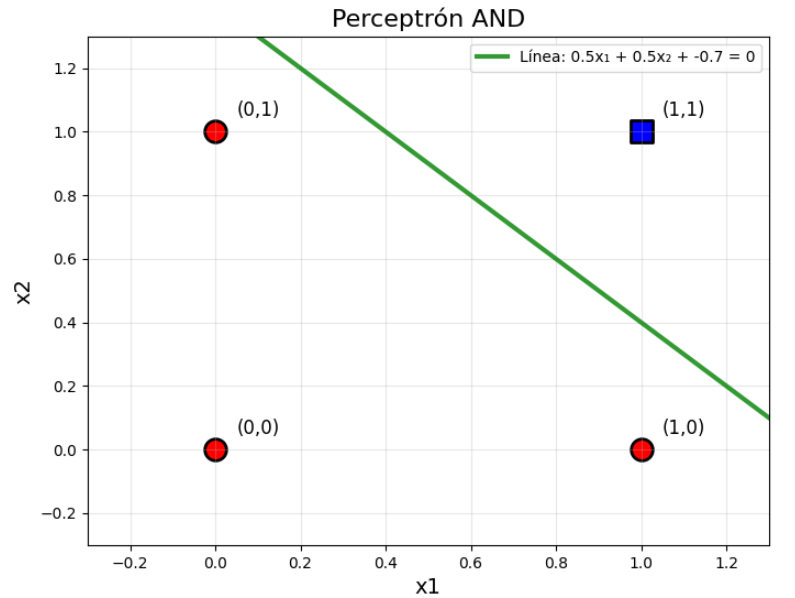

Como se puede observar, la línea verde es la representación del Perceptrón, la ecuación de una línea, puede separar correctamente las 2 clases True y False para la operación AND, significando que sí nos permite representar esta parte de la lógica.

Posteriormente se intentó representar la operación OR obteniendo estos resultados:

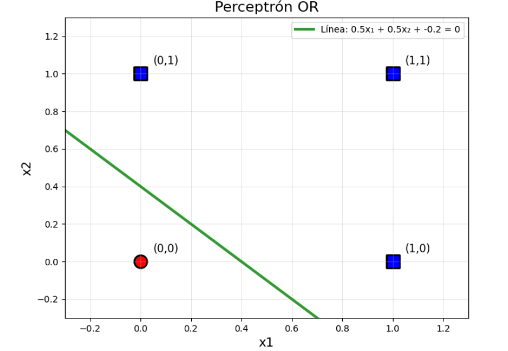

Nuevamente podemos concluir que la línea verde separa correctamente las clases True y False para la operación OR, ya que todos aquellos puntos con al menos 1 positivo caen como TRUE, y el único False con el caso (0,0) en False.

También se representó la operación NOT, obteniendo estos resultados:

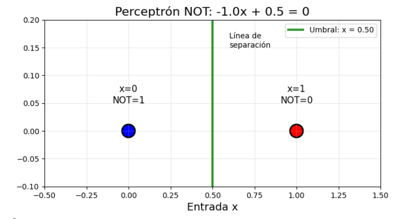

Como se puede observar, el perceptrón divide correctamente las clases, con una línea verde vertical que separa el NOT 0 (que sería True) y el NOT 1 (que sería False).

Por último, se intentó representar la operación lógica de XOR, llegando a estos gráficos:

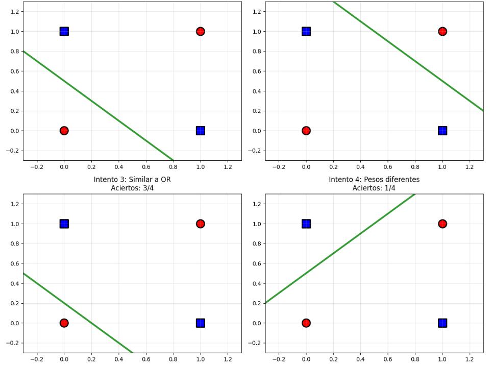

Se realizaron 4 intentos: un Perceptrón similar al AND, un AND estricto, uno similar a un OR, e incluso con distintos pesos, pero todos los gráficos no pudieron representar correctamente la operación XOR.

### MLP
A partir del anterior problema, se intentó observar si era posible llegar a la representación de la operación XOR usando una red neuronal con MLP.

La red implementada tiene 1 capa de entrada, 1 oculta, y por último una salida; las entradas son x1 y x2 (dos valores que representan x1 XOR x2), y la salida es el XOR de dichos valores.

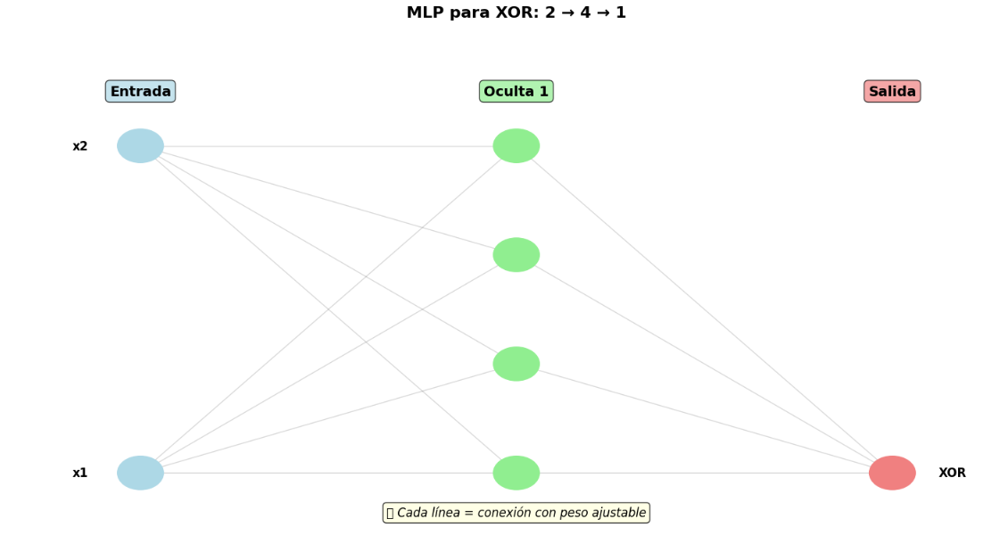

Por último, se probó en comparativa con el Perceptrón si este sí era capaz de representar la operación, llegando a estos resultados:

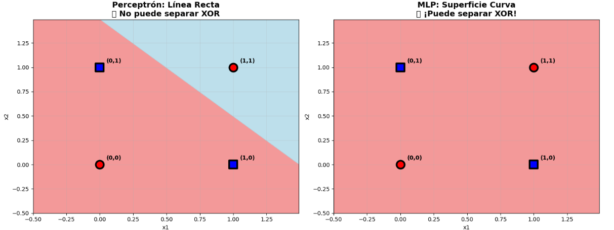

Podemos observar claramente que el Perceptrón no fue capaz de hacer una correcta separación de las clases para la operación, mientras que MLP sí.

### Dataset Real
Por último, se realizó un MLP con un Dataset Real para llegar a observaciones que se puedan ver en el mundo.

Utilizando make_classification se realizó un Dataset con 1000 ejemplos, 20 features, y 2 clases para probar.

Llegando a estos resultados con el MLP:

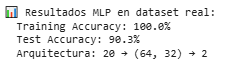

Se realizaron redes neuronales profesionales con TensorFlow, llegando a estas otras estadísticas utilizando el mismo dataset:

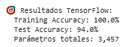

Viendo sobre este las gráficas de aprendizaje que pueden llegar a demostrar un overfitting:

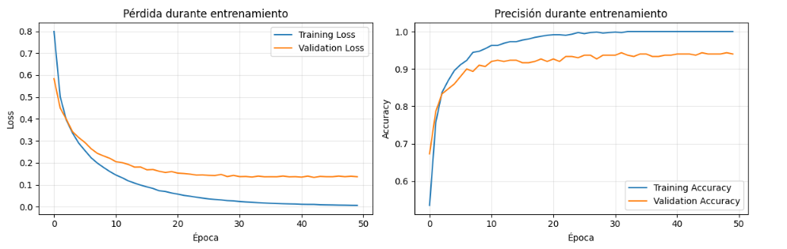

También se creó un modelo con PyTorch Lightning, a partir del cual se llegaron a estas métricas:

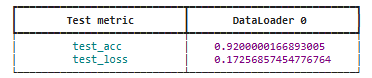

Y finalmente se realizó una comparativa por medio de observar las diferencias en las matrices de confusión de cada modelo:

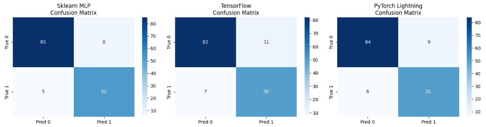

## Evidencias
[Collab](https://colab.research.google.com/drive/1mjdINA4M1QP2ziglYKkk1w-qe7X_tjDP?usp=sharing)

## Reflexión

### ¿Por qué AND, OR y NOT funcionaron pero XOR no?

Una línea recta en un plano puede separar los casos positivos de los negativos de AND, OR y NOT, pero no de XOR. Esto se debe a que, sin importar dónde se coloque la recta, siempre se obtendrá algún valor incorrecto, como se observa en los gráficos. Los puntos (0,1) y (1,0), que son los casos positivos, se encuentran entre los casos (0,0) y (1,1), lo que provoca que siempre haya al menos un caso predicho incorrectamente si se intenta predecir los casos positivos.

### ¿Cuál es la diferencia clave entre los pesos de AND vs OR?

La diferencia es que el AND necesita un umbral más alto para activarse, ya que solamente se activará cuando ambos son positivos. Mientras que en el OR, mientras al menos uno de los 2 sea positivo, ya se activa.

### ¿Qué otros problemas del mundo real serían como XOR?

- Prendido o Apagado
- Hombre o Mujer
- Vivo o Muerto
- Enfermo o Sano

### ¿Por qué sklearn MLP puede resolver XOR pero un perceptrón no?
Debido a que MLP permite representar una curva sobre el plano, la cual captura los puntos (0,1) y (1,0), sin tener que predecir incorrectamente (1,1) y (0,0). Gracias a las múltiples capas.

### ¿Cuál es la principal diferencia entre TensorFlow/Keras y sklearn MLP?
Un TensorFlow solo puede crear una única línea de decisión, mientras que un MLP con capas ocultas puede crear superficies de decisión.

### ¿Por qué TensorFlow usa epochs y batch_size mientras sklearn MLP no?
TensorFlow procesa los datos en lotes (batches) y múltiples iteraciones (epochs), mientras que sklearn MLP generalmente procesa todos los datos a la vez en cada iteración.

### ¿Cuándo usarías sigmoid vs relu como función de activación?
Sigmoid se usa en la capa de salida para clasificación binaria, mientras que ReLU se usa en capas ocultas.

### ¿Qué ventaja tiene PyTorch Lightning sobre TensorFlow puro?
PyTorch Lightning reduce el código boilerplate, organizando el flujo de entrenamiento, validación y test, lo que facilita experimentación rápida y hace que el código sea más limpio y mantenible.

### ¿Por qué PyTorch Lightning separa training_step y test_step?
Porque el comportamiento durante entrenamiento y evaluación es distinto:
En training_step se calcula la pérdida y se aplican gradientes (backprop).
En test_step o validation_step solo se evalúa el modelo sin modificar los pesos.

### ¿Cuál framework elegirías para cada escenario?

Prototipo rápido: SkLearn MLP
Modelo en producción: TensorFlow
Investigación avanzada: PyTorch

### ¿Por qué el error dimensional "mat1 and mat2 shapes cannot be multiplied" es común en PyTorch?
Sucede cuando las dimensiones de entrada del dataset no coinciden con la primera capa del modelo. Siempre hay que asegurar que input_size de la primera capa lineal coincida con el número de features de tus datos.

### ¿Qué significa el parámetro deterministic=True en PyTorch Lightning Trainer?
Garantiza reproducibilidad entre ejecuciones, evitando que resultados cambien por operaciones de CUDA u optimizadores.

### ¿Por qué TensorFlow muestra curvas de loss y val_loss durante entrenamiento?
loss indica cómo aprende el modelo en entrenamiento y val_loss en validación. Comparando ambas se puede detectar overfitting: si loss baja y val_loss sube, el modelo se está ajustando demasiado a los datos de entrenamiento.

### ¿Cuál es la diferencia entre trainer.test() y trainer.predict() en PyTorch Lightning?
* trainer.test(): devuelve métricas y calcula pérdidas sobre un dataset de test.
* trainer.predict(): devuelve solo las predicciones sin calcular métricas.

### ¿Por qué sklearn MLP es más fácil pero menos flexible?
Es más simple porque maneja automáticamente entrenamiento, optimización y evaluación, pero pierdes flexibilidad para:
- Personalizar capas y forward pass
- Controlar ciclos de entrenamiento
- Integrar callbacks complejos o métodos avanzados de regularización

## Referencias
- https://juanfkurucz.com/ucu-ia/ut2/07-mlp-activaciones/
- https://pytorch-lightning.readthedocs.io/
- https://scikit-learn.org/stable/modules/generated/sklearn.neural_network.MLPClassifier.html
- https://www.tensorflow.org/guide
- https://keras.io/api/optimizers/