<link rel="stylesheet" href="../custom.css">

# Maximizando la precisión
## 2025-10-12

## Contexto
CIFAR-10 es un dataset con 50,000 imágenes de entrenamiento, 10,000 de test, y 10 clases. Este dataset será de ayuda para la evaluación de mejores configuraciones y uso de optimizadores para llegar a la mayor accuracy posible en la clasificación de estas imágenes.

## Objetivos

- Aprender las configuraciones posibles
- Cargar y aplicar un modelo sobre los datos
- Maximizar la accuracy al probar distintas configuraciones
- Interpretar resultados y llegar a ciertas observaciones

## Actividades (con tiempos estimados)

- Elaboración inicial y entendimiento del dataset — 35 min  
- Exploración de posibilidades de configuración — 1h 20 min  
- Elaboración de código final — 30 min  
- Documentación de los hallazgos — 30 min  

## Desarrollo y Observaciones
Se comenzó con una implementación básica de un modelo con TensorFlow para a partir de los datos clasificar dichas imágenes, y observar un accuracy inicial usando ReLU y Adam como optimizador.

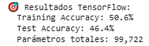

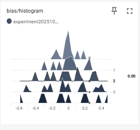

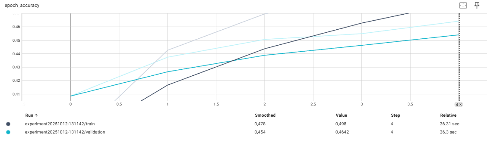

Posteriormente se realizaron múltiples experimentos para hallar las mejores configuraciones posibles.

### Número de capas y neuronas
Se experimentó viendo las métricas de accuracy para modelos con capas de 1-5 y 64-2048 neuronas, viendo todas las combinaciones.

Con ello se llegaron a estas métricas:

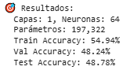

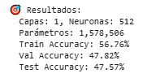

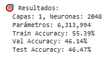

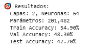

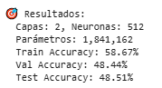

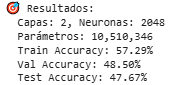

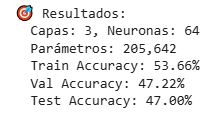

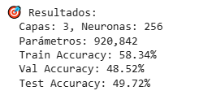

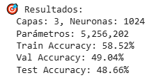

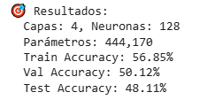

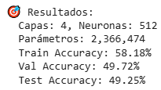

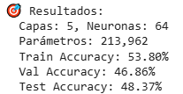

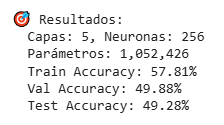

Con una tabla final de los resultados, mostrando para cada experimento la accuracy en val y test:

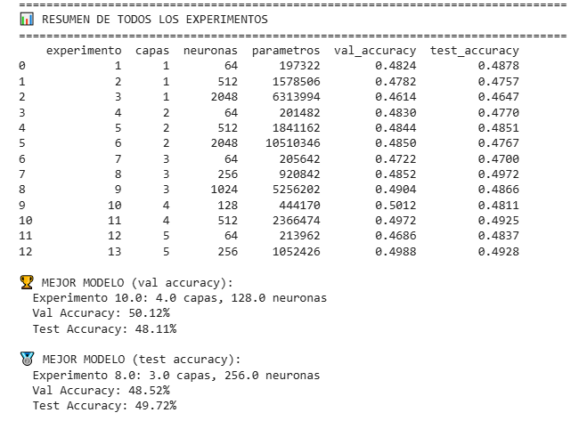

Si bien se observa que el mejor modelo fue el de 3 capas con 256 neuronas, se decidió para el modelo final que está al final de esta sección utilizar 5 capas con 256 neuronas, ya que es el segundo con mejor test_accuracy y demora unas 3 veces menos en tiempo que con 3 capas, además de que la diferencia no es muy elevada.

### Funciones de activación

Se probó utilizar 3 funciones de activación distintas para ver si había alguna mejora en el accuracy, obteniendo estas métricas para relu, gelu, y tanh:

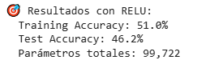

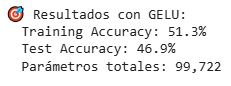

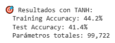

Se puede observar que la única diferencia relevante que se puede observar es de Tanh, que posee la mayor diferencia de accuracy frente a ReLU y GELU que están muy reñidos.

No aparenta ser una selección realmente relevante entre estas últimas dos, sus resultados son demasiado similares para llegar a otra conclusión.

### BatchNorm

Se probó utilizar BatchNorm y no utilizarlo, surgieron estas métricas:

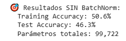

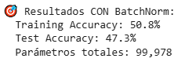

Se puede observar una ligera mejora usando el BatchNorm.

### Learning rate, Beta-1 y Beta-2

Se realizaron distintas combinaciones de learning rate, beta-1 y beta-2 para comparar su accuracy y ver si había alguno óptimo:

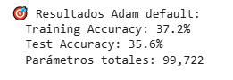

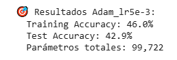

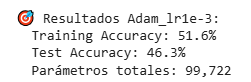

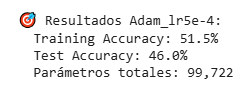

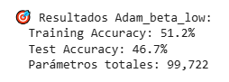

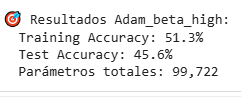

Se vio que el mejor accuracy fue con LR: 0.001, beta1: 0.8, beta2: 0.888, aunque tampoco pareció a primera idea una diferencia demasiado relevante.

### SGD con momentum/Nesterov

Se probó SGD con distintos momentum y con/sin Nesterov:

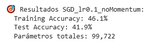

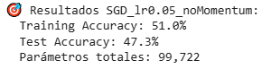

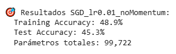

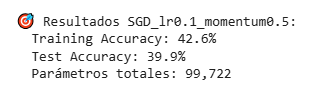

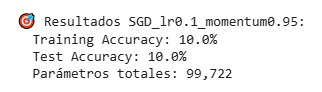

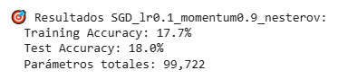

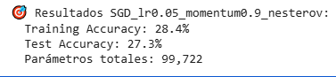

En general los resultados fueron muy negativos, no se vio tampoco una combinación que realmente diera una mejora en el accuracy.

### EarlyStopping

Se probaron distintas combinaciones de EarlyStopping, algunas monitoreando el accuracy y otras el loss, con distintos valores de paciencia, y con restore_best_weights:

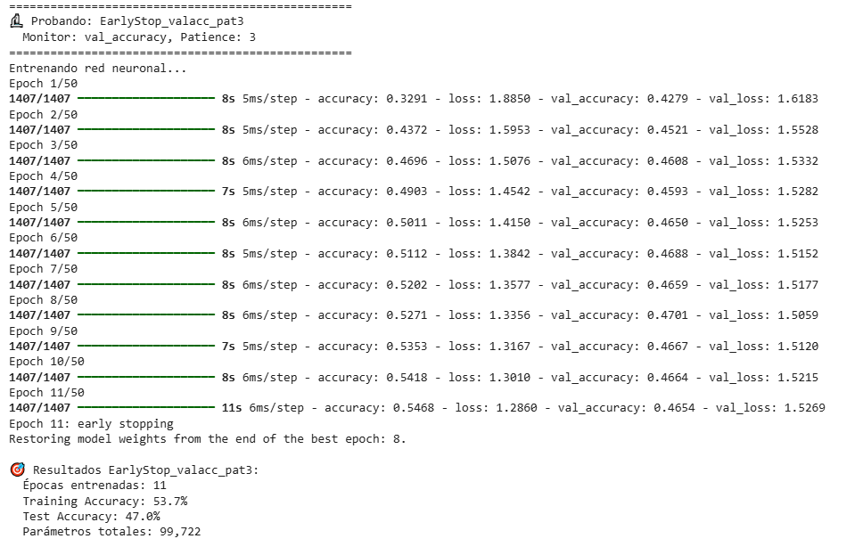

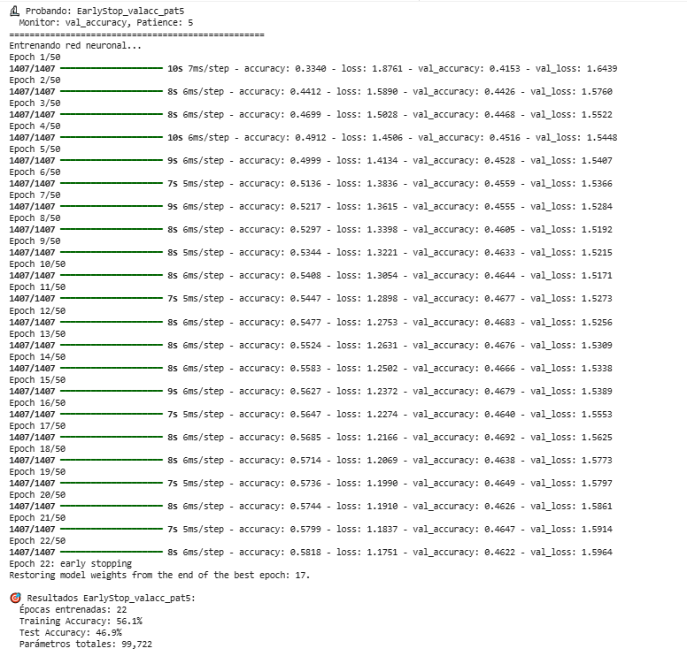

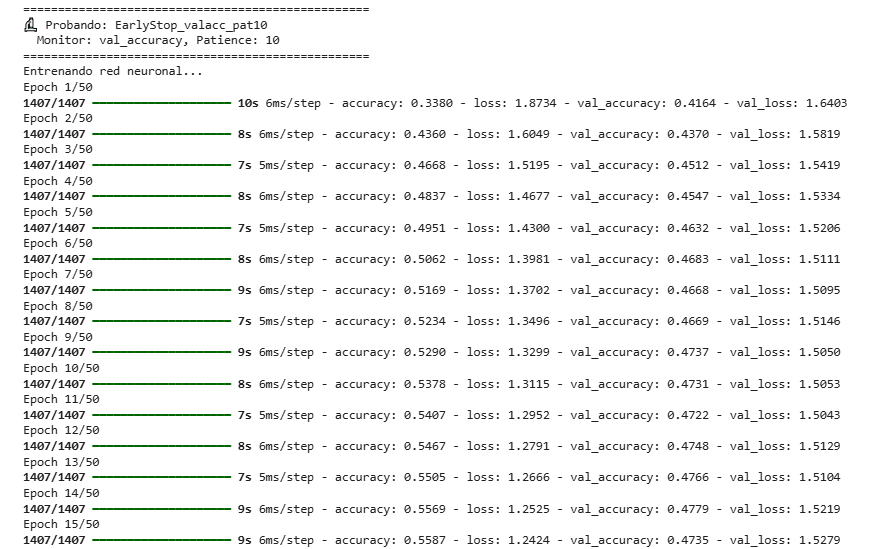
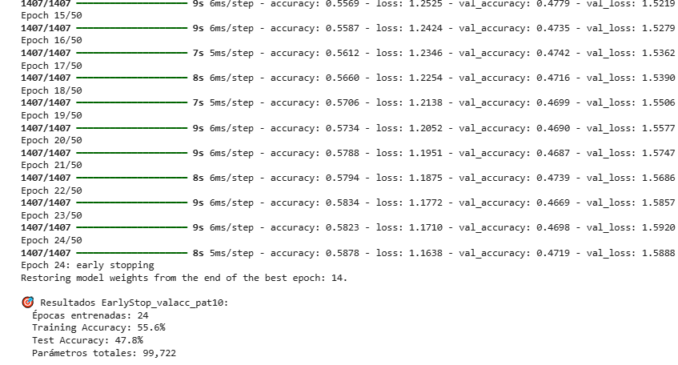

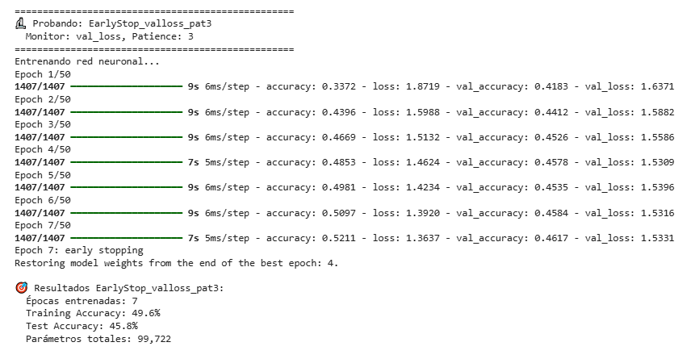

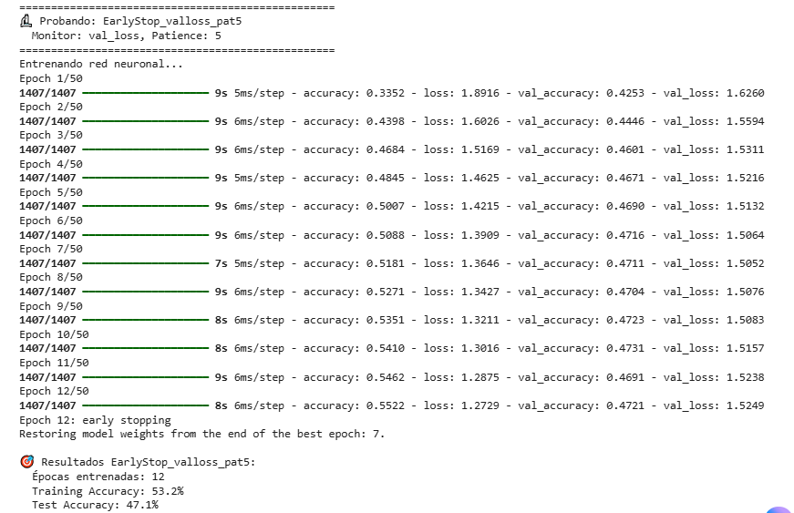

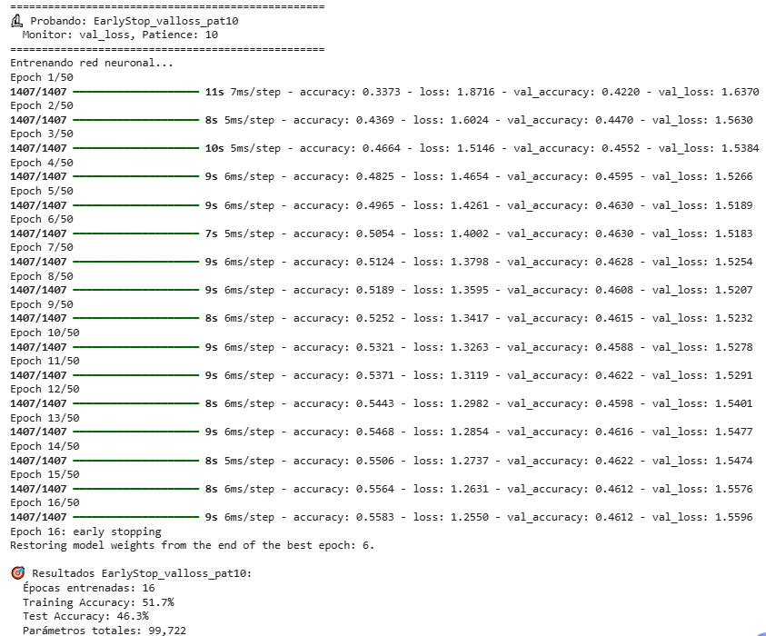

De los resultados se puede interpretar que la mejor accuracy obtenida fue la de la combinación de paciencia 10, con un monitor de val_accuracy, que la mejor accuracy fuera de un modelo con EarlyStopping según dicho valor puede parecer ser coherente como una observación inicial.

### ReduceLROnPlateau

Se probaron distintas combinaciones de factor, y paciencia para el ReduceLR:

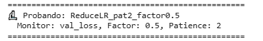
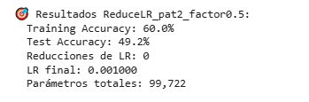

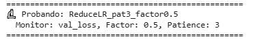
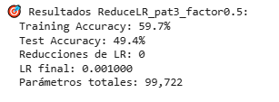

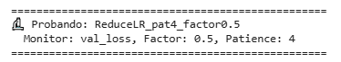
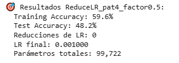

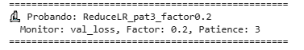
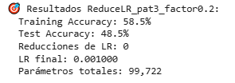

Se puede ver una mejora en el accuracy con respecto al inicial, el mejor entre todos estos resultados es el de ReduceLR con 0.5 factor y 3 de paciencia.

### Configuración Final
Por último se probó también el uso de un initializer de he_normal, un dropout rate de 0.3 y una regularización 1e-4 que también mejoraron la accuracy del modelo final, para este último modelo se tomaron todas las configuraciones que resultaron en una mejora de los anteriores pasos llegando a:
- MEJOR_NUM_CAPAS = 5
- MEJOR_NEURONAS = 256
- MEJOR_ACTIVACION = 'relu'
- MEJOR_OPTIMIZADOR = 'adam'
- MEJOR_LEARNING_RATE = 0.001
- MEJOR_BATCH_SIZE = 32
- USAR_BATCHNORM = True
- DROPOUT_RATE = 0.3
- L2_REGULARIZATION = 1e-4
- INITIALIZER = 'he_normal'

Al aplicar todas estas configuraciones se llegó al mejor resultado en accuracy con diferencia con un 56.79% de accuracy en el testing.

## Evidencias
[Collab](https://colab.research.google.com/drive/1bmeVSEHH-LtNvBorqApawAZrx236idsw?usp=sharing)

## Reflexión
- Encontrar la configuración óptima requiere balancear múltiples factores, no solo maximizar el accuracy
- Las mejoras incrementales de cada técnica se acumulan para lograr una ganancia significativa final
- El tiempo de entrenamiento es un factor práctico crucial que puede justificar elegir configuraciones subóptimas en accuracy
- Experimentar sistemáticamente con cada componente por separado permite entender su contribución real al rendimiento
- La regularización y técnicas como BatchNorm demostraron ser tan importantes como la arquitectura misma
- No existe una solución universal, la configuración ideal depende del balance específico entre precisión, velocidad y recursos disponibles

## Referencias
- https://juanfkurucz.com/ucu-ia/ut2/08-backpropagation-optimizadores/
- https://www.tensorflow.org/api_docs/python/tf/keras/layers/Dense
- https://www.tensorflow.org/api_docs/python/tf/keras/activations 
- https://www.tensorflow.org/api_docs/python/tf/keras/activations/gelu
- https://www.tensorflow.org/api_docs/python/tf/keras/layers/Dropout
- https://www.tensorflow.org/api_docs/python/tf/keras/regularizers/l2
- https://www.tensorflow.org/api_docs/python/tf/keras/initializers
- https://www.tensorflow.org/api_docs/python/tf/keras/optimizers/Adam
- https://www.tensorflow.org/api_docs/python/tf/keras/optimizers/SGD
- https://www.tensorflow.org/api_docs/python/tf/keras/callbacks/EarlyStopping
- https://www.tensorflow.org/api_docs/python/tf/keras/callbacks/ReduceLROnPlateau
- https://www.tensorflow.org/api_docs/python/tf/keras/callbacks/ModelCheckpoint