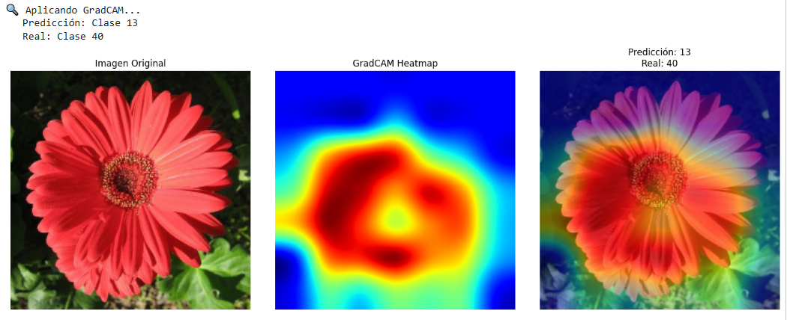
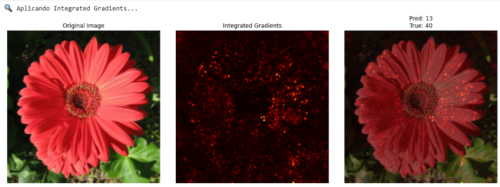

## Contexto

En esta actividad se trabajó con el dataset Oxford Flowers 102, un conjunto de imágenes que contiene **102 clases de flores** con alta variabilidad de color, forma y entorno.

El objetivo fue aplicar Transfer Learning utilizando un modelo preentrenado en ImageNet (MobileNetV2) para clasificar las imágenes incorporando además técnicas de data augmentation y de interpretabilidad mediante **GradCAM** e **Integrated Gradients**.

## Objetivos

- Cargar y preparar el dataset Oxford Flowers 102
- Aplicar data augmentation para mejorar la generalización
- Implementar un modelo basado en MobileNetV2 congelado
- Entrenar el modelo y evaluar su desempeño en validación y test
- Aplicar GradCAM e Integrated Gradients para visualizar la atención del modelo
- Analizar los resultados y proponer mejoras

## Actividades (con tiempos estimados)

- Exploración y preprocesamiento del dataset — 25 min
- Implementación del modelo con MobileNetV2 — 35 min
- Entrenamiento y evaluación — 40 min
- Aplicación de GradCAM e Integrated Gradients — 30 min
- Documentación de resultados y conclusiones — 30 min

## Desarrollo

### Preparación de datos

- Las imágenes fueron **redimensionadas a 224×224 píxeles** y normalizadas en el rango [0,1].
- Las etiquetas se codificaron mediante *one-hot encoding*.
- Se realizó una división del dataset en:
  - **Entrenamiento:** 80%
  - **Validación:** 10%
  - **Prueba:** 10%

Se aplicaron técnicas de **data augmentation**:
- Rotaciones aleatorias
- Zoom
- Traslaciones horizontales y verticales
- Flips horizontales

### Modelo: Transfer Learning con MobileNetV2

Se utilizó la arquitectura MobileNetV2 preentrenada en ImageNet, configurada como extractor de características.

**Configuración del modelo:**
- MobileNetV2(include_top=False, weights='imagenet') 
- Capas añadidas:
  - GlobalAveragePooling2D()  
  - Dense(102, activation='softmax')  
- Capas base congeladas (fine-tuning en false)  
- Optimizador: Adam (lr=0.001) 
- Pérdida: categorical_crossentropy 
- Épocas: 6 
- Tamaño de batch: 32  

## Resultados

El entrenamiento se realizó durante 6 épocas, y se observó un desempeño bajo, indicando que el modelo no logró generalizar correctamente.

| Conjunto | Accuracy | Loss |
|-----------|-----------|------|
| Entrenamiento | ~14% | — |
| Validación | ~5% | — |
| Test | 5.20% | 4.6937 |

### Observaciones

- El accuracy en entrenamiento fue bajo, sin indicios de sobreajuste.  
- El modelo se mantuvo cercano al rendimiento aleatorio (~1%), lo que sugiere subajuste severo.  
- El congelamiento completo de MobileNetV2 impidió la adaptación de las características a las flores del dataset.

## Análisis

Las causas principales del bajo rendimiento fueron:

1. Modelo completamente congelado, sin fine-tuning.  
2. Gran número de clases (102) y alta variabilidad dentro del dataset.  

### Propuestas de mejora

- Realizar **fine-tuning** descongelando las últimas capas convolucionales.
- Ajustar la tasa de aprendizaje a valores más bajos. 

## Explainability: GradCAM e Integrated Gradients

Se aplicaron dos técnicas para analizar qué regiones de las imágenes influían más en las predicciones:

### Ejemplo GradCAM

La visualización muestra que el modelo enfocó correctamente su atención en la flor, aunque la predicción fue incorrecta.  
Esto indica que, aunque el modelo detecta regiones visualmente relevantes, no logra distinguir entre clases con características similares.

### Ejemplo Integrated Gradients

El mapa resalta principalmente los pétalos, lo que confirma que el modelo usa zonas visualmente coherentes para tomar decisiones, aunque la clasificación final no sea correcta.

## Conclusión

El modelo **MobileNetV2 congelado** obtuvo un **accuracy de 5.2% en el conjunto de prueba**, evidenciando una **falta de aprendizaje efectivo**.

Sin embargo, la práctica fue valiosa para:
- Comprender el flujo de trabajo de **Transfer Learning**  
- Reconocer la importancia del **fine-tuning**  
- Aplicar y entender herramientas de **Explainability**

Para mejorar el desempeño, se sugiere descongelar capas finales, extender el entrenamiento y ajustar hiperparámetros.  
Aun con bajo rendimiento, se cumplieron los objetivos didácticos del ejercicio.

Como punto extra se probo a poner el 

---

## Reflexión Final

### 1. Data Augmentation
El *data augmentation* no mejoró significativamente la accuracy, posiblemente porque el modelo no llegó a aprender patrones robustos debido al bajo número de épocas y al congelamiento total de la red base.  
Sin embargo, estas transformaciones son útiles para evitar sobreajuste y mejorar la generalización cuando el modelo logra entrenar adecuadamente.

### 2. GradCAM
En los ejemplos analizados, el modelo miró las partes correctas (los pétalos), pero aún así falló la predicción.  
Esto demuestra que el modelo identifica regiones visualmente relevantes, pero no logra diferenciarlas entre clases muy similares, algo común en datasets con muchas categorías visualmente parecidas.

### 3. Errores del Modelo
El ejemplo mostrado (predicción: clase 13, real: clase 40) ilustra un caso donde el modelo se enfoca en la flor correcta, pero la representación interna no es suficiente para distinguir especies con forma o color similares.  
GradCAM ayudó a entender que el error no proviene de mirar el fondo, sino de una confusión semántica entre clases.

### 4. Aplicación Práctica
En una aplicación de identificación de flores, la interpretabilidad es esencial para que el usuario confíe en el sistema.  
Si un modelo predice sin explicación, puede dar resultados erróneos o inconsistentes, afectando su credibilidad y utilidad práctica (por ejemplo, confundir una flor venenosa con una inofensiva).

### 5. Mejoras
Si se contara con más tiempo y recursos, se podrían implementar:
- **Fine-tuning** parcial de capas superiores.  
- **Más épocas de entrenamiento** con *early stopping*.  
- **Reducción del learning rate**.  
- **Aumento del dataset** o uso de *pretraining específico* en datasets de flores.  

---

## Evidencias
[Collab](https://colab.research.google.com/drive/1F5PgokqJ0G---ECYMXUQc7H0JLXEc4Z_?usp=sharing)

## Referencias

- https://www.tensorflow.org/tutorials/images/data_augmentation?hl=es-419
- https://juanfkurucz.com/ucu-ia/ut3/10-data-augmentation-xai-assignment
- https://www.robots.ox.ac.uk/~vgg/data/flowers/102/  
