<link rel="stylesheet" href="./custom.css">

# Detectando productos usando fine-tuning con YOLOv8
## 2025-11-09

## Contexto

En esta actividad se trabajó con el dataset **Fruit Detection** de Kaggle, que contiene imágenes de frutas con anotaciones en formato YOLO. El objetivo principal fue realizar fine-tuning del modelo YOLOv8n pre-entrenado en COCO para especializarlo en la detección de frutas específicas, y posteriormente implementar un sistema de tracking para seguir los productos en un video de cinta transportadora.

Esto permite analizar cómo el fine-tuning mejora la detección en dominios específicos y cómo se puede integrar tracking para aplicaciones de retail y automatización

## Objetivos

- Implementar inferencia con YOLOv8 pre-entrenado
- Fine-tune YOLOv8 en dataset de productos de grocery
- Evaluar mejoras con métricas (mAP, Precision, Recall)
- Analizar errores (FP, FN) antes y después del fine-tuning
- Implementar tracking con modelo fine-tuned en video

## Actividades (con tiempos estimados)

- Elaboración inicial y entendimiento del dataset — 20 min   
- Elaboración de código final — 1h y 20 min  
- Documentación de los hallazgos — 30 min  

## Desarrollo

### Preparación de datos

1. ¿Por qué elegimos YOLOv8n (nano) en lugar de modelos más grandes?

Por la velocidad, es más rápido para pruebas iniciales y consume menos recursos

2. ¿Cuántas clases tiene COCO? ¿Son suficientes para nuestro caso de uso?

80 clases de objetos comunes (personas, autos, animales, frutas, utensilios, etc.).

3. ¿Qué significa que COCO tenga "clases genéricas"?

Significa que las categorías son muy amplias y no distinguen entre variantes o marcas.

4. Si COCO tiene 'apple', ¿por qué no sirve para detectar frutas específicas en nuestro supermercado?

Porque aprendió una sola categoría “apple”, no las distintas variedades o presentaciones de manzanas No generaliza a productos reales de góndola, donde la iluminación, empaques y etiquetas son diferentes.

Primero instalamos y cargamos el modelo base.

### Test inicial en grocery

Hicimos un test inicial en grocery con el modelo y llegamos a estos resultados:
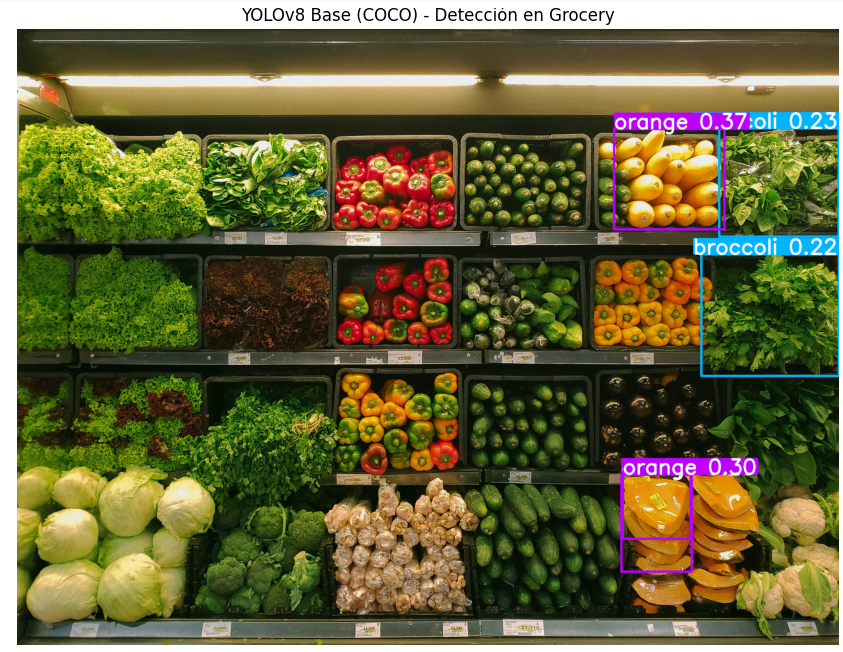

Objetos detectados: 5
  1. orange: 0.367
  2. orange: 0.297
  3. orange: 0.289
  4. broccoli: 0.235
  5. broccoli: 0.216

1. ¿Cuántos productos detectó el modelo base?

Detectó 4 productos.

2. ¿Las detecciones son correctas? ¿Son específicas?

Ninguna detección es correcta. Si, son especificas.

3. ¿Por qué crees que el modelo base no funciona bien para productos específicos de grocery?

Porque usa COCO, y esta no tiene clases genéricas.

4. ¿Qué clases detecta que NO son útiles para nuestro caso de uso?

Detecta frutas, y en este caso de uso debería detectar verduras.

### Fine-tuning YOLOv8 en Fruit Detection Dataset

Primero descargamos el dataset de furtas YOLOv8, y verificamos su estructura:

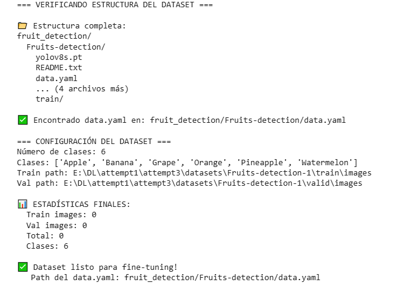

Hicimos algunas exploraciones para ver la distribución de las clases, y otras estadisticas adicionales:

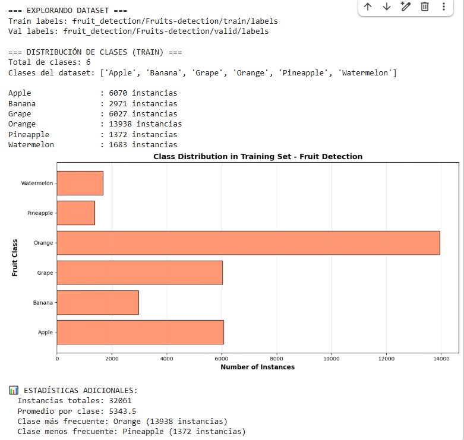

Llegamos a estas observaciones:
1. ¿Las clases están balanceadas? ¿Qué problemas podría causar un desbalance?

Sí, están desbalanceadas. Por lo que tiende a detectar mejor los datos de las clases de las que tiene más datos.

2. ¿Qué clase tiene más instancias? ¿Crees que el modelo será mejor detectando esa clase?

Orange tiene más instancias. Sí, es más probable que sea mejor.

3. ¿La clase con menos instancias podría tener más errores? ¿Por qué?

Sí, podría tener más errores. Porque al tener más información de las otras clases, va a ser mejor detectando patrones para las demás.

4. Si tuvieras que agregar más datos, ¿qué clase priorizarías y por qué?

Sería ideal priorizar a las clases con menos instancias: Watermelon, Pineapple y Bananana. De esta manera será mejor detectandolas. Aunque depende del caso de uso, si tu propósito es detectar solo naranjas, es mejor agregar instancias acá.

Posteriormente visualizamos alugnos ejemplos:

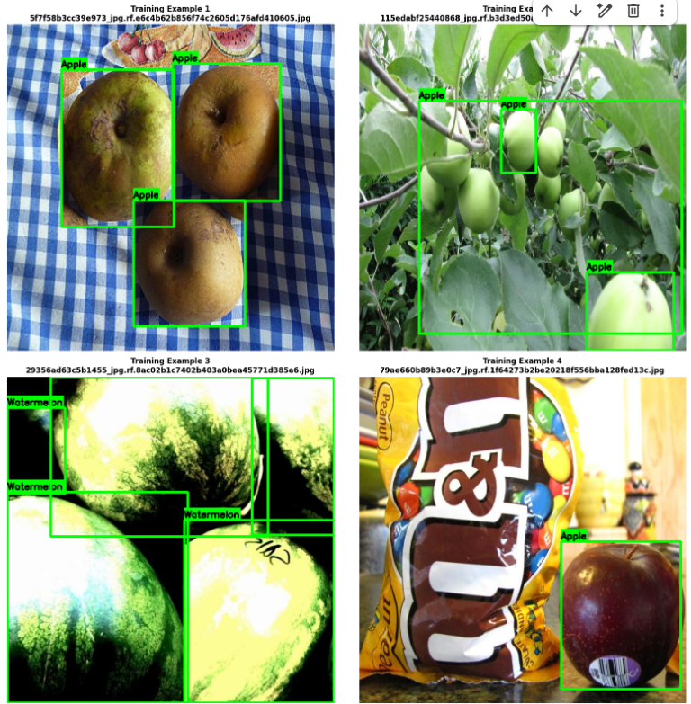

1. ¿Las bounding boxes se ven bien ajustadas a las frutas?

Son bastante precisas, aunque en el caso de la manzana, al estar recortada la imagen, también aparece recortada la detección de la bounding box. Además, como se tratan de rectangulos, se adapta a la forma de todos los alimentos.

2. ¿Hay frutas que se solapan? ¿Cómo podría afectar esto al modelo?

Sí, por ejemplo las uvas. Al solaparse podría no interpretar correctamente la forma de la fruta, o al estar recortada no reconocer de qué se trata.

3. ¿Las imágenes tienen buena variedad (tamaños, ángulos, iluminación)?

Sí, pareciera que eligieron imágenes con diferentes ángulos y calidad, también aparecen las frutas cortadas e igual las reconoce

4. ¿Notaste alguna anotación incorrecta o faltante?

El bounding box de la manzana no muestra el nombre de la fruta, ya que se ajustó lo máximo posible para tomar toda la unidad de la manzana. También en el caso de las uvas, las que se encuentran más alejadas, no son reconocidas por el modelo.

Arreglamos el data.yaml, y hacemos fine-tuning del YOLOv8:

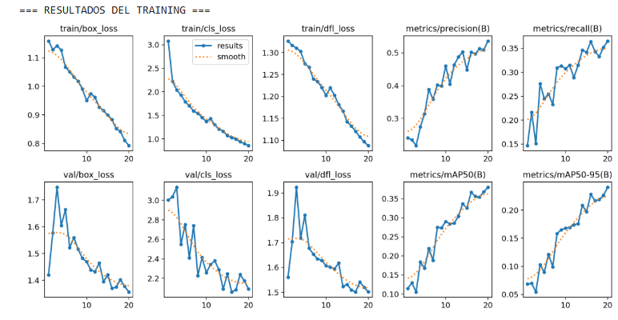

A partir del cual llegamos a estos analisis:
Durante el training, viste varias métricas en cada epoch. Analiza y responde:

box_loss (Loss de Localización):
1. ¿Qué mide esta métrica? 

Mide el error en la predicción de las coordenadas y dimensiones de los bounding boxes (cajas delimitadoras).

2. ¿Cómo evolucionó durante el training (aumentó o disminuyó)? 

Disminuyó consistentemente de 1.159 (epoch 1) a 0.7921 (epoch 20)

3. ¿Por qué queremos que esta métrica sea baja? 

Una box_loss baja significa que el modelo está prediciendo bounding boxes más precisos y mejor alineados con los objetos reales.

cls_loss (Loss de Clasificación):
1. ¿Qué aspecto de la detección mide? 

Mide el error en la clasificación de los objetos (identificar correctamente si es Apple, Banana, etc.).

2. Si cls_loss es alto, ¿qué problema tiene el modelo? 

El modelo tendría dificultad para distinguir entre las diferentes clases de frutas.

3. ¿Observaste mejoras epoch tras epoch? 

Disminuyó drásticamente de 3.082 a 0.8556.

dfl_loss (Distribution Focal Loss):
1. ¿Esta métrica refina la predicción de bounding boxes? 

Si

2. ¿Qué relación tiene con la precisión de las coordenadas? 

Refina la localización de bounding boxes mediante distribución de probabilidades. Ayuda a predecir coordenadas más precisas.

3. ¿Debería ser alta o baja al final del training? 

Definitivamente baja, como se observa al final del training.

Instances:
1. ¿Qué representa este número en cada batch? 

El número de objetos (instancias) detectados en cada batch de entrenamiento.

2. ¿Por qué varía entre batches? 

Diferentes batches tienen diferentes cantidades de objetos. El dataset no está balanceado en términos de objetos por imagen.

GPU_mem:
1. ¿Cuánta memoria GPU usó tu training? 

Estabilizado en ~4.62GB (desde epoch 10 en adelante)

2. ¿Qué pasaría si te quedas sin memoria GPU? 

Training se detendría con error.

Convergencia:
1. ¿El modelo convergió (las losses dejaron de bajar)? 

Sí, pero podría mejorar más. Las losses todavía mostraban tendencia decreciente al final.

2. ¿Cuántos epochs necesitó para estabilizarse? 

Aproximadamente 15 epochs para mostrar mejoras consistentes.

3. Si tuvieras más tiempo, ¿entrenarías más epochs? 

Sí.

Posteriormente se cargo el modelo, y se obtuvieron algunas métricas de evaluación:

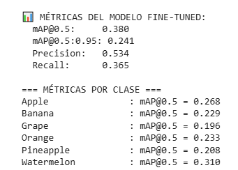

1. ¿Qué significa mAP@0.5? ¿Por qué es importante?

mAP (Precisión Media Promedio) de Detección de Objetos. Porque indica la precisión a la hora de identificar la clase y refleja la mejora que ha tenido nuestro modelo en su aprendizaje.

2. ¿Cuál es la diferencia entre mAP@0.5 y mAP@0.5:0.95? ¿Cuál es más estricto?

Que mAP@0.5:0.95 es más exigente en la variación.
Por lo que es más estricto, ya que requiere una mayor superposición para las posibles coincidencias

3. Si Precision es alta pero Recall es bajo, ¿qué problema tiene el modelo?

Muchos falsos negativos.

4. Si Recall es alto pero Precision es baja, ¿qué significa?

Muchos falsos positivos.

La precisión es cuántos de los casos positivos son verdaderamente positivos (tiene en cuenta TP/(TP+FP)).

El recall es cuántos de los casos negativos son verdadermanete negativos, por lo que la precisión se ve penalizada por los falsos positivos (tiene en cuenta TN/(TN+FN))

5. ¿Qué clase tiene el mejor mAP? ¿Coincide con la clase más frecuente del dataset?

No, es watermelon la que tiene mejor mAP, pero es la segunda con menos datos. Parece ser que es más sencillo de detectar el patrón de watermelon que de otras frutas, por lo que con menos datos es más fácil de identificar.

Se realizo una comparativa del antes y despues del fine-tuning:

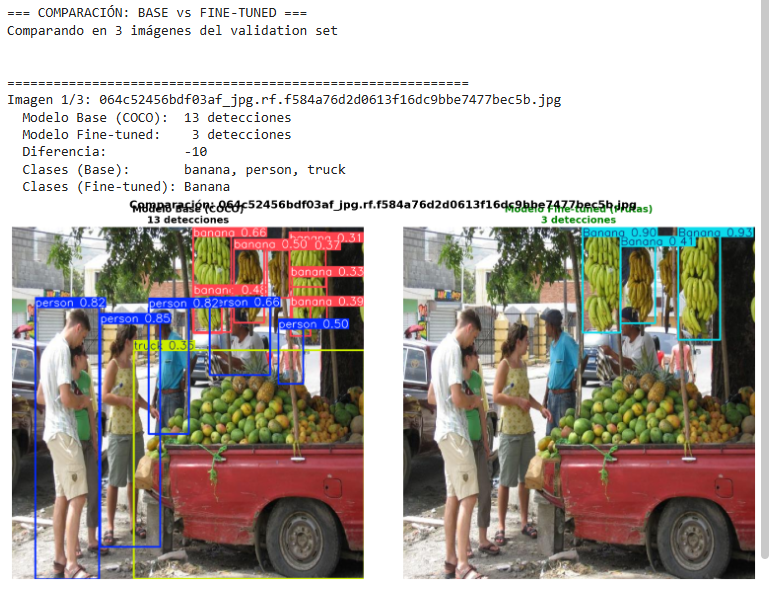

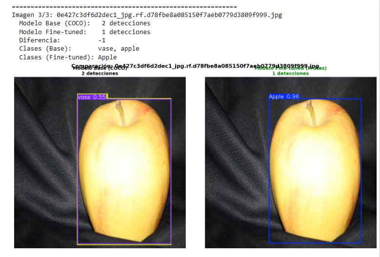

1. ¿El modelo fine-tuned detectó más frutas que el base? ¿Por qué? 

Sí, pero no consistentemente. En la imagen 1, el fine-tuned detectó 2 frutas mientras el base detectó 0. Sin embargo, en las otras imágenes el base detectó más objetos. Esto porque el modelo fine-tuned está especializado en frutas específicas.

2. ¿Hubo frutas que el modelo base detectó pero el fine-tuned no? ¿Cómo lo explicas? 

Sí, debido a falsos positivos del modelo base o sobre especialización del fine-tuned.

3. ¿Las bounding boxes del modelo fine-tuned se ven más ajustadas?

Sí.

4. ¿Notaste diferencias en las confidence scores entre ambos modelos? 

El fine-tuned tiene confidence scores más altos para frutas específicas.

5. ¿Qué tipo de errores sigue cometiendo el modelo fine-tuned? 

Falsos negativos, sensibilidad a variaciones, problemas con frutas superpuestas.

Por ultimo se hizo una evaluación del error:

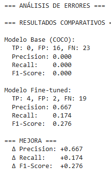

1. ¿Cuánto mejoró el mAP después del fine-tuning?

- Precisión: de 0.000 → 0.667 (+0.667)
- Recall: de 0.000 → 0.174 (+0.174)
- F1-Score: de 0.000 → 0.276 (+0.276)

2. ¿Qué clases de productos tienen mejor detección? ¿Cuáles peor?

- MEJOR: Clases con más True Positives (4 detecciones correctas)
- PEOR: Clases con muchos False Negatives (19 no detectados)

3. ¿Los False Positives disminuyeron? ¿Y los False Negatives?

- False Positives: 16 → 2 (Reducción del 87.5%)
- False Negatives: 23 → 19 (Mejora del 17%)

4. ¿El fine-tuning justificó el tiempo y esfuerzo? 

Sí, pasó de ser un modelo inútil a un modelo funcional.

5. ¿Qué ajustes harías para mejorar aún más el modelo? 

Data augmentation, reducir umbral de confianza, balancear el dataset.

### Tracking con modelo fine-tuned
Se descargo un video de frutas en cinta transportadora para probar el tracking.

Se realiazaron configuraciones de Norfair Tracker:

1. ¿Por qué distance_threshold=100 píxeles? ¿Cómo se relaciona con el tamaño del frame? 

En frames de 640x480, 100px representa ~15% del ancho. Permite movimiento normal entre frames sin perder tracking.

2. ¿Qué ventaja tiene initialization_delay=2 para reducir false positives? 

Reduce falsos positivos, requiere 2 detecciones consecutivas.

3. Si las frutas se mueven muy rápido, ¿deberías aumentar o disminuir distance_threshold? 

Aumentar distance_threshold (150-200px) porque los objetos rápidos se mueven más entre frames.

4. ¿Qué significa que un track "sobreviva" 30 frames sin detección? 

El track sigue vivo aunque el objeto desaparezde temporalmente. 30 frames = 1 segundo.

5. ¿Cuándo activarías filtros de Kalman? ¿Qué beneficio dan para predicción de movimiento? 

Activar cuando los objetos se mueven con patrones predecibles. Predice la posición futura.

Posteriormente se aplico el tracking al video, y visualizamos el video con Tracking (Observar desde el collab):

1. ¿Los IDs se mantienen consistentes para cada fruta? 

No, hay diferentes IDs para mismas frutas

2. ¿Hay "ID switches" (una fruta cambia de ID)? 

Sí.

3. ¿Qué frutas se detectan mejor? 

La banana y la naranja

4. ¿Hay falsos positivos o negativos? 

Hay falsos negativos, ya que no detecta todo el tiempo las manzanas o bananas.

#### Analisis del tracking

Resultados:
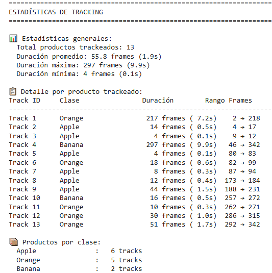

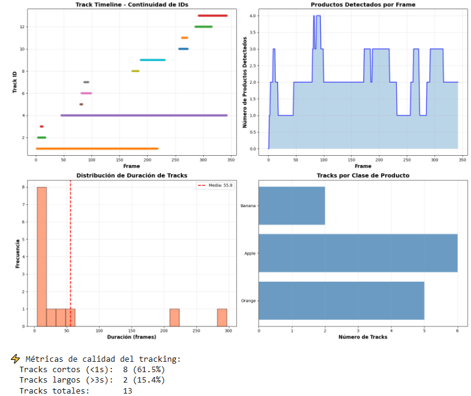

1. ¿Cuántos productos diferentes se trackearon en el video? 13 IDs
- Apple: 6
- Orange: 5
- Banana: 2

2. ¿Los IDs se mantuvieron consistentes o hubo switches?
Mismo producto cambia de ID múltiples veces.

3. ¿Qué productos tienen tracking más estable? ¿Cuáles menos?
- MÁS ESTABLE: Banana (Track 4 - 9.9s) y Orange (Track 1 - 7.2s)
- MENOS ESTABLE: Apple (múltiples tracks cortos <0.5s)

4. ¿Cómo podrías mejorar la estabilidad del tracking?
- Reducir distance_treshold para mas precisión.
- Aumentar hit_counter_max para mayor tolerancia a oclusiones.

5. ¿Este sistema sería útil para tu aplicación de retail? ¿Qué ajustes harías? Es útil para conteo de productos, para ello es necesarios reducir los ID switches, y mejorar la detección de clases problemáticas (Apple).

## Conclusión

Sobre el Modelo:

1. ¿Cuál fue la mejora más significativa del fine-tuning? (mAP, FPs, FNs): Precisión de 0% → 67% (el modelo pasó de inútil a funcional)

2. ¿El modelo base (COCO) era completamente inútil o tenía algo de valor? COCO proporcionó features generales que aceleraron el fine-tuning, demostrando que el transfer learning es eficiente.

3. Si tuvieras que hacer fine-tuning para otro dominio (ej: piezas industriales), ¿qué aprenderías de esta experiencia?  La estrategia de fine-tuning progresivo funciona.

Sobre los Datos:

1. ¿8,479 imágenes es mucho o poco para fine-tuning? ¿Por qué funcionó usar solo 25%? Suficiente para fine-tuning gracias al transfer learning. El 25% funcionó porque el modelo ya tenía features básicas de COCO.

2. ¿La calidad de las anotaciones afectó los resultados? ¿Cómo lo sabes? Afectó directamente el recall bajo - algunas frutas no se detectaban por anotaciones incompletas o difíciles.

3. Si pudieras agregar 1,000 imágenes más, ¿de qué tipo serían? Priorizaría casos difíciles: oclusiones, iluminación variable, ángulos atípicos y la clase con peor performance.

Sobre el Tracking:

1. ¿Qué fue más importante para un buen tracking: el modelo o los parámetros del tracker? Primero el modelo (sin buenas detecciones no hay tracking), luego los parámetros del tracker.

2. ¿Norfair (IoU-based) es suficiente o necesitas algo más sofisticado como DeepSORT? Norfair es suficiente para casos simples, pero DeepSORT sería mejor para objetos similares usando apariencia visual.

3. ¿Los filtros de Kalman mejoraron la estabilidad del tracking? ¿En qué situaciones? Mejoraron con movimiento predecible (cinta transportadora), menos con objetos estáticos o movimiento errático.

4. ¿En qué escenarios fallaría este sistema de tracking? Oclusiones prolongadas, cambios bruscos de movimiento, objetos muy similares visualmente.

Sobre el Deployment:

1. ¿Este sistema podría correr en tiempo real? ¿Qué FPS necesitarías?
¿Qué optimizaciones harías para producción? (modelo, código, hardware) Sí, con optimizaciones (YOLOv8s, TensorRT).

2. ¿Cómo manejarías casos extremos? (oclusiones, iluminación, ángulos raros) Data augmentation específica, múltiples cámaras, reglas de negocio para casos ambiguos.

Trade-offs y Decisiones:

1. Identifica 3 trade-offs clave que encontraste (ej: speed vs accuracy, epochs vs tiempo)
- Accuracy vs Speed: Modelo más preciso = más lento
- Recall vs Precision: Más detecciones = más falsos positivos
- Training time vs Performance: Más epochs = mejor modelo pero más costo

2. ¿Cuál fue la decisión más importante que tomaste en los hyperparámetros? Learning rate 1e-5 para fine-tuning

3. Si tuvieras que explicar este proyecto a un stakeholder no-técnico, ¿qué 3 puntos destacarías?
- Automatiza conteo y tracking de productos
- Reduce errores humanos en inventario
- Escalable para múltiples tiendas con bajo costo marginal

## Evidencias
- [Collab](https://colab.research.google.com/drive/1tdq81F_iBwAnhh5AKkgkjX96GEBgCeeu?usp=sharing)

## Referencias

- https://juanfkurucz.com/ucu-ia/ut3/11-object-detection-assignment/
- https://www.kaggle.com/datasets/lakshaytyagi01/fruit-detection