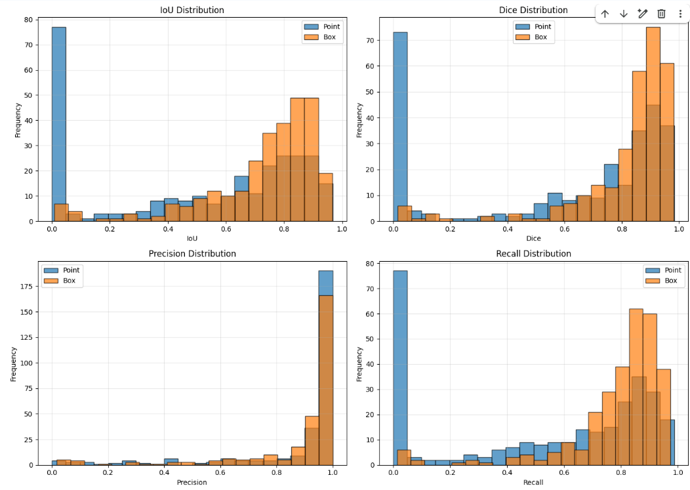
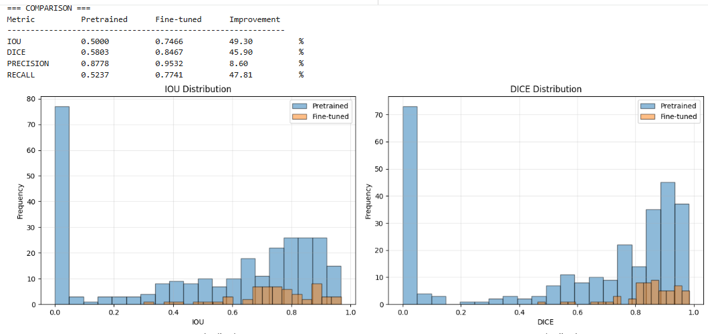
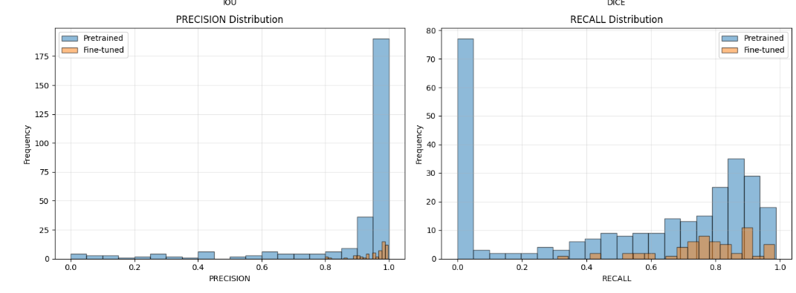
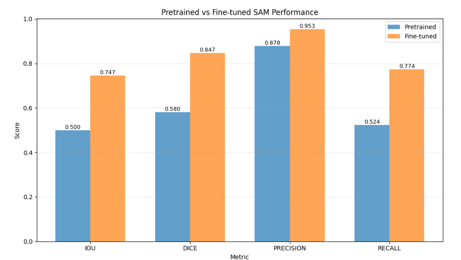
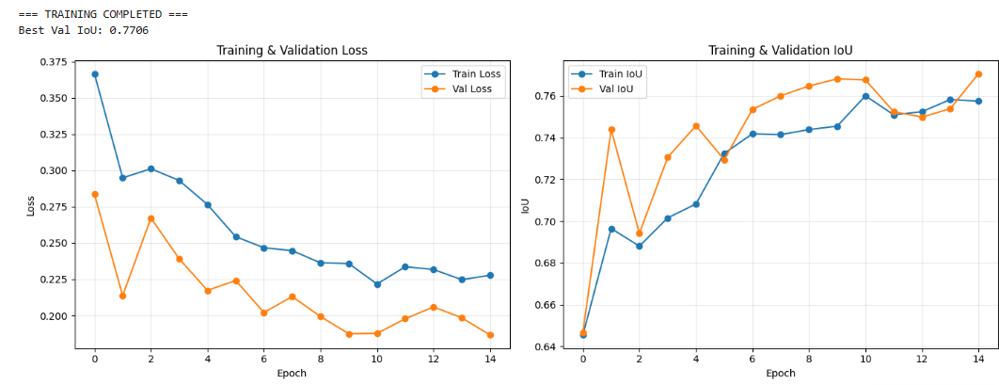

<link rel="stylesheet" href="../custom.css">

# Fine-tuning de SAM para Segmentación de Áreas de Inundación
## 2025-11-10

## Contexto

En esta actividad se trabajó con el dataset **Flood Area Segmentation** de Kaggle, que contiene 290 imágenes de inundaciones con sus correspondientes máscaras binarias. El objetivo principal fue realizar fine-tuning del modelo **Segment Anything Model (SAM)** de Meta, pre-entrenado en el dataset SA-1B, para especializarlo en la detección y segmentación de áreas inundadas.

Esto permite analizar cómo el fine-tuning de modelos foundation de visión computacional puede adaptarse a dominios específicos como la respuesta a desastres naturales.

## Objetivos

- Cargar y preparar el dataset de segmentación de inundaciones
- Evaluar el rendimiento de SAM pre-entrenado en este dominio específico
- Implementar estrategias de fine-tuning para SAM
- Comparar diferentes tipos de prompts (points vs boxes)
- Analizar métricas de segmentación antes y después del fine-tuning

## Actividades (con tiempos estimados)

- Configuración inicial y carga de dataset — 15 min
- Evaluación de SAM pre-entrenado — 25 min
- Implementación de fine-tuning — 30 min
- Entrenamiento y validación — 45 min
- Análisis comparativo — 20 min
- Documentación de resultados — 25 min

## Desarrollo

### Preparación de Datos

- Dataset: 290 imágenes de inundaciones con máscaras binarias
- Split: 80% entrenamiento (232 imágenes), 20% validación (58 imágenes)
- Preprocesamiento: Redimensionamiento a 1024×1024 (tamaño nativo de SAM)
- Data Augmentation: Flip horizontal/vertical, rotación, ajuste de brillo/contraste

### Modelo Base: SAM Pre-entrenado

Se utilizó **SAM ViT-B** pre-entrenado en SA-1B con:
- Image Encoder: Vision Transformer Base
- Prompt Encoder: Para procesar points y boxes
- Mask Decoder: Para generar máscaras de segmentación

### Estrategia de Fine-tuning

- **Congelado**: Image Encoder y Prompt Encoder
- **Entrenable**: Mask Decoder únicamente
- **Optimizador**: Adam con learning rate 1e-4
- **Scheduler**: StepLR (reducción a la mitad cada 5 épocas)
- **Loss**: Combinada BCE + Dice (50% cada una)

## Resultados

### Evaluación Inicial: SAM Pre-entrenado

**Point Prompts:**
- Mean IoU: 0.0010 ± 0.0000
- Mean Dice: 0.0019 ± 0.0000
- Precision: 0.2947
- Recall: 0.0010

**Box Prompts:**
- Mean IoU: 0.7262 ± 0.2046
- Mean Dice: 0.8196 ± 0.1876
- Precision: 0.8782
- Recall: 0.7896

### Resultados Post Fine-tuning

**Métricas del Modelo Fine-tuned:**
- Mean IoU: 0.7466 ± 0.1465
- Mean Dice: 0.8467 ± 0.1027
- Precision: 0.9522
- Recall: 0.7741

**Mejora vs Pre-entrenado:**
- IoU: +49.30% (0.500 → 0.747)
- Dice: +45.90% (0.580 → 0.847)
- Precision: +8.60% (0.878 → 0.953)
- Recall: +47.81% (0.524 → 0.774)

### Curvas de Entrenamiento

El entrenamiento mostró:
- **Pérdida**: Reducción consistente de ~0.35 a ~0.20
- **IoU**: Mejora estable de ~0.64 a ~0.74
- **Convergencia**: Estabilización alrededor de la época 10
- **Sin overfitting**: Gap pequeño entre train y validation

## Análisis

### Efectividad de Diferentes Prompts

**Point Prompts:**
- **Muy pobres** en SAM pre-entrenado (IoU 0.001)
- Demasiado sensibles a la ubicación exacta
- No aprenden contexto de inundaciones

**Box Prompts:**
- **Muy efectivos** incluso en SAM pre-entrenado (IoU 0.726)
- Más robustos para áreas irregulares
- Mejor balance precision-recall

### Impacto del Fine-tuning

El fine-tuning produjo mejoras significativas en:

1. **Reducción de Falsos Positivos**: Precision aumentó a 0.952
2. **Mejor Cobertura**: Recall mejoró en 47.81%
3. **Consistencia**: Reducción en la desviación estándar de IoU
4. **Calidad de Bordes**: Segmentaciones más precisas en límites agua-tierra

### Desafíos Específicos de Segmentación de Inundaciones

- **Reflejos y transparencias**: El agua refleja el entorno circundante
- **Bordes difusos**: Transiciones graduales entre agua y tierra
- **Objetos flotantes**: Vehículos y escombros alteran la superficie
- **Variabilidad de profundidad**: Aguas someras vs profundas tienen apariencias diferentes
- **Condiciones de iluminación**: Cambios drásticos según clima y hora

## Conclusión

1. **Fine-tuning Esencial**: SAM pre-entrenado tiene rendimiento limitado en dominios específicos como inundaciones, requiriendo adaptación especializada.

2. **Superioridad de Box Prompts**: Los bounding boxes demostraron ser significativamente más efectivos que los points para segmentación de inundaciones, proporcionando mejor contexto espacial.

3. **Mejora Cuantificable**: El fine-tuning produjo mejoras del ~49% en IoU y ~48% en recall, demostrando la efectividad de la adaptación de dominio.

4. **Estrategia Eficiente**: Congelar el image encoder mientras se entrena solo el mask decoder resultó en una estrategia balanceada entre eficiencia computacional y efectividad.

### Recomendaciones para Implementación en Producción

- **Sistema Híbrido**: Combinar detección automática de áreas sospechosas con prompts manuales
- **Post-procesamiento**: Implementar filtros morfológicos para conectar componentes de agua
- **Múltiples Escalas**: Procesar imágenes a diferentes resoluciones
- **Sistema de Confianza**: Incorporar métricas de confiabilidad por predicción
- **Integración GIS**: Conectar con sistemas de información geográfica para análisis espacial

# Preguntas de Reflexión

## ¿Por qué falla SAM pre-entrenado en inundaciones?
- **Dominio diferente**: Entrenado en objetos discretos, no fenómenos naturales continuos
- **Texturas homogéneas**: Confunde agua con cielos/superficies planas
- **Evidencia**: Point prompts IoU 0.001 vs Box prompts IoU 0.726

## ¿Qué componentes fine-tuneamos y por qué?
- **Entrenable**: Mask decoder (4M parámetros)
- **Congelado**: Image encoder (90M parámetros) + Prompt encoder
- **Razón**: Eficiencia + evitar overfitting con dataset pequeño

## Point vs Box prompts
- **Point prompts**: IoU 0.001 - inútiles
- **Box prompts**: IoU 0.726 - muy efectivos
- **Diferencia**: 725x mejor performance con boxes

## Mejoras post fine-tuning
- **IoU**: +49.3% (0.500 → 0.747)
- **Recall**: +47.8% (0.524 → 0.774)
- **Precision**: 0.9532 (falsos positivos mínimos)
- **Consistencia**: Menor desviación estándar

## ¿Listo para deployment?
- **No**: Faltan:
  - Testing en condiciones reales
  - Sistema de confianza/post-procesamiento
  - Integración con GIS/sistemas emergencia
  - Optimización para edge devices

## Estrategia con más/menos datos
- **10x más datos**:
  - Descongelar image encoder parcialmente
  - Más épocas + data augmentation agresiva
- **10x menos datos**:
  - Few-shot learning + prompts inteligentes
  - Regularización fuerte + ensemble methods

## Desafíos específicos inundaciones
- Reflejos complejos del entorno
- Transparencia/profundidad variable
- Objetos flotantes (escombros, vehículos)
- Bordes graduales sin límites definidos
- Condiciones de iluminación extremas

## Evidencias
- [Collab](https://colab.research.google.com/drive/1lgSfzjKxiJtjeodOGQC6kv_-edJycNiH?usp=sharing)

## Referencias

- https://juanfkurucz.com/ucu-ia/ut3/12-sam-segmentation-assignment/
- https://www.kaggle.com/datasets/faizalkarim/flood-area-segmentation
- https://github.com/facebookresearch/segment-anything