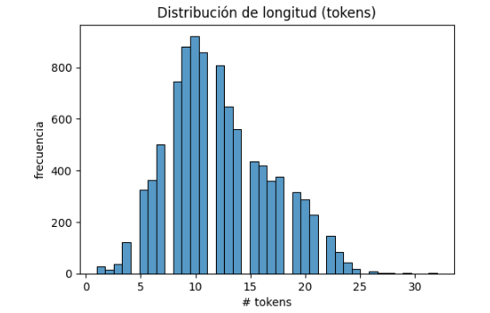
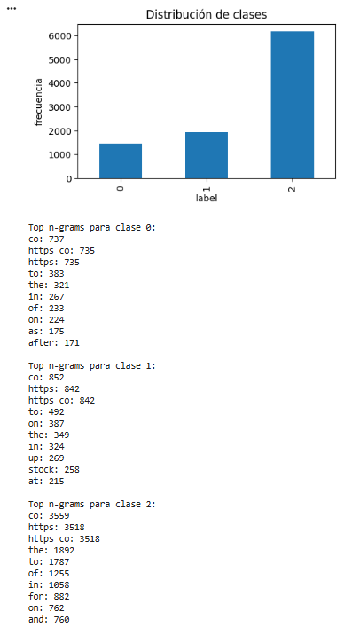
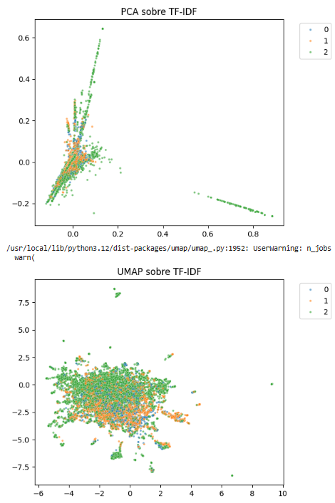
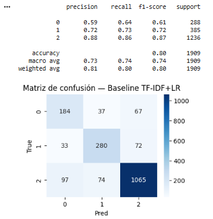
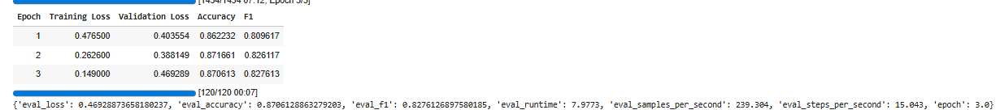
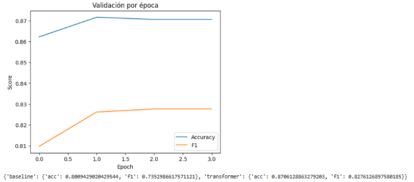

<link rel="stylesheet" href="../custom.css">

# Fine-tuning de Transformers para Clasificación de Sentimiento Financiero
## 2025-11-30

## Contexto

En esta actividad se trabajó con el dataset **zeroshot/twitter-financial-news-sentiment** de Hugging Face, que contiene aproximadamente 12.000 tweets financieros anotados en **tres clases**:  
- **0 = Bearish**,  
- **1 = Bullish**,  
- **2 = Neutral**.

El objetivo fue realizar **análisis exploratorio (EDA)**, construir un **baseline clásico** (TF-IDF + LR) y finalmente aplicar **fine-tuning de un modelo Transformer** (FinBERT y alternativas) para comparar el rendimiento entre enfoques tradicionales y modelos preentrenados.

## Objetivos

- Cargar y preprocesar datasets de texto con **datasets** y tokenizers.  
- Realizar EDA: distribución de clases, longitudes, n-grams, wordclouds, proyecciones TF-IDF y Word2Vec.  
- Implementar un baseline con vectores TF-IDF y regresión logística.  
- Aplicar fine-tuning de un modelo Transformer (FinBERT).  
- Evaluar resultados con accuracy, F1 y matriz de confusión.  
- Comparar Bag of Words vs. Transformers.

## Actividades (con tiempos estimados)

- Setup y carga del dataset — 10 min  
- EDA general + n-grams — 25 min  
- Proyecciones TF-IDF + Word2Vec — 25 min  
- Baseline TF-IDF + LR — 20 min  
- Fine-tuning Transformer — 40 min  
- Comparación de resultados + conclusiones — 20 min  
- Documentación — 20 min  

---

## Desarrollo

### Exploración del dataset

En ese trabajo lo que se hizo primero fue una preparación básica del dataset: se cargaron los documentos, se limpiaron (formato, saltos de línea, textos sueltos), se dividieron en chunks y se indexaron en dos vectores distintos (FAISS y Chroma) para poder comparar. También hubo una exploración inicial del corpus para entender su tamaño, distribución de textos y nivel de redundancia, lo que permitió definir el tamaño de los chunks y el valor de k a probar. Luego se generaron las cadenas RAG, combinando los índices vectoriales con distintos prompts (estricto y flexible) para observar cómo cambiaba la calidad del grounding. 

Finalmente, se ejecutaron varias consultas y se recopilaron las respuestas que produjo el modelo con cada configuración, permitiendo comparar cómo influían el tipo de índice, el valor de k y el tono del prompt en la solidez de la generación.

#### Observaciones

La distribución muestra que la mayoría de textos tienen entre 5-20 tokens, con muy pocos superando 25 tokens. Esto confirma que un max_length de 128 es más que suficiente y que incluso podría disminuirse y funcionar.

Las clases están desbalanceadas: Clase 2 (Neutral) = 6,178 (65%), Clase 1 (Bullish) = 1,923 (20%), Clase 0 (Bearish) = 1,442 (15%). Por este desbalance, el modelo tiende a favorecer a la clase mayoritaria.

### Exploración del dataset 2

Posteriormente se hizo una exploración más profunda del dataset para entender mejor cómo está distribuida la información y qué características distinguen a cada clase. Primero se analizó la distribución de clases para verificar si el conjunto estaba balanceado o no, lo cual es importante para anticipar posibles sesgos en el modelo. Después se calcularon los top n-grams por clase usando un enfoque rápido con Bag-of-Words; esto permitió identificar qué palabras o combinaciones de palabras aparecen con mayor frecuencia dentro de cada categoría, ayudando a entender qué señales lingüísticas podría estar usando un modelo para diferenciar una clase de otra. Finalmente, se generaron wordclouds por clase como una visualización cualitativa para ver de manera intuitiva qué términos dominan en cada grupo. En conjunto, este EDA sirvió para validar la coherencia del dataset, detectar posibles desbalances y obtener pistas sobre los rasgos textuales más representativos de cada etiqueta.

#### Observaciones

- n-grams más frecuentes por clase
  - Clase 0 (Bearish): "after", "cut", "down" - términos negativos esperados
  - Clase 1 (Bullish): "up", "stock", "gain" - términos positivos claros
  - Clase 2 (Neutral): vocabulario general como "the", "to", "of"

- sesgos/ruido en las nubes de palabras: "https" y "co" dominan todas las clases, sugiriendo que URLs/tickers son ruido que debería limpiarse.

### Separabilidad en el espacio

En esta parte se buscó entender si las clases del dataset presentan alguna separabilidad en el espacio vectorial y también explorar la semántica del vocabulario. 

Para eso primero se vectorizaron los textos con TF-IDF y se proyectaron a dos dimensiones usando PCA; aunque es una reducción bastante agresiva, sirve como una primera aproximación para ver si existen agrupamientos visibles o si las clases se mezclan mucho. Luego se aplicó UMAP directamente sobre la matriz dispersa, una técnica más adecuada para datos de alta dimensión, que suele revelar patrones de proximidad más realistas; esta visualización permitió identificar si había clusters más definidos o si la frontera entre clases era difusa. Como complemento, se entrenó un modelo Word2Vec de forma exploratoria para examinar relaciones semánticas entre palabras, observando qué términos aparecen como más cercanos a algunos probes relevantes. 

Esto ayudó a validar si el corpus tenía cohesión lingüística y si el vocabulario expresaba asociaciones razonables, lo que da una idea de la calidad textual sobre la que después trabajará el modelo.

#### Observaciones

- Separabilidad en PCA/UMAP. Datos solapados, ruido, y features
  - PCA revela cierta estructura pero con áreas de mezcla
  - UMAP muestra un solapamiento significativo
  - El solapamiento sugiere que el contexto y relaciones semánticas complejas son importantes.

- Los vecinos de Word2Vec no reflejan semántica financiera.

### Baseline basico

Se construyó un modelo baseline clásico para tener una referencia antes de usar modelos más complejos. Primero se dividió el dataset en entrenamiento y prueba manteniendo la proporción de clases, y luego se armó un pipeline que combina TF-IDF (con uni- y bi-gramas) y una regresión logística con balanceo de clases para mitigar posibles desbalances del corpus. Tras entrenar el modelo con los textos vectorizados, se evaluó su rendimiento sobre el conjunto de prueba generando el classification report, que resume métricas como precisión, recall y F1 para cada categoría. Finalmente se construyó una matriz de confusión para visualizar los tipos de errores más frecuentes y entender qué clases tiende a confundir el modelo, ofreciendo así un punto de comparación sólido para experimentos posteriores.

#### Observaciones

- Clases donde falla más el baseline
  - Clase 0 (Bearish): F1 más bajo (0.61) - clase minoritaria más difícil
  - Clase 1 (Bullish): Performance media (0.72)
  - Clase 2 (Neutral): Mejor performance (0.87) - beneficio del desbalance

- Hiperparámetros probados y cómo cambiaron los resultados
  - class_weight='balanced' fue acertado dado el desbalance
  - ngram_range=(1,2) capturó bigramas importantes como "price target", "stock up"
  - max_features=10000 no sobrecarga el modelo

### Enfoque moderno basado en transformers

En esta etapa se pasó de los modelos clásicos a un enfoque moderno basado en transformers. Primero se volvió a generar el split estratificado, pero ahora convirtiendo los datos en objetos de datasets, que son compatibles con el ecosistema de HuggingFace. Se configuró la columna de etiquetas como ClassLabel para asegurar que el modelo reconozca correctamente las tres clases. 

Luego se seleccionó automáticamente el primer modelo disponible entre varias opciones, priorizando un checkpoint preentrenado en lenguaje financiero (FinBERT), con alternativas más generales en caso de fallo.

Después se aplicó la tokenización BPE propia del modelo y se crearon versiones tokenizadas de los conjuntos de entrenamiento y prueba. Se definió una función de métricas personalizada para calcular accuracy y F1, adaptándose al número de clases. Finalmente se configuró el entrenamiento con TrainingArguments, usando hiperparámetros estándar para fine-tuning (tasa de aprendizaje baja, batch moderado y unas pocas épocas), y se entrenó mediante la clase Trainer, que gestionó tanto el entrenamiento como la selección automática del mejor checkpoint según F1. 

Al final se evaluó el modelo y se imprimieron los resultados, proporcionando así una línea base fuerte basada en modelos de lenguaje preentrenados.

#### Observaciones

- Mejora el Transformer al baseline
  - Accuracy: 87.1% (+7 puntos vs baseline)
  - Macro F1: 82.8% (+9.3 puntos vs baseline)
  - Mejora consistente en todas las métricas

- Costo de entrenamiento (tiempo/VRAM): Tiempo de ~12 minutos

### Desempeño del modelo durante el entrenamiento

En el cierre del análisis se revisó cómo evolucionó el desempeño del modelo durante el entrenamiento extrayendo del trainer el historial de métricas por época, lo que permitió graficar la progresión del accuracy y del F1 en validación. Esto sirve para verificar si el modelo converge de forma estable y si hay signos de sobreajuste. A continuación se realizó una comparación directa entre el modelo clásico (TF-IDF + regresión logística) y el modelo basado en transformers: para cada uno se calcularon nuevamente accuracy y F1 sobre el conjunto de prueba. Con estos valores se generó un pequeño resumen que deja claro cuál de las dos aproximaciones rinde mejor, ofreciendo así una visión final del impacto real de pasar de un baseline tradicional a un modelo moderno de lenguaje preentrenado.

#### Reflexiones finales

- El mejor método para producción: FinBERT.
  - FinBERT entiende contexto financiero específico
  - Mejor manejo de lenguaje financiero técnico
  - Superior discriminación entre Bullish/Bearish

- Siguientes pasos: El primer paso urgente sería una limpieza de datos, eliminando URLs, menciones, símbolos de trading.

## Evidencias
- [Collab](https://colab.research.google.com/drive/1Ff3za3Mgi-Oz7XhtuTgldWH0KRjDFjrg?usp=sharing)

## Referencias

- https://juanfkurucz.com/ucu-ia/ut4/13-nlp-ofensivo-transformers-assignment/
