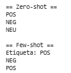
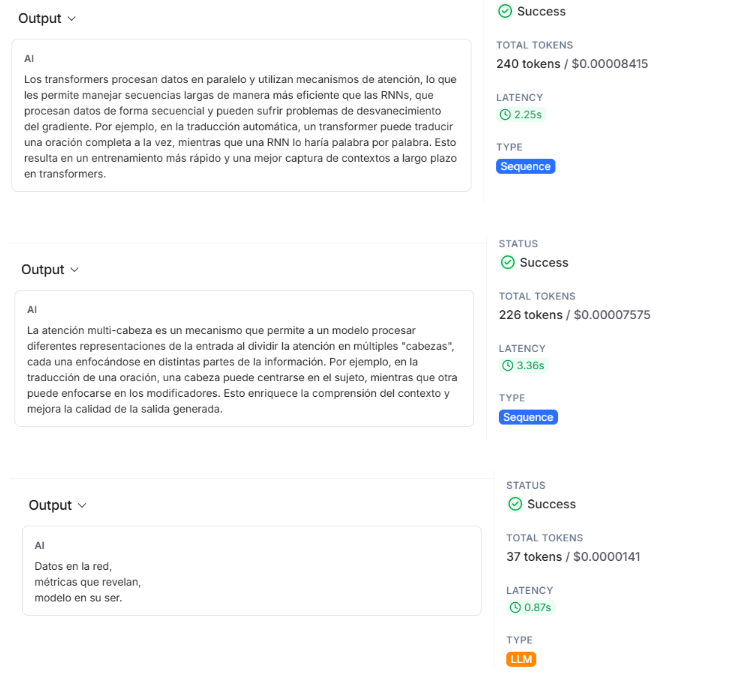

## Contexto

En esta actividad se trabajó con **LangChain + OpenAI** para explorar el flujo completo de uso de LLMs en aplicaciones prácticas: desde el setup básico, control de parámetros de decodificación, diseño de prompts reutilizables, generación de **salidas estructuradas**, medición de tokens/latencia con LangSmith, hasta construcción de un pipeline **RAG** sencillo con FAISS/Chroma. El objetivo fue comprender cómo LangChain organiza estos componentes, cómo afecta cada parámetro al comportamiento del modelo y cómo obtener respuestas confiables, reproducibles y parseables sin depender de prompts frágiles.

## Objetivos

- Instanciar modelos OpenAI con `ChatOpenAI` y controlar `temperature`, `max_tokens` y `top_p`.  
- Diseñar prompts robustos con `ChatPromptTemplate` y componerlos con LCEL (`|`).  
- Generar salidas estructuradas usando `with_structured_output` (JSON/Pydantic).  
- Medir tokens y latencia con LangSmith (tracing y callbacks).  
- Implementar tareas guiadas: traducción determinista, resúmenes, Q&A condicionado al contexto.  
- Comparar enfoques zero-shot vs few-shot.  
- Construir un RAG básico con FAISS/Chroma para responder preguntas con grounding.

## Actividades (con tiempos estimados)

- Setup e instanciación del modelo — 10 min  
- Experimentación con temperature / top_p / max_tokens — 20 min  
- Creación de plantillas de prompt + LCEL — 20 min  
- Structured output (JSON/Pydantic) — 20 min  
- Métricas con LangSmith — 15 min  
- Tareas guiadas (traducción, resúmenes, QA) — 25 min  
- Zero-shot vs few-shot — 15 min  
- RAG básico (FAISS / Chroma) — 40 min  
- Documentación final — 20 min  

---

## Desarrollo

### Setup e intentos iniciales con el modelo

Se realizó la configuración inicial del entorno de trabajo, tanto para ejecución local como en Google Colab, instalando las versiones recientes de los paquetes clave de LangChain y sus extensiones (incluyendo módulos de comunidad, conectores con OpenAI y utilidades para RAG como FAISS y Chroma). Luego se definieron las variables de entorno necesarias para habilitar el tracing en LangSmith y autenticar las llamadas a los modelos de OpenAI, permitiendo que cada ejecución quedara registrada con métricas de tokens y latencia. Una vez configurado esto, se instanció un modelo base (gpt-5-mini) ajustando el parámetro de temperatura para experimentar con respuestas más deterministas o más creativas, y se hicieron llamadas simples al modelo para verificar que el setup estuviera funcionando correctamente. En conjunto, esta sección prepara el entorno, valida la autenticación y establece los parámetros iniciales con los que luego se construyen prompts, cadenas y experimentos más avanzados dentro del informe.

#### Reflexión

**Temp = 0.2:**
Cambios en las oraciones

**Resultados:**

"Soy ChatGPT, un modelo de la familia GPT-4 (versión GPT-4o)."

"Soy ChatGPT, un modelo de lenguaje con corte de conocimiento en junio de 2024."

"Soy ChatGPT, un modelo de lenguaje de OpenAI con conocimiento actualizado hasta junio de 2024."

- Variancia entre ejecuciones con la misma consigna:

Hay algo de variancia, aunque pequeña. Por ejemplo, todas comienzan con la frase "Soy ChatGPT, un modelo de", y luego las últimas dos mencionan la misma información sobre la fecha del conocimiento.

**Temp = 0.9:**
Cambios en las oraciones

**Resultados:**

"Soy ChatGPT, un modelo de lenguaje de OpenAI; la versión exacta no está especificada en este entorno."

"Soy ChatGPT (modelo GPT-4o), con corte de conocimiento en junio de 2024."

"Soy ChatGPT, modelo GPT-4o (corte de conocimiento: junio de 2024)."

- Variancia entre ejecuciones con la misma consigna:

Podemos observar que la primera respuesta se contradice con las otras, que sí indican una versión. Aun así, podemos ver cierta similitud, sobre todo en las últimas dos respuestas, y todas empiezan por "Soy ChatGPT". Diría que la variancia es mayor que en el primer caso.

### Exploración de las configuraciones

En este bloque se exploró cómo cambian las respuestas del modelo al variar los parámetros de generación, principalmente la temperatura. Para eso se definió un pequeño conjunto de prompts y se evaluó el mismo modelo con tres configuraciones distintas (0.0, 0.5 y 0.9), observando cómo aumenta la creatividad y la variabilidad a medida que sube la temperatura. Esto permite ilustrar de forma práctica el impacto de este hiperparámetro en tareas de generación corta, como tuits o bullets explicativos. 

Luego se probó una segunda configuración con un modelo alternativo (gpt-4o-mini) incorporando también el parámetro top_p, que controla la diversidad del muestreo desde otra perspectiva. Con esta prueba adicional se verificó cómo ambos parámetros influyen en el estilo y la originalidad del texto generado, dejando una demostración concreta de control de comportamiento en modelos generativos.

#### Reflexión  
**Resultados**

**Temp 0.0 y top_p = 1.0**

Métrica y test,  
cruces, sesgo y ruido,  
entrega verdad.

¿Querés otra versión (más técnica o más lírica)?

---

**Temp 0.5 y top_p = 0.9**

Datos en la mesa,  
métricas que susurran,  
verdad y ruido.

---

**Temp 0.9 y top_p = 0.7**

Datos en la red,  
métricas que revelan,  
modelo en su ser.

---

### Respuestas a las preguntas

**combinación que da claridad vs creatividad**  
- Para la claridad la mejor combinación fue **Temp 0.0 + top_p 1.0**, porque genera un haiku más preciso, directo y consistente entre ejecuciones. El contenido es más “fijo”.  **Temp 0.5 + top_p 0.9** es donde aparece algo de variación pero sin perder coherencia. Y **Temp 0.9 + top_p 0.7** produce frases más libres, y asociaciones menos literales.

**Impacto de estos parámetros en tareas “cerradas”**  
- Temperature bajo (0.0–0.2): ideal para tareas cerradas porque reduce la variabilidad y aumenta la precisión.
- Temperature medio (0.5): funciona, pero puede introducir ligera variación y riesgos de desviarse del objetivo.  
- Temperature alto (0.9): puede inventar detalles, desviarse del formato o perder exactitud, por lo que no seria bueno en tareas cerradas.  
- top_p bajo (0.7): restringe el espacio de palabras, meora las tareas cerradas por mantener coherencia.  
- top_p alto (1.0): deja más libertad, pero no se debe combinar con temperatura alta. No es recomendable para respuestas únicas.

### Usando plantillas

En este bloque se usó ChatPromptTemplate para crear un prompt estructurado que separa instrucciones, ejemplos y la interacción con el usuario, incluyendo un mensaje del sistema que define el rol del asistente y un placeholder {tema} para reutilización; luego se combinó con el modelo (llm) usando |, generando una cadena ejecutable que mantiene consistencia en estilo y formato, permitiendo few-shot controlado, y en el ejemplo con “atención multi-cabeza” produjo una explicación breve y práctica siguiendo la estructura definida.

#### Reflexión

**Resultado:**

La atención multi-cabeza es un mecanismo que permite a un modelo procesar diferentes representaciones de la entrada al dividir la atención en múltiples "cabezas", cada una enfocándose en distintas partes de la información. Por ejemplo, en la traducción de una oración, una cabeza puede centrarse en el sujeto, mientras que otra puede enfocarse en los modificadores. Esto enriquece la comprensión del contexto y mejora la calidad de la salida generada.

- Mejora frente a “parsear a mano” cadenas JSON

Usar salidas estructuradas evita errores comunes del parseo manual y garantiza que el formato sea siempre válido. Y reduce la complejidad del código.

- Contratos de salida necesitás en producción

Se requieren respuestas con estructura estable, tipos definidos y campos obligatorios claros. Permite validar fácilmente la salida y asegurar una consistencia, evitando cambios inesperados.

### Observación de métricas en langsmith

Se vieron en langsmith algunas metricas de uso de tokens y latencia para entender los costos en tiempo y tokens de las prompts.

#### Reflexión

**Resultado:**

- Prompt que costó más tokens

Los prompts más extensos son los que más tokens costaron; en este caso, fue el último, sobre Transformers vs RNNs.

- Balancear latencia vs calidad

Usar prompts más cortos, evitar contexto innecesario, utilizar modelos más rápidos para tareas simples y reservar los modelos grandes solo para tareas que realmente requieren mayor calidad.

### Variedad de prompts estructurados

Se trabajó con salida estructurada y prompts específicos para distintas tareas. Primero se definió un modelo Pydantic Traduccion y se utilizó with_structured_output para generar traducciones confiables en JSON, asegurando que la respuesta cumpla un esquema predefinido. Luego se creó un resumen ejecutivo usando ChatPromptTemplate, estableciendo un formato fijo (Intro / Hallazgos / Recomendación) y un límite de 120 tokens, lo que permite que el modelo sintetice textos largos de manera consistente. 

Finalmente, se implementó un Q&A con contexto, donde el prompt fuerza al modelo a responder únicamente con la información provista, retornando “No suficiente contexto” si la información no alcanza, demostrando cómo se puede controlar la precisión y concisión del output sin depender de recuperación externa (RAG).

#### Reflexión

**Resultado**
text='Excelente trabalho da equipe.' lang='pt'
Resumen ejecutivo generado por el modelo:

Intro: La creciente dependencia de la inteligencia artificial en las organizaciones modernas trae beneficios, pero también riesgos significativos. 

Hallazgos: Se identifican problemas de transparencia, sesgos en los modelos y deficiencias en la calidad de datos. Además, muchas empresas carecen de marcos de gobernanza adecuados para monitorear y auditar estos sistemas.

Recomendación: Es crucial implementar prácticas robustas de evaluación, auditoría continua y control del ciclo de vida de los modelos para maximizar el potencial de la IA, garantizando seguridad y confiabilidad.
content='La ventaja del structured output es que permite una interpretación y procesamiento más fácil y eficiente de los datos, facilitando la integración con otros sistemas y la automatización de tareas.

- Alucinaciones del modelo al no tener suficiente contexto

El modelo alucina cuando la información necesaria no está en el contexto y no se le da una instrucción clara para admitirlo. En este caso, gracias al prompt estricto "Respondé SOLO usando el contexto", no alucinó.

- Exigir formato y concisión de manera consistente

Usando structured_output para obligar al JSON, mensajes system que definan el formato exacto, límites de longitud y prompts con estructura fija. Reduce variabilidad y garantiza respuestas consistentes.

## Exploración de diferencias entre zero-shot y few-shot

Se exploró la diferencia entre zero-shot y few-shot learning usando ChatPromptTemplate. Primero se definió un prompt zero-shot, donde el modelo recibe solo la consigna general de clasificar sentimientos (POS/NEG/NEU) sin ejemplos previos. Luego se creó un prompt few-shot que incluye uno o dos ejemplos concretos antes de presentar el texto objetivo, lo que guía al modelo sobre el formato esperado y mejora la consistencia de la respuesta. Se probó con tres textos distintos, observando cómo la inclusión de ejemplos (few-shot) generalmente produce clasificaciones más precisas y consistentes que el enfoque zero-shot, especialmente en casos ambiguos.

#### Reflexión

- Mejora la consistencia al ajustar el número/elección de ejemplos

Agregar 1-2 ejemplos en el few-shot mejora la consistencia de la clasificación.
Con zero-shot, el modelo puede dudar con frases ambiguas "Está bien, nada extraordinario", pero con ejemplos cercanos, tiende a etiquetar siempre de forma más estable, ej: NEU. Además, la elección de ejemplos importa: si incluís ejemplos más variados, el modelo generaliza mejor.

- Impacto de cambiar la temperatura

Temp baja: clasificación estable, siempre repite el mismo criterio.
Temp alta: más variabilidad, a veces cambia NEU por POS

### Resumen de textos largos

Se trabajó con resumen de textos largos utilizando dos enfoques distintos con LangChain y ChatOpenAI. Primero se hizo un resumen directo, enviando todo el texto al modelo con un prompt que solicitaba un párrafo breve y factual. Este método es simple, pero puede ser menos eficiente con textos muy extensos o repetitivos.

Luego se implementó un resumen estilo map-reduce, donde el texto se divide en fragmentos manejables mediante RecursiveCharacterTextSplitter. Cada fragmento se resume en bullets de manera independiente (fase “map”), y finalmente se consolidan los bullets para generar un resumen final único y breve (fase “reduce”). Este enfoque permite procesar textos largos de manera más controlada, evita que el modelo omita información y facilita la reducción de redundancias, generando un resultado más organizado y completo que el resumen directo.

#### Reflexión

**Resultado**

=== RESUMEN DIRECTO ===

La metamorfosis, novela de Franz Kafka publicada en 1915, narra la transformación de Gregorio Samsa en un insecto y el drama familiar que ello provoca. Su título original en alemán, Die Verwandlung, podría traducirse como "La transformación", aunque en español se la conoce como La metamorfosis, con connotaciones míticas. La obra suele interpretarse como una alegoría del enfrentamiento del individuo con un mundo moderno opresor y es considerada una pieza clave en la literatura del absurdo que influyó a numerosos autores posteriores.

=== RESUMEN MAP-REDUCE ===

La Metamorfosis (Die Verwandlung), novela de Franz Kafka publicada en 1915, narra la súbita transformación de Gregorio Samsa en un insecto y el drama familiar que provoca. El título alemán —«la transformación»— se tradujo como Metamorfosis, con matiz mítico. La obra funciona como alegoría del individuo frente a un mundo moderno opresivo, inaugura la literatura del absurdo e influyó en autores posteriores.

- “resumen directo” (sin split) vs map-reduce.

En la prueba, el resumen directo salió bien pero un poco más largo y con alguna repetición. El map-reduce, en cambio, quedó más compacto y parejo, como si estuviera mejor editado.
En este texto corto no hubo una diferencia enorme, pero se nota que map-reduce ayuda a ordenar y limpiar las ideas. En textos largos seguramente la ventaja sería mucho mayor.

- Efectos del chunk_size y chunk_overlap en la calidad

El chunk_size influye en cuánto contexto ve el modelo: si es muy chico pierde ideas, si es muy grande se parece demasiado al texto original y no aporta mucho.

El chunk_overlap ayuda a que no se corten frases o ideas entre chunks: poco overlap pierde continuidad, demasiado genera repeticiones.

### Extracción estructurada de información

En este bloque se trabajó con extracción estructurada de información usando LangChain y ChatOpenAI. Se definió un modelo de salida con Pydantic (ExtractInfo) que incluye título, fecha y entidades reconocidas (organizaciones, personas o lugares), lo que permite que el modelo devuelva la información en un formato consistente y fácil de procesar automáticamente.

Se probó la extracción en tres escenarios distintos: un texto completo con título, fecha y entidades; un texto con fecha ambigua; y un texto sin fecha. El uso de with_structured_output garantiza que, independientemente de la complejidad o la ausencia de datos, el modelo genere una salida consistente, diferenciando claramente los campos presentes de los que están vacíos o no aplican. Esto demuestra cómo se puede automatizar la extracción de información clave de textos con distintos niveles de completitud y claridad.

#### Reflexión

**Resultado**

=== Resultado 1 (básico) ===
titulo=None fecha='05/11/2025' entidades=[Entidad(tipo='Organización', valor='OpenAI'), Entidad(tipo='Organización', valor='Universidad Católica del Uruguay'), Entidad(tipo='Ubicación', valor='Montevideo')]

=== Resultado 2 (fecha ambigua) ===
titulo=None fecha='03/04/25' entidades=[Entidad(tipo='Organización', valor='IBM'), Entidad(tipo='Institución pública', valor='Intendencia de Canelones')]

=== Resultado 3 (sin fecha) ===
titulo='Amazon abrirá un nuevo centro de investigación en Río de Janeiro.' fecha=None entidades=[Entidad(tipo='Organización', valor='Amazon'), Entidad(tipo='Instalación', valor='centro de investigación'), Entidad(tipo='Ubicación', valor='Río de Janeiro')]

- El modelo identifica bien organizaciones y ubicaciones. En los tres casos capturó entidades relevantes sin errores graves.

- Tuvo problemas con categorías inconsistentes, usa etiquetas distintas para conceptos similares "Organización", "Institución pública", "Instalación".

- Si no se fija un conjunto de tipos permitido, el modelo inventa variaciones.

- Las fechas ambiguas se devuelven tal cual, no intenta inferir si 03/04/25 es 3 de abril o 4 de marzo.
- El modelo no desambigua fechas por sí mismo si no se lo pedís explícitamente.

- Cuando no hay fecha, completa el campo con None según el esquema, lo que demuestra que maneja bien campos opcionales.

### Flujo de RAG (Retrieval-Augmented Generation) combinando recuperación de documentos y generación de texto

Se exploró un flujo de RAG (Retrieval-Augmented Generation) combinando recuperación de documentos y generación de texto con un modelo LLM (gpt-5-mini). Primero, se crearon documentos de ejemplo y se dividieron en fragmentos manejables con RecursiveCharacterTextSplitter. Luego, se generaron embeddings de cada fragmento con OpenAIEmbeddings y se indexaron en dos vectorstores diferentes: FAISS y Chroma.

Se definieron dos estilos de prompt: uno estricto, que obliga al modelo a responder solo con la información del contexto, y otro flexible, que permite inferencias pero señalando cuando se infiere. Con esto, se construyó una cadena RAG que, dado un número k de documentos a recuperar, devuelve una respuesta fundamentada en los fragmentos más relevantes.

Finalmente, se comparó el comportamiento del modelo usando diferentes combinaciones: FAISS vs Chroma, k=2 vs k=4, y prompts estrictos vs flexibles. Esto permitió observar cómo la selección de documentos y el estilo del prompt impactan la precisión, grounding y creatividad de las respuestas generadas. El ejemplo mostró que aumentar k o usar prompts más flexibles puede dar respuestas más completas, mientras que prompts estrictos reducen el riesgo de “alucinaciones”.

#### Reflexión

**Resultado**

=== FAISS | k=2 | Prompt estricto ===
Aporta mejor grounding: al combinar recuperación y generación, y usando la recuperación para evitar alucinaciones del modelo.

=== FAISS | k=4 | Prompt estricto ===
La ventaja clave es que RAG combina recuperación y generación para mejorar el grounding del modelo, siendo la recuperación fundamental para evitar alucinaciones.

=== Chroma | k=2 | Prompt flexible ===
La ventaja clave de RAG es que mejora el grounding del modelo al combinar recuperación y generación: la etapa de recuperación aporta evidencia factual que reduce las alucinaciones y aumenta la fidelidad de las respuestas.

Adicionalmente (inferido):
- Permite acceder a conocimiento externo y más actualizado, porque recupera documentos fuera del modelo.
- Mejora la trazabilidad/falsabilidad: es más fácil verificar y citar las fuentes usadas por la generación.

(Lo principal viene del contexto; las dos últimas ventajas las he inferido.)

=== Chroma | k=4 | Prompt flexible ===
La ventaja clave de RAG (según el contexto) es que permite groundear las respuestas del modelo recuperando documentos relevantes antes de generar texto, lo que reduce las alucinaciones y mejora la exactitud factual.

Apoyo técnico (contexto):
- La etapa de recuperación es decisiva para evitar alucinaciones.
- OpenAIEmbeddings sirve para convertir textos en vectores y así indexarlos para la búsqueda.
- LangChain puede ayudar a producir salidas estructuradas y controladas (por ejemplo con Pydantic).

Inferencia (aclaración): además, RAG facilita la trazabilidad y la actualización del conocimiento sin reentrenar el modelo, porque basta con actualizar el índice de documentos.

1. k más alto (k=4) no cambia demasiado el contenido, pero sí hace que la respuesta sea más completa y repetida.
El modelo recibió más contexto y por eso reforzó la misma idea "mejor grounding", pero no agregó nada realmente nuevo.

2. k más bajo (k=2) sigue dando buenas respuestas.
Con poca información relevante ya puede contestar correctamente, puede que el conjunto de documentos sea chico y muy directo.

3. FAISS y Chroma se comportaron prácticamente igual.
Ambos recuperaron bien. En un dataset chico no hay diferencias prácticas.

4. El prompt flexible permitió inferencias extra.
Como se le dio permiso para inferir, el modelo agregó:

- acceso a conocimiento externo
- trazabilidad
- cosas que no estaban en los documentos, pero son razonables.

Esto confirma que con la regla "infiere", va a inferir.

5. El prompt estricto cumplió: cero inferencias.
Se mantuvo pegado al contexto, lo cual es lo esperado.

## Evidencias
- [Collab](https://colab.research.google.com/drive/1MIwekmPWzHJyxlHs5u_SddaeWs-FOpdp?usp=sharing)

## Referencias

- https://juanfkurucz.com/ucu-ia/ut4/14-langchain-openai-intro/
- [docs.langchain.com](https://docs.langchain.com)
- [api.python.langchain.com](https://api.python.langchain.com)
- [platform.openai.com](https://platform.openai.com)